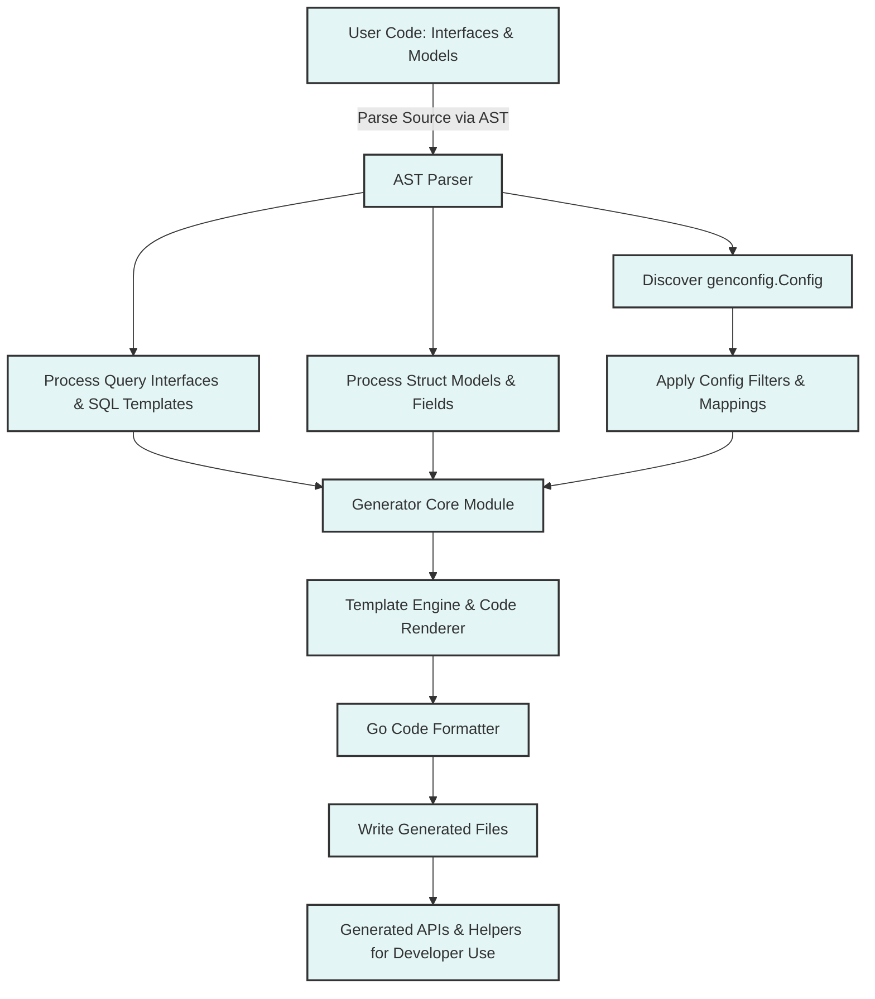

# How Does GORM CLI Work? (Architecture Diagram)

Explore the high-level workflow of the GORM CLI tool, focusing on how it processes your Go code—scanning user interfaces and models, handling configuration, and finally generating strongly-typed helpers and query APIs. This page breaks down the flow from your input code to the generated output, emphasizing the generator’s core modules and entry points for a clear, visual understanding of the architecture.

---

## Understanding the GORM CLI Generation Flow

When you run the GORM CLI generator, your source code is the starting point. The tool thoroughly analyzes your Go interfaces and model structs to produce powerful, type-safe APIs and helpers that improve productivity and reduce runtime errors.

### What Happens Behind the Scenes?

1. **Input Scanning**
   - The CLI accepts either individual files or entire directories.
   - It parses Go source files using Go's abstract syntax tree (AST) to extract relevant declarations like interfaces, structs, and configuration.

2. **Configuration Detection and Application**
   - The generator auto-discovers optional package-level configuration (`genconfig.Config`) defined in your source.
   - This config controls output paths, file-level behavior, and inclusion/exclusion of interfaces or structs.
   - Configuration maps Go types or field tags to custom field helper types, enabling extensibility.

3. **Interface and Model Processing**
   - Interfaces annotated with SQL template comments are processed to extract method signatures, parameter types, and SQL code.
   - Structs representing models are parsed to identify fields, including embedded and relation types.
   - The tool handles complex Go types (generics, pointers, slices, named types) and association relations, preparing them for generation.

4. **Code Generation**
   - Using templates, the generator produces:
     - **Type-safe query APIs** from interfaces, implementing methods that include SQL execution logic with compile-time safety.
     - **Model-driven field helpers** that allow fluent and expressive filtering, updates, and association management.
   - The output reflects configured paths and respects inclusion/exclusion rules for granular control.
   
5. **Code Formatting and Output**
   - The generated Go files are formatted according to Go standards before being written to the specified output location.

---

## Core Architecture Diagram

---

## Deep Dive: What Each Module Does

### 1. Input Scanning and AST Parsing
GORM CLI uses Go's parser to convert your source files into an abstract syntax tree. This allows it to:
- Capture package imports, interfaces, and struct definitions precisely.
- Discover method signatures and associated SQL templates via comments.
- Parse struct fields, including anonymous embeddings and relationship annotations.

### 2. Configuration Discovery
Detects `genconfig.Config` literals defined at package level. This config:
- Specifies output directory and file-level generation options.
- Includes or excludes certain interfaces or structs based on patterns.
- Maps Go types or struct tags to specific field helper implementations.

### 3. Interface and Model Processing
Interfaces tagged with SQL templates guide the generation of type-safe query APIs, translating your annotated comments into executable methods. Structs representing database models are parsed to synthesize corresponding field helpers, including for relations (has one, has many, belongs to, many2many).

### 4. Code Generation
The core generator populates Go templates with processed data, producing:
- Fluent interface implementations for queries.
- Strongly-typed helper structs and methods supporting filters, updates, and association operations.

### 5. Formatting and Writing
Before writing output files, the generator applies automatic formatting using Go’s `imports` tool to ensure clean and idiomatic Go code.

---

## Real-World Example Flow

Imagine you have a Go package with a `Query[T]` interface containing methods annotated with SQL templates, and a set of model structs like `User` and `Pet`. When you run `gorm gen -i ./examples -o ./generated`:

- GORM CLI parses all files in `./examples`.
- It finds the `Query` interface and extracts methods with SQL comments.
- It discovers models and their fields, including polymorphic and many-to-many relations.
- It checks for any `genconfig.Config` defined and respects its settings.
- It generates the code into `./generated`, creating type-safe query API implementations and model field helpers.
- You then import this generated code and enjoy compile-time safe, discoverable access to your data layer.

---

## Practical Tips & Best Practices

- **Organize Your Code:** Define your query interfaces and models together or within a consistent package to simplify scanning.
- **Use Config for Customization:** Employ `genconfig.Config` to control what gets generated and how.
- **Annotate SQL in Comments:** Leverage the SQL template DSL in interface method comments to define queries.
- **Incrementally Build:** Start with simple query interfaces and evolve with custom field mappings and association helpers.
- **Review Output:** Regularly inspect generated code to understand the patterns and enable debugging.

---

## Troubleshooting

<AccordionGroup title="Common Issues When Running GORM CLI">
<Accordion title="No Output Files Generated">
- Verify your input path is correct and contains Go files.
- Ensure interfaces or structs match any inclusion filters in your config.
- Check for parsing errors logged during execution.
</Accordion>
<Accordion title="Unexpected Generated Code Behavior">
- Check your SQL templates for syntax and placeholder correctness.
- Confirm field tags and config mappings are properly set.
- Look for conflicts or missing implementations in your interfaces.
</Accordion>
<Accordion title="Configuration Not Applying">
- Confirm `genconfig.Config` is declared at package level and imported correctly.
- Remember that `FileLevel` config limits application to the file scope.
- Review inclusion/exclusion wildcard patterns.
</Accordion>
</AccordionGroup>

---

## Next Steps

- Start with the [Quickstart: From Models to Type-Safe APIs](/overview/features-and-workflows/quickstart-user-journey) page to see hands-on examples.
- Explore [Core Concepts & Terminology](/overview/architecture-and-core-concepts/core-concepts-terminology) for foundational knowledge.
- Understand configuration options on [Configuration & Extensibility](/overview/features-and-workflows/configuring-generation).

---

For detailed source insights, view the [generator.go](https://github.com/go-gorm/cli/blob/main/internal/gen/generator.go) file where core parsing and generation logic resides.

---

_You are now equipped to visualize and understand how GORM CLI transforms your Go code into powerful, type-safe data access layers. Harness this knowledge to build more reliable and maintainable applications with confidence._
