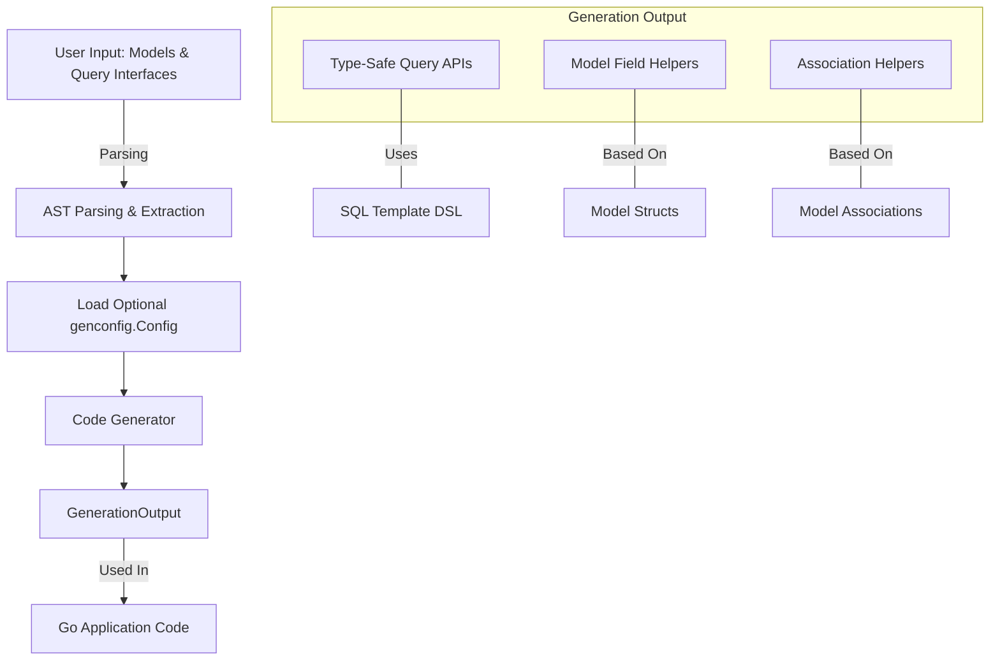

# Core Concepts & Terminology

Master the essential domain knowledge that unlocks the full power of GORM CLI. This page guides you through the foundational building blocks users interact with daily: from query interfaces and SQL templates, through model field helpers and association helpers, all the way to the linear generation workflow. Understanding these core concepts empowers you to write clearer code, harness type safety, and confidently debug and extend your generation setup.

---

## What Are the Core Concepts?

### Type-Safe Query Interfaces

Query interfaces are Go interfaces whose methods correspond to database operations. Each method uses Go-style SQL templates in its comments to define the underlying query or mutation.

- **What you do**: Write interfaces with methods annotated by SQL templates.
- **What you get**: Generated concrete implementations with compile-time safety and clear API signatures.

**Example:**
```go
// Query interface example
// SELECT * FROM @@table WHERE id=@id
GetByID(id int) (User, error)
```

This means you write a high-level declarative contract and the tool generates full implementations you can invoke with type safety and autocompletion.

---

### SQL Templates & Template DSL

SQL templates in comments are the heart of query interface definitions. They allow embedding dynamic SQL with placeholders and logic.

- `@@table`: Resolves automatically to the table name of the model, so no hard-coded table names.
- `@@column`: Binds to a column dynamically.
- `@param` or `@user.Field`: Maps Go method parameters to SQL placeholders, ensuring safe binding.
- Control structures `{{if}}`, `{{for}}`, `{{where}}`, and `{{set}}` provide conditional logic, iteration, and dynamic clause generation.

**Key benefit:** You write expressive SQL logic inline with Go interfaces, yet rely on automatic parameter binding and method generation.


### Model-Driven Field Helpers

Field helpers are strongly typed representations generated for each model's fields, replacing error-prone string literals.

- **Basic fields:** Int, float, string, bool, time, bytes, and custom mapped types.
- **Field helper methods:** Provide predicates (e.g., `.Eq()`, `.Like()`, `.Between()`), setters for updates, increments, and more.

This enables developers to construct complex query and update clauses fluently and safely.

Example:
```go
// generated.User.Name.Eq("Alice") generates `name = "Alice"`
users := gorm.G[User](db).Where(generated.User.Age.Between(18, 65)).Find(ctx)
```


### Association Helpers

Associations represent model relationships (has one, has many, belongs to, many2many).

- Generated as `field.Struct[T]` for single relations or `field.Slice[T]` for collections.
- Provide operations: Create, CreateInBatch, Update, Unlink, Delete.

Example:
```go
// Create a user and a pet simultaneously
gorm.G[User](db).Set(
  generated.User.Name.Set("alice"),
  generated.User.Pets.Create(generated.Pet.Name.Set("fido")),
).Create(ctx)
```

Association helpers simplify management of related data with compile-time guarantees, avoiding tedious FK handling.


### Generation Workflow Overview

The generation workflow is linear and designed for seamless integration into Go project development:

1. **Write your interfaces with SQL templates** and define your models.
2. **Run the CLI generator** which parses your Go source, extracts:
   - Interfaces with SQL comments
   - Model structs and their fields
   - Optional configuration (`genconfig.Config`)
3. **Generate code** producing:
   - Concrete implementations of query interfaces with embedded SQL and parameter handling.
   - Field helper variables and association helpers.
4. **Use generated code** in your application with full type safety.

---

## Key Terminology Explained

| Term                 | Explanation                                                                                          |
|----------------------|--------------------------------------------------------------------------------------------------|
| **Type-safe query APIs** | Methods that execute SQL with compile-time checked parameters and return types derived from models. |
| **Association helpers** | Generated helpers for managing related models/relationships with operations like Create, Unlink.| 
| **Template DSL**       | The simple directives and control structures embedded in interface comments to describe SQL.    |
| **Field helpers**      | Typed fields and methods on generated variables representing model columns for fluent query building.| 
| **Generation workflow** | The end-to-end process from writing interfaces to using generated code in your project.           |

---

## Real-World User Flow: From Interface to Generated Code

### 1. Define Your Query Interface

Write Go interfaces where each method corresponds to a query or mutation. Annotate them with SQL templates:

```go
// SELECT * FROM @@table WHERE id=@id
GetByID(id int) (User, error)

// UPDATE @@table
// {{set}}
//   {{if user.Name != ""}} name=@user.Name, {{end}}
// {{end}}
// WHERE id=@id
UpdateUser(user User, id int) error
```

### 2. Declare Model Structs

Define models with Go structs. Include struct tags for GORM.

```go
type User struct {
  ID uint
  Name string
  Age int
  Pets []Pet
}
```

### 3. Run the Generator

```bash
gorm gen -i ./examples -o ./generated
```

This produces generated implementations and field helpers.

### 4. Use the Generated API

```go
user, err := generated.Query[User](db).GetByID(ctx, 123)

// Use field helpers for fluent queries
results, err := gorm.G[User](db).
  Where(generated.User.Age.Gt(21)).
  Find(ctx)
```

### 5. Manage Associations Easily

```go
// Add pets to a user
err := gorm.G[User](db).
  Where(generated.User.ID.Eq(1)).
  Set(generated.User.Pets.Create(generated.Pet.Name.Set("rex"))).
  Update(ctx)
```

---

## Practical Tips & Common Pitfalls

- **Use placeholders like `@@table` and `@param` exclusively** to ensure generated code picks up the correct tables and params.
- **Include `ctx context.Context` in methods** if needed; the generator adds it automatically if omitted.
- **Apply configurations via `genconfig.Config`** for fine-grained control of field mapping and interface inclusion/exclusion.
- **Beware of mismatched return signatures** – generated methods require error as last return type.
- **Avoid hard-coding SQL strings inline; prefer the DSL directives** for safer generation.

<Warning>
Improperly annotated interfaces or structs outside the recognized generation scope will be skipped silently.
Make sure your files are included correctly using CLI flags and configuration.
</Warning>

---

## Additional Learning

Explore related pages to deepen your understanding:

- [Generation Workflow](https://docs.gorm.io/concepts/core-architecture/generation-workflow) — Detailed process from input to output.
- [Template DSL Usage](https://docs.gorm.io/guides/advanced-patterns/template-based-sql) — Advanced SQL template directives.
- [Working with Associations](https://docs.gorm.io/guides/advanced-patterns/working-with-associations) — In-depth examples managing relations.

---

## Summary Diagram: Core Concept Relationships




---

This page is your pivotal reference for mastering the vocabulary and components of GORM CLI, enabling you to craft precise, safe, and maintainable database interactions effortlessly.

---


<Check>
You have mastered the key concepts to write interfaces, templates, and models that ignite GORM CLI’s generation power.
Use this knowledge as your foundation to confidently explore usage and advanced features.
</Check>
