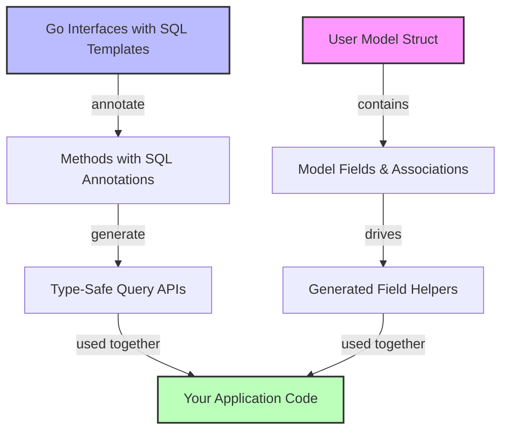

# Core Concepts & Terminology

Understanding the foundational terms and concepts of GORM CLI is essential for maximizing its power and efficiency. This practical glossary introduces you to the key domain-specific language you'll encounter throughout your GORM CLI journey. By familiarizing yourself with these terms, you will gain clear insight into how GORM CLI generates type-safe APIs, simplifies querying, and enhances your database interactions.

---

## Type-Safe Query APIs

### What It Is
Type-safe query APIs are Go interfaces generated from your declarative SQL annotations. They expose methods you call that correspond exactly to SQL queries but with compile-time guarantees about types and correctness.

### Why It Matters
- **Eliminates runtime errors:** Your queries are checked for type correctness when you compile, protecting you from surprises at runtime.
- **Fluent usage:** Access comprehensive, discoverable methods matching your data models.

### Real-World Example
Instead of writing raw SQL strings, invoke generated methods:

```go
user, err := generated.Query[User](db).GetByID(ctx, 123)
```
The method signature ensures `User` is returned, avoiding manual scanning or type assertions.

---

## SQL Templates

### What They Are
SQL templates are parameterized SQL snippets written inside Go interface method comments. Placeholders like `@@table` and `@param` provide dynamic binding.

### Purpose
They let you define query logic flexibly while the generator translates them into safe, efficient Go code.

### How They Work
The syntax supports:
- **Dynamic table and column resolution:** `@@table` resolves to the table of the model type.
- **Conditional logic:** `{{if}}` and `{{where}}` blocks enable optional SQL parts.
- **Iterative constructs:** `{{for}}` loops handle slices gracefully.

Example snippet:

```sql
// SELECT * FROM @@table WHERE id=@id
GetByID(id int) (T, error)
```

---

## Field Helpers

### Definition
Field helpers are generated typed objects representing your model's fields. They encapsulate SQL predicates and setters for that field.

### Why Use Them
- **Simplify querying:** Compose filters like `generated.User.Age.Gt(18)` instead of manually crafting SQL.
- **Support updates and ordering:** Set new values or define sorting rules with fluent, type-safe code.

### Supported Field Types
Basic fields include:
- Primitive types: `int`, `string`, `bool`, `float`.
- `time.Time` and nullable types like `sql.NullInt64`.
- Custom mapped types, e.g., JSON field helpers.

Example predicate usage:
```go
generated.User.Name.Like("%jinzhu%")
generated.User.Age.Between(18, 65)
```

---

## Associations

### Overview
Associations represent relationships between your models, such as:
- **Belongs to**
- **Has one / Has many**
- **Many-to-many**

GORM CLI generates helpers to perform operations on associations with compile-time safety.

### Operations Supported
- **Create:** Insert related records and link them.
- **Update:** Modify associated records matching conditions.
- **Unlink:** Remove foreign key relationships without deleting.
- **Delete:** Remove associated records or join table rows (in many2many).
- **CreateInBatch:** Batch insertion and linkage.

### Practical Scenario
Creating a user with pets:

```go
gorm.G[User](db).
  Set(
    generated.User.Name.Set("alice"),
    generated.User.Pets.Create(generated.Pet.Name.Set("fido")),
  ).
  Create(ctx)
```

This creates both User and Pet entries, associating them correctly.

---

## Generators

### What They Do
GORM CLI's generators process your Go interface methods annotated with SQL templates and your model structs to produce Go code:
- Type-safe query interface implementations
- Strongly-typed field helpers with predicates and setters

### How You Use Them
Provide paths to your interface files and models, and invoke the generator with simple CLI commands. The generated code integrates seamlessly with GORM's DB API.

Example command:

```bash
gorm gen -i ./examples -o ./generated
```

### Configurability
You can customize generation with per-package `genconfig.Config` objects to control output paths, include/exclude patterns, and custom field type mappings.

---

## Configuration

### Purpose
Configuration lets you tailor how the generator treats your models and query interfaces.

### Common Options
- `OutPath`: Specify where to place generated files.
- `FieldTypeMap`: Map Go types to custom or wrapper field helpers.
- `FieldNameMap`: Map struct tags (e.g., `gen:"json"`) to field helpers.
- `IncludeInterfaces` / `ExcludeInterfaces`: Whitelist or blacklist interfaces.
- `IncludeStructs` / `ExcludeStructs`: Whitelist or blacklist struct types.

### Example
```go
var _ = genconfig.Config{
  OutPath: "examples/output",
  FieldNameMap: map[string]any{
    "json": JSON{},
  },
}
```

This tells the generator to apply a custom JSON helper to fields tagged accordingly.

---

## Progressive Mastery: Using These Concepts Together

Start by writing your Go model structs with clear fields and relationships. Define query interfaces with concise SQL templates. Configure generation rules if needed. Then, run the generator.

With generated code, leverage type-safe query APIs and rich field helpers in your application for safer, cleaner, and more maintainable database interactions.

---

## Troubleshooting Tips

- **Compile-time errors on generated methods?** Ensure interface definitions return expected types and error as last return.
- **Unexpected code absence?** Verify your `genconfig.Config` include/exclude patterns to confirm interfaces and structs are processed.
- **Custom field helpers not recognized?** Confirm `FieldNameMap` or `FieldTypeMap` are properly set in config literals.

---

## Summary Diagram



This workflow illustrates how your Go code and annotations feed the generator, producing type-safe APIs and helpers that empower your application's database operations.

---

For a guided start, review the [What is GORM CLI?](../introduction-and-value/what-is-gorm-cli) page, then dive into [System Overview (Architecture Diagram)](../architecture-and-core-concepts/system-overview-diagram) for a broader technical understanding.


---

### Additional Resources
- [GORM CLI Installation & Setup](../../getting-started/setup-installation/installation)
- [Generating Query APIs from Interfaces](../../guides/getting-started/generating-query-apis)
- [Model-Driven Field Helpers](../../guides/getting-started/field-helpers-basics)
- [Customizing Generation with Config](../../guides/customization-advanced/generation-config)

---

With this foundational terminology and concept guide, you’re well-equipped to harness the full capability of GORM CLI and build robust, maintainable database layers with confidence.