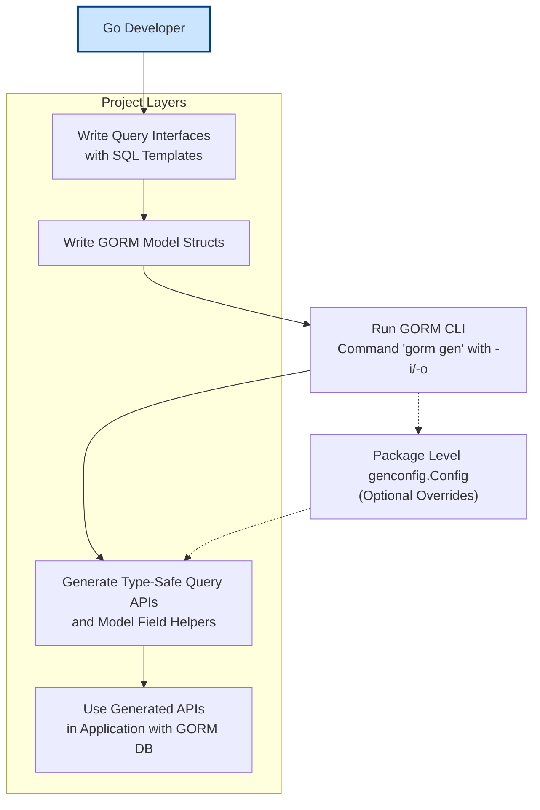

# Integration with GORM & Your Project

Seamlessly connect the power of GORM CLI with your GORM ORM-based Go projects. This page guides you through where the CLI fits in your typical Go project layout, how it integrates with your models and query interfaces, and how to invoke it within your development workflow to unlock type-safe, maintainable data access.

---

## Why This Matters

If you're using GORM ORM for your Go backend, adopting GORM CLI elevates your project by auto-generating robust query APIs and model-driven helpers. This integration eliminates tedious boilerplate, catches errors early at compile time, and aligns your code with idiomatic Go patterns.

You’ll learn how GORM CLI plugs naturally into your existing codebase and how to invoke it so that generated code stays in sync with your models and queries.

---

## How GORM CLI Integrates with GORM ORM

At its core, GORM CLI complements GORM by generating **type-safe query interfaces** and **model-driven field helpers** based on your Go source code:

- **Query APIs**: From your Go interfaces annotated with SQL templates, GORM CLI creates concrete implementations exposing seamless, type-checked query methods.

- **Field Helpers**: From model struct definitions, it generates strongly typed helpers for filtering, updating, and managing associations.

This combination plugs directly into GORM’s `*gorm.DB` objects allowing you to write expressive, fluent queries while gaining compile-time safety and discoverability.


### Typical Project Layout

Your Go project is expected to organize models and query interfaces following typical Go practices:

```
your_project/
  models/           # Your GORM model structs
    user.go
    account.go
  queries/          # Query interfaces with SQL templates
    user_query.go
  generated/        # Directory for generated code (e.g., query implementations)
```

The CLI tool consumes your interface and struct files, then outputs generated code, often in a dedicated directory (default `./g` or configurable).


### Example Workflow Invocation

Invoke the CLI generator from your project root or specific package path:

```bash
gorm gen -i ./queries -o ./generated
```

- `-i` points to the input directory or file containing your interfaces and models.
- `-o` specifies where to place the generated code.

This command parses interfaces with SQL templates and models, applies configurations if present, then writes strongly typed query API code and model field helpers.


### Using Generated Code

After generation, import and use the generated APIs and helpers in your application:

```go
import (
    "your_project/generated"
    "your_project/models"
    "gorm.io/gorm"
)

func FetchUserByID(db *gorm.DB, id int) (models.User, error) {
    // Use generated query API
    return generated.Query[models.User](db).GetByID(context.Background(), id)
}
```

This approach removes manual SQL and repetitive data access code while preserving maximum flexibility in customizing queries with GORM.

---

## Step-by-Step Integration Guide

<Steps>
<Step title="Define Your Models and Query Interfaces">
Create your GORM models and write Go interfaces with SQL template comments that describe your queries.

```go
// models/user.go
package models

type User struct {
  ID   uint
  Name string
  Age  int
}

// queries/user_query.go
package queries

type Query[T any] interface {
  // SELECT * FROM @@table WHERE id=@id
  GetByID(id int) (T, error)
}
```
</Step>

<Step title="Generate Code Using GORM CLI">
Run the CLI generator targeting the directory with your interfaces and models.

```bash
gorm gen -i ./queries -o ./generated
```

This creates concrete query implementations and field helpers under `./generated`.
</Step>

<Step title="Import and Call Generated APIs">
Use the generated package to perform type-safe queries.

```go
import "your_project/generated"

user, err := generated.Query[models.User](db).GetByID(ctx, 1)
if err != nil {
    // handle error
}
```
</Step>

<Step title="Customize with genconfig.Config (Optional)">
Write a package-level config file to override output settings, mappings, includes/excludes.

```go
package queries

import "gorm.io/cli/gorm/genconfig"

var _ = genconfig.Config{
  OutPath: "generated",
  IncludeInterfaces: []any{"Query*"},
}
```
</Step>
</Steps>

---

## Best Practices

- **Keep models and query interfaces close together**

Organizing related models and query definitions in nearby packages or directories helps ease maintenance and improves clarity.

- **Configure `OutPath` thoughtfully**

Choose an output directory for generated code that separates it clearly from handwritten code, avoiding accidental edits.

- **Use `IncludeInterfaces` and `ExcludeInterfaces` to scope generation**

Selective generation accelerates builds and keeps output minimal.

- **Regenerate often**

Run the generator after changing interfaces or models to keep your APIs accurate.

- **Version control generated code cautiously**

Commit generated code if your CI/CD or build processes depend on it; otherwise, consider regenerating during builds.

---

## Common Pitfalls and Troubleshooting

<AccordionGroup title="Troubleshooting Common Issues">
<Accordion title="Generated Code Not Updating">
- Ensure you are running `gorm gen` with the correct `-i` (input) and `-o` (output) paths.
- Check if any `genconfig.Config` files are overriding settings unexpectedly.
- Verify your interface methods have proper SQL template comments.
</Accordion>

<Accordion title="Methods Missing Context Parameter">
- If your interface methods do not declare `context.Context`, the generator automatically injects it.
- Avoid manually inserting `context.Context` in methods to prevent signature mismatch.
</Accordion>

<Accordion title="Compilation Errors After Generation">
- Check that all imported packages for your models and generated code are correctly referenced.
- Validate your model struct tags and `gen` tags, ensuring no conflicts in field mappings.
- Run Go formatting tools to clean generated code.
</Accordion>
</AccordionGroup>

---

## Visual Overview of Integration Flow



This flow highlights how developers create the source input, run the CLI, and consume the output, optionally with configuration.

---

## Next Steps

- Explore [Quickstart: From Models to Type-Safe APIs](overview/features-and-workflows/quickstart-user-journey) for hands-on walkthrough.
- Review [Configuration & Extensibility](overview/features-and-workflows/configuring-generation) to fine-tune generation.
- Dive into [Model-Driven Field Helpers](guides/core-workflows/field-helpers-basics) to master generated helpers for filters and associations.

---

For a deeper understanding of the underlying architecture and the generation workflow, visit [How Does GORM CLI Work? (Architecture Diagram)](/overview/architecture-and-core-concepts/architecture-diagram).


---

### References

- [GORM CLI Overview](overview/introduction-and-value/what-is-gorm-cli)
- [Quickstart Guide](overview/features-and-workflows/quickstart-user-journey)
- [Configuring Generation](overview/features-and-workflows/configuring-generation)
- [Example Models & Queries](examples/query.go, examples/models/user.go)
- [GORM CLI GitHub Repository](https://github.com/go-gorm/cli)

---

Harness the full power of GORM CLI by embedding it into your Go projects—generate code that’s safe, maintainable, and tightly integrated with GORM ORM, boosting your developer productivity with every build and iteration.
