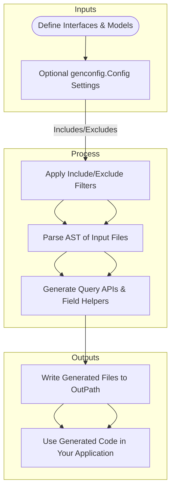

# How GORM CLI Integrates with Your Project

Understanding how GORM CLI fits into your development workflow is essential to leverage its full power in generating type-safe query APIs and model-driven field helpers. This page guides you through the end-to-end process — from writing your Go interfaces and models, through running code generation, to consuming the generated APIs in your application.

---

## Seamless Integration Workflow

GORM CLI acts as a bridge between your data model definitions, query interfaces, and your application code. It automates the creation of strongly typed, fluent APIs that enhance safety and productivity when interacting with databases using GORM.

Here is the natural flow:

1. **Define Interfaces and Models**
   - You start by writing idiomatic Go interfaces with embedded SQL templates via method comments.
   - Simultaneously, you define your Go structs representing database models.
   - This source code serves as the input to GORM CLI.

2. **Configure Optional Generation Behavior**
   - Optionally, place a package-level `genconfig.Config` to control output paths, include/exclude filters, and custom field mappings.
   - This config ensures the generator tailors outputs to your project architecture and coding style.

3. **Run the GORM CLI Generator**
   - Execute `gorm gen` pointing to your interfaces and models.
   - The CLI parses your code, extracting interfaces, methods, and struct fields.
   - It applies any relevant `genconfig` filters for selective generation.
   - Generates two complementary outputs:
     - Type-safe, interface-driven query APIs with fluent SQL builders.
     - Model-driven field helpers for filters, updates, and associations.

4. **Consume the Generated Code**
   - Import the generated packages into your application.
   - Use the fluent, discoverable APIs to write concise, type-safe queries.
   - Benefit from compile-time validation of your queries and updates.

---

## Mapping Inputs, Outputs, and Configuration Hooks

GORM CLI handles multiple input sources and generates corresponding output files, applying configuration settings dynamically through a hierarchical pattern matching system.



### Inputs

- **User Go files:** Interfaces with SQL templates and model structs.
- **Configuration:** Optional `genconfig.Config` that can specify:
  - Output directory (`OutPath`)
  - File-level or package-level generation mode
  - Include or exclude filters for interfaces/structs
  - Field type and Named type mappings (e.g., mapping specific JSON or time fields)

### Processing

- The generator scans your files recursively if you give it a directory.
- Filters are merged from multiple configs respecting priority:
  - Include filters take precedence over exclude.
  - File-level configs apply to single files; package-level apply recursively.
- Parsed AST nodes yield metadata about interfaces and structs.
- The generator enforces method signature and SQL template correctness.

### Outputs

- Generated Go files containing:
  - Interface implementations with concrete, type-safe methods.
  - Structs with strongly typed field helpers for predicates and updates.
- Files are organized maintaining the input package structure under the specified `OutPath`.

---

## User Intent and Benefits

### What You Achieve

- **Type-Safe Queries:** Avoid runtime SQL errors by catching issues at compile time.
- **Fluent Query Building:** Enjoy easy-to-read code using generated fluent APIs.
- **Consistent Up-to-Date Code:** Your generated code always matches your current models and interfaces.
- **Flexible Customization:** Selectively generate code for desired interfaces or structs.

### Real-World Scenario

Imagine you have an interface with a method:

```go
// SELECT * FROM @@table WHERE id=@id
GetByID(id int) (User, error)
```

After generation, you call:

```go
user, err := generated.Query[User](db).GetByID(ctx, 123)
```

This call is typesafe, auto-completed, and guarantees your SQL aligns with method params.

---

## Configuration Hooks and Influence Points

The generator respects configuration hooks embedded in your code via `genconfig.Config`. These enable nuanced control:

- **OutPath:** Keep generated files separate or within your project layout.
- **FileLevel:** Restrict generation scope to a single file or expand to the package subtree.
- **Include/Exclude Filters:** Use patterns or struct/interface literals to finely control what code is generated.
- **Field Mappings:** Customize how Go types map to helper field types.

For example:

```go
var _ = genconfig.Config{
  OutPath: "generated",
  IncludeInterfaces: []any{"Query*"},
  ExcludeStructs: []any{"*DTO"},
  FieldTypeMap: map[any]any{
    sql.NullTime{}: field.Time{},
  },
}
```

This config directs the generator to:

- Put output under `generated/` folder.
- Only generate interfaces whose names begin with `Query`.
- Skip structs matching `*DTO`.
- Map nullable time fields to a specialized field helper.

---

## Practical Tips

- Keep your interface methods well-documented with SQL templates — this is the blueprint for generation.
- Use `genconfig.Config` in packages to handle generation variation across your project.
- Validate your configuration and code using the CLI’s verbose output to troubleshoot mismatches.
- Leverage generated association helpers for relational data operations without writing boilerplate.

---

## Troubleshooting Common Integration Issues

<AccordionGroup title="Troubleshooting Integration Issues">
<Accordion title="Generated Code Not Found by Application">
Check that your `OutPath` aligns with your project’s import path. Ensure your Go modules are aware of the generated package.
</Accordion>
<Accordion title="Methods Missing in Generated Interfaces">
Verify your interface methods include correctly formatted SQL template comments. Missing or malformed templates prevent method generation.
</Accordion>
<Accordion title="Unexpected Types in Generated Field Helpers">
Confirm your `FieldTypeMap` and `FieldNameMap` accurately map your custom or wrapped types to the expected helpers.
</Accordion>
<Accordion title="Config Not Applied to All Files">
If using `FileLevel: true`, configs apply per-file. For package-wide config, use `FileLevel: false` and place the config in a higher directory.
</Accordion>
</AccordionGroup>

---

## Summary

By understanding GORM CLI’s integration workflow, you align your project structures, code, and configuration to effortlessly generate, maintain, and consume type-safe, declarative database query code in your Go projects. This synergy unlocks higher productivity, stronger safety guarantees, and cleaner codebases.

---

## See Also

- [What is GORM CLI?](/overview/introduction-and-value/what-is-gorm-cli) — Understand core capabilities
- [Core Concepts & Terminology](/overview/architecture-and-core-concepts/core-concepts-terminology) — Glossary of key terms
- [Minimal Configuration & Project Setup](/getting-started/first-generation/basic-configuration) — Step-by-step setup guide
- [Generating Query APIs from Interfaces](/guides/getting-started/generating-query-apis) — How to write SQL templates
- [Customizing Generation with Config](/guides/customization-advanced/generation-config) — Detailed config usage

---

## Next Steps

Ready to harness GORM CLI? Start by defining your query interfaces and models, add optional configs for fine-tuning, then generate your first code with the CLI command `gorm gen`. Integrate the generated packages into your application and experience safer, fluent querying today.

---

<Info>
Do remember: GORM CLI is purely a code generation tool. It does not change your runtime database access code other than providing safer and simpler APIs generated from your interfaces and models.
</Info>
