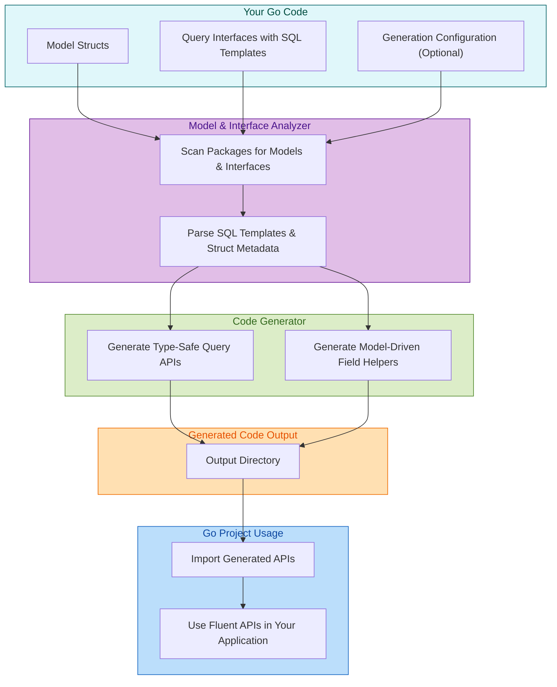

# System Architecture (With Diagram)

## Understanding the Core Workflow of GORM CLI

GORM CLI is designed to streamline the development of Go projects that use the GORM ORM by automating the generation of type-safe query APIs and model-driven field helpers. This page visualizes the key components, their interactions, and the overall flow from your source code definitions through to generated, ready-to-use Go code.

### Why It Matters

Developers want an efficient, reliable way to bridge their Go model definitions and query interfaces to concrete, safe APIs without manual boilerplate. Understanding the system architecture helps you anticipate how your input source code transforms, where configuration fits in, and how generated code integrates back into your project.

---

## High-Level Workflow Overview

At its core, GORM CLI takes your Go code—comprising:

- **Model Structs** (e.g., User, Account)
- **Query Interfaces** (annotated with SQL templates in comments)
- **Generation Configuration** (optional overrides)

It then performs several consecutive steps:

1. **Discovery**: Scans your specified package(s) to identify model structs and interfaces.
2. **Parsing**: Reads SQL templates embedded in interface method comments.
3. **Generation**: Produces type-safe Go code with:
   - Fluent query APIs conforming to your templates
   - Model-driven field helper types for filtering, updates, and associations
4. **Integration**: Outputs the code to your configured directory, ready for import and use in your application.

You seamlessly move from your code definitions to compile-time-safe query APIs without sacrificing development speed or correctness.

---

## Core Components and Their Relationships



---

## Component Descriptions

### 1. Source Code

Your existing Go project codebase containing:
- **Model Structs** that define your database schema in Go.
- **Query Interfaces** with SQL templates embedded as method comments, specifying your intended queries.
- Optional **generation configuration** code that customizes output.

### 2. Model & Interface Analyzer

This component explores your source code to:
- Discover model structs and relationships.
- Parse SQL templates from interface comments.
- Interpret configuration options affecting generation behavior.

This step is crucial to understand your domain and query requirements.

### 3. Code Generator

Transforms parsed data into precise Go code:
- **Query APIs**: Implement methods matching your SQL templates with type safety.
- **Field Helpers**: Generate fluent helpers for model fields and associations allowing concise, safe expressions for filtering and updating.

This ensures driver-level correctness and developer ergonomics.

### 4. Generated Code Output

Writes the generated Go source files into your configured directory, ready for:
- Easy integration importing as a module
- Improving codebase safety and maintainability

### 5. Go Project Usage

Finally, you consume the generated code by:
- Importing the packages where code is generated.
- Using the fluent APIs in your service/business logic to perform queries and updates safely and cleanly.

---

## Practical User Flow Scenario

Imagine you have a `User` model and want to query users by ID and filter by name dynamically:

1. Define your `User` struct and a `Query` interface with methods and SQL templates.
2. Run GORM CLI, which:
   - Reads the struct and interface
   - Generates `generated.Query[User]` with `GetByID(id int)` and `FilterByName(name string)` methods
   - Produces `generated.User` field helpers (e.g., `generated.User.Name.Like()`)
3. In your Go app, import the generated package and write:

```go
// SELECT * FROM users WHERE id=123
u, err := generated.Query[User](db).GetByID(ctx, 123)

// SELECT * FROM users WHERE name LIKE '%jinzhu%'
users, err := gorm.G[User](db).Where(generated.User.Name.Like("%jinzhu%"))..Find(ctx)
```

This flow eliminates manual SQL crafting, boosts type safety, and expedites development.

---

## Tips & Best Practices

- **Organize Your Code**: Keep your model structs and interfaces well organized in packages for easier discovery.
- **Leverage Configuration**: Use `genconfig.Config` to fine-tune generation paths and field mappings.
- **Annotate Intelligently**: Write meaningful SQL template comments to maximize generated methods' expressiveness.
- **Review Generated Code**: Inspect output to understand generated helpers and APIs, ensuring alignment with your expectations.

---

## Troubleshooting Common Issues

- If model or interface changes don't reflect after regeneration, check:
  - Correct package paths
  - No build errors in source
  - Configuration correctness
- Ensure Docker or local MySQL is accessible if you test with database interaction.
- Refer to [Troubleshooting & Common Issues](../../getting-started/essentials/troubleshooting) for detailed steps.

---

For a deeper understanding of how to use the generated APIs, see [Using Type-Safe Query APIs](/guides/getting-started-workflows/using-type-safe-queries) and explore practical examples in the generated output folder.


---

## Summary

The GORM CLI system architecture tightly integrates your Go models and interface definitions with a powerful code generator to produce type-safe, fluent APIs. This ensures robust database querying and modification capabilities with compile-time guarantees and dramatically improved developer productivity.


---

For more details on the underlying concepts and next steps, visit:
- [What is GORM CLI?](/overview/product-intro-and-value/what-is-gorm-cli)
- [Quick Feature Overview](/overview/features-and-workflow-overview/quick-feature-overview)
- [Getting Started Essentials](/getting-started/essentials/prerequisites)


---

<Info>
This page is part of the System Architecture & Core Concepts group, bridging your understandings from product intro to practical code generation workflows.
</Info>