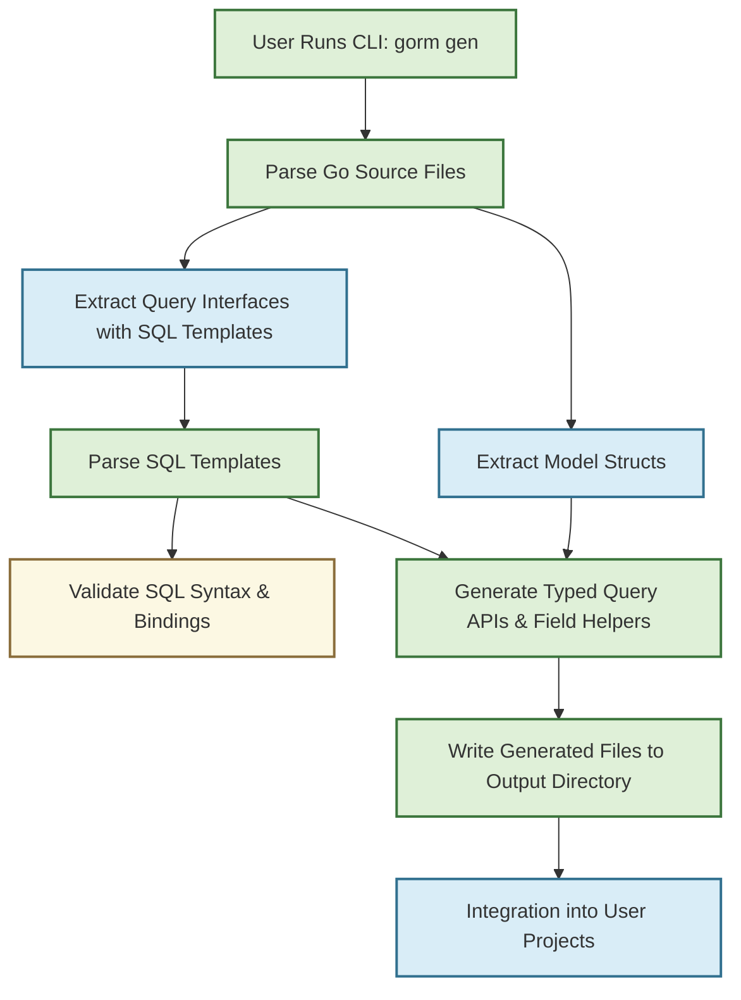

# System Architecture

Experience a clear, visual explanation of how GORM CLI processes your Go source code to produce powerful, type-safe query APIs and model helpers. This System Architecture guide walks you through the full flow—from your initial CLI command, through parsing models and interfaces, processing SQL templates, to generating code ready for seamless integration into your projects.

## Why This Matters to You

Understanding the architecture empowers you to anticipate what happens under the hood each time you run `gorm gen`. This insight will help you:

- Confidently troubleshoot generation issues by knowing each step’s role
- Customize and optimize your code generation workflow
- Leverage GORM CLI’s strengths effectively in your projects

## High-Level Overview

At its core, GORM CLI transforms your Go model structs and SQL-annotated interfaces into ready-to-use, compile-time safe APIs for querying and manipulating your database.

Here’s the simplified flow:

1. **CLI Entry Point:** You invoke the CLI with `gorm gen`, specifying input interfaces and output directories.
2. **File Processing:** The tool parses your Go source files, extracting models and interface methods with raw SQL annotations.
3. **SQL Template Parsing:** It interprets SQL templates embedded in interface comments, resolving placeholders (e.g., `@@table`, `@param`) into parameterized, type-safe queries.
4. **Code Generation:** Finally, it generates Go source files that provide fluent, type-checked APIs and field helpers.

## Detailed Workflow

### 1. CLI Command Execution

The `main.go` file initializes the CLI, registering the `gen` subcommand.

```go
// main.go snippet
rootCmd := &cobra.Command{
  Use:   "gorm",
  Short: "GORM CLI Tool",
}
rootCmd.AddCommand(gen.New())
```

When you run a command like:

```bash
gorm gen -i ./examples -o ./generated
```

The CLI triggers the generation process targeting the specified input path and output directory.

### 2. Parsing Input Files

GORM CLI reads your Go files to discover:

- **Models:** Struct definitions representing database tables.
- **Interfaces:** Query interfaces containing methods annotated with SQL templates.

This step maps your domain model and query logic to the generator’s internal representation.

### 3. Processing SQL Templates and Interfaces

The tool parses the SQL template DSL within interface comments, resolving dynamic elements like:

- `@@table` → model’s table name
- `@param` → method parameters bound safely into SQL
- Conditional blocks such as `{{where}}` and `{{set}}`

It validates template syntax and injects context, enabling flexible, dynamic query generation.

### 4. Code Generation

Based on parsed data, GORM CLI generates:

- **Query API Implementations:** Concrete methods that implement your interface, returning type-safe results.
- **Model Field Helpers:** Strongly typed predicates and setters for queries and updates.

These generated files compile alongside your project for seamless integration.

## Visual System Architecture Diagram



## Practical User Flow Example

Consider the typical user journey:

1. **You define your model structs** in Go (e.g., `User`, `Pet`).
2. **You write SQL-annotated interfaces** with methods like `GetByID(id int) (User, error)`.
3. **Invoke `gorm gen`** with input and output paths, triggering parsing and generation.
4. **Use the generated APIs** in your code for type-safe, fluent database operations.

This flow assures that your query logic is kind to both the compiler and your runtime.

## Tips and Best Practices

- Keep your interfaces expressive with SQL templates to fully leverage generation capabilities.
- Use configuration files (`genconfig.Config`) to tailor generation per package or struct needs.
- Organize your input files so models and interfaces are easy to locate by the tool.
- Verify generated code with automated tests to catch mismatches or template issues early.

## Troubleshooting

If code generation fails or produces unexpected output:

- Confirm your input path points to valid Go files containing your models and interfaces.
- Check SQL template syntax carefully—misplaced placeholders or blocks cause parsing errors.
- Ensure Go source files compile without errors separately.
- Examine CLI error messages; they often indicate file or template issues.

## Next Steps

Once familiar with the architecture, you’re ready to:

- Explore [Core Concepts & Terminology](/overview/architecture-and-core-concepts/core-concepts-and-terminology) to deepen understanding.
- Dive into [Quick Feature Overview](/overview/architecture-and-core-concepts/feature-overview) to see generation outputs.
- Start your first generation with [Quickstart Overview](/getting-started/first-steps/quickstart-overview).

Together, these guides ensure you exploit GORM CLI's full developer productivity potential.

---

For the full CLI command and generation options, see the `gen` subcommand implementation in [internal/gen/gen.go](https://github.com/go-gorm/cli/blob/main/internal/gen/gen.go).