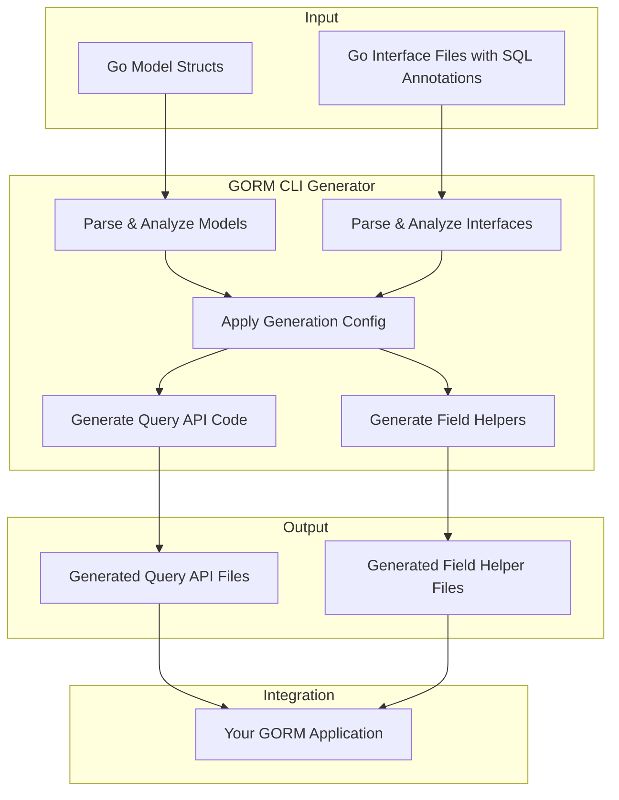

# System Overview (Architecture Diagram)

GORM CLI streamlines your Go application's data access by analyzing your codebase to generate type-safe query APIs and model-driven field helpers. This page provides a clear, visual map of how the GORM CLI works internally and integrates with your existing GORM projects, breaking down the main components and their interactions.

---

## At a Glance: How GORM CLI Works

GORM CLI takes your annotated Go interfaces and model definitions as input, processes them through a generator, and produces seamlessly integrated type-safe APIs and field helpers. These outputs empower developers with fluent, compile-time-safe methods to query and update databases effortlessly.

### Key Components and Workflow

- **Source Inputs**: Your Go interface files contain raw SQL templates annotated in comments, and your Go model structs define database schema and relationships.

- **Processing Engine (Generator)**: The core GORM CLI generator parses, analyzes, and interprets your code annotations and struct fields. It applies configurable generation rules to produce two outputs:
  - **Query API code**: Interface-driven, type-safe methods generated from query interfaces using SQL templates
  - **Field helpers**: Generated helpers mapped from model fields and associations supporting filtering, updating, and advanced association management

- **Integration Output**: The generated code files are written to your specified output directory. You then incorporate these into your GORM application to replace manual SQL and enhance safety and discoverability.

---

## Why This Matters

By visually breaking down these internal components, this diagram clarifies the value GORM CLI adds to your development workflow:

- **Reduced Boilerplate**: No need to hand-write repetitive query and field helper code
- **Compile-time Safety**: Avoid runtime SQL errors via type-checked generated methods
- **Fluent Developer Experience**: Explore database operations through strongly typed, discoverable APIs
- **Seamless GORM Integration**: Generated output extends your existing GORM models without friction

---

## Visual Architecture Diagram

---

## Step-by-Step User Flow

1. **Prepare your interfaces and models**
   - Define query interfaces with SQL templates in Go interface files.
   - Define your data schema and relationships in Go structs as GORM models.

2. **Run the generator**
   - Use the `gorm gen` CLI command with your interface files as input.
   - The generator parses, analyzes, and applies any user-specified or default config.

3. **Review generated code**
   - Output files contain ready-to-use, type-safe query APIs and field helpers.
   - These files live alongside your application code and are designed for immediate use.

4. **Integrate and use in your GORM application**
   - Call generated API methods for queries, filters, updates, and association operations.
   - Leverage model-driven field helpers for safe, expressive database interaction.

---

## Practical Tips

- **Use generation config to customize behavior**: You can create `genconfig.Config` variables in your interface package to control output paths and tailoring rules.

- **Keep your interfaces clean and annotated properly**: The SQL template annotations in comments are vital to generate correct and efficient query methods.

- **Explore model associations thoroughly**: GORM CLI generates helpers for various relation types (has one, has many, belongs to, many2many) allowing rich association operations.

- **Automate generation in your build pipeline** to ensure generated APIs stay in sync with code and models.

---

## Troubleshooting Common Scenarios

<AccordionGroup title="Troubleshooting Common Issues with GORM CLI Processing">
<Accordion title="Generated Code Not Found or Outdated">
Ensure the generator runs with the correct input path and output directory is checked in your codebase. Use the `-i` and `-o` flags properly.
</Accordion>
<Accordion title="SQL Templates Not Generating Correctly">
Verify your interface comments follow the documented SQL template DSL syntax. Avoid syntax errors in conditional blocks and placeholders.
</Accordion>
<Accordion title="Association Helpers Missing">
Confirm your model structs define associations with proper GORM tags and naming conventions.
</Accordion>
</AccordionGroup>

---

## Summary

This page visually and conceptually maps how GORM CLI processes your Go code to generate powerful, type-safe query APIs and field helpers, showing how the components connect and feed into your GORM application for safer and more maintainable database interaction.

---

## Next Steps

- Explore the [Integration Workflow](https://docs.example.com/overview/architecture-and-core-concepts/integration-workflow) to see how generated code fits into the larger application lifecycle.
- Dive into [Getting Started Guides](https://docs.example.com/getting-started/first-generation/first-generation-command) to learn how to run your first code generation.
- Check out [Customizing Generation](https://docs.example.com/guides/customization-advanced/generation-config) to tailor the generator to your project needs.

---