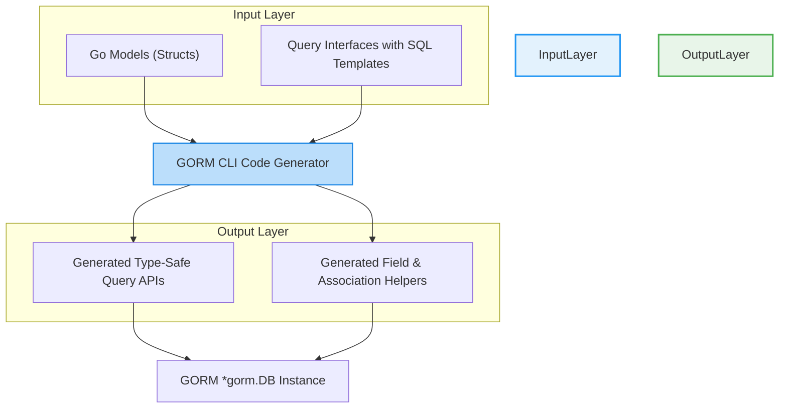

# System Architecture Overview

## Understanding How GORM CLI Works Under the Hood

GORM CLI transforms your Go-based models and query interfaces into powerful, type-safe APIs that streamline database interaction with GORM. This page guides you through the architecture and workflow of GORM CLI, showing how your input flows through the generation process and integrates seamlessly with GORM, enabling safer, fluent queries and operations.

---

## The Journey from Your Code to Generated APIs

At its core, GORM CLI operates on two input types: your Go model structs and your query interfaces with embedded SQL templates. The CLI parses these inputs, generates corresponding Go code, and produces two complementary outputs:

- **Type-safe query API implementations** for your query interfaces.
- **Model-driven field and association helpers** to ease filtering, updating, and creating related records.

This process eliminates common runtime pitfalls by shifting error detection to compile-time and provides a fluent, discoverable API experience.

### High-Level Workflow



## Key Components Explained

### 1. Go Models (Structs)
These define the schema of your database entities including fields and relationships. GORM CLI analyzes them to generate field helpers that simplify building filters, creating records, and managing associations.

### 2. Query Interfaces with SQL Templates
You write interfaces in Go with methods annotated by SQL templates using a flexible DSL (Directives like `@@table`, `@param`, `{{where}}`). GORM CLI parses these to generate concrete implementations that execute type-safe, templated SQL queries.

### 3. GORM CLI Code Generator
This component drives the transformation. It parses your input models and interfaces, applies the SQL template DSL, and generates two things:

- **Query API implementations** matching your interfaces — ensuring your method takes parameters and returns results with full type safety.
- **Field helpers** that correspond to your model fields and associations.

### 4. Generated Query APIs
Built on top of `gorm.io/gorm`, these APIs expose fluent, strongly typed methods to execute common and complex database operations without manual SQL or boilerplate.

### 5. Generated Field & Association Helpers
These helpers abstract predicate creation (e.g., `.Eq()`, `.Like()`), updates with zero values or expressions, and operations on various associations (`has one`, `has many`, `belongs to`, `many2many`). They encode correct database semantics, reducing errors and developer load.

### 6. Integration with GORM
The generated code integrates directly with your existing GORM `*gorm.DB` instances. Queries and mutations flow through GORM’s context and middleware, preserving transactionality and configurability.

---

## How Components Interact: A User-Centric Story

Imagine you start by defining a `User` model with fields and associations and write a `Query` interface to fetch users by ID or filtered conditions. When you run `gorm gen`, the code generator:

- Parses your `User` struct.
- Creates field helpers such as `User.Name.Eq("alice")`.
- Parses methods like `GetByID` in your interface, reads the SQL template comment, and generates a concrete implementation with a method that executes type-safe SQL.

Post-generation, your workflow improves dramatically:

- Instead of crafting raw SQL, you write fluent Go calls.
- The compiler validates input-output types.
- Your IDE offers autocomplete for field predicates and association operations.

This lets you focus on business logic rather than boilerplate.

---

## Technical Highlights — User-Focused

- **Model-driven helpers** come from analyzing all basic fields (`int`, `string`, `bool`, nullable types) and associations in your structs.
- **Query API methods** correspond 1:1 with your interface methods and accept parameters mapped into SQL templates safely.
- **Association operations** like `Create`, `Update`, `Unlink`, and `Delete` are accessible as helper methods on generated fields, aware of cardinality.

### Example

```go
// Generated query usage example
u, err := generated.Query[User](db).GetByID(ctx, 123)

// Generated field predicate
users, err := gorm.G[User](db).
    Where(generated.User.Age.Gt(18)).
    Find(ctx)

// Association creation example
err := gorm.G[User](db).
    Set(
      generated.User.Name.Set("alice"),
      generated.User.Pets.Create(generated.Pet.Name.Set("fido")),
    ).
    Create(ctx)
```

---

## Troubleshooting Tips

- **If code does not generate**: verify your interfaces contain properly formatted SQL template comments.
- **Generated code compilation errors**: check your models for unsupported or misconfigured fields.
- **Runtime query errors**: ensure your SQL templates use correct placeholders and conditional directives per the template DSL.

---

## Next Steps
- Explore the [Integration & Workflow with GORM](../architecture-and-integrations/integration-workflow) to see how generated code fits into daily development.
- Visit [First Code Generation Workflow](../../getting-started/first-codegen-workflow/prepare-models-interfaces) for a step-by-step guide to start generating code from your models and interfaces.

---

## Summary
This page detailed how GORM CLI processes your Go source (models and query interfaces), generates the type-safe query APIs and field helpers, and integrates them with GORM to empower safe, fluent data access. By understanding this architecture, you can better leverage GORM CLI’s code generation to accelerate development with confidence.

---

For full source and examples, visit the [GORM CLI GitHub repository](https://github.com/go-gorm/cli).

---