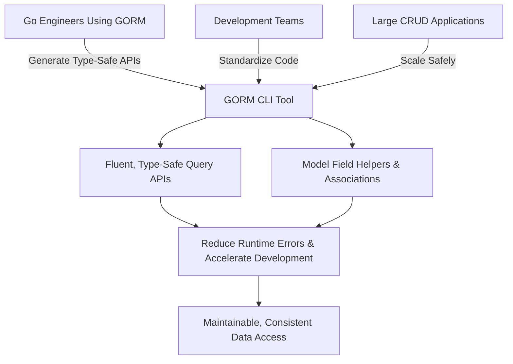

# Target Audience & Use Cases

## Unlocking Greater Productivity and Safety for Go Developers with GORM CLI

GORM CLI is designed specifically for Go engineers and development teams who use GORM and seek a superior developer experience with database operations. This page clarifies exactly who benefits most from the tool and outlines the common scenarios where GORM CLI empowers users to build scalable, maintainable applications faster and with less risk.

---

## Who Should Use GORM CLI?

### 1. Go Engineers Working with GORM

If you write Go applications that use GORM for ORM and database interactions, GORM CLI provides a type-safe, fluent API for your queries and field operations. Instead of crafting raw SQL strings or verbose query logic, you get compiler-checked code generated from your interface definitions and model structs. This reduces runtime errors and accelerates development.

### 2. Development Teams Standardizing Data Access

Teams striving to enforce consistent, shared data access patterns across projects benefit immensely. By defining query interfaces and models centrally, the whole team works from the same generated APIs and helpers, ensuring:

- Consistent query implementation
- Reduced boilerplate
- Easier code reviews and debugging

### 3. Projects Prioritizing Scalable and Maintainable Codebases

When building large applications or services with extensive CRUD operations, maintaining raw queries and field accessors manually becomes costly and error-prone. GORM CLI automates generation of these tedious parts, enabling rapid development while keeping code DRY and easier to evolve over time.

---

## Common Use Cases Where GORM CLI Excels

### Rapid API Prototyping and Iteration

Developers can swiftly define type-safe query interfaces reflecting API requirements, generate the code, and immediately leverage ready-to-go, fluent APIs for database interaction.

**Example:**

```go
// Define query interface
// SELECT * FROM @@table WHERE id=@id
GetByID(id int) (T, error)

// Generate code and use:
user, err := generated.Query[User](db).GetByID(ctx, 123)
```

### CRUD-heavy Applications

Whether you’re creating, updating, or filtering large data sets, GORM CLI offers helpers representing model fields and associations to build precise queries and updates.

**Example:**

```go
// Update a user's pet name where conditions match
err := gorm.G[User](db).
  Where(generated.User.ID.Eq(1)).
  Set(generated.User.Pets.Where(generated.Pet.Name.Eq("fido")).Update(generated.Pet.Name.Set("rex"))).
  Update(ctx)
```

### Reducing Runtime Errors Through Compile-Time Safety

By generating query APIs from strongly typed Go interfaces and embedding SQL templates checked at generation time, GORM CLI helps catch mistakes early—well before deployment.

### Standardized, Reusable Field Helpers

GORM CLI auto-generates field helper structs and methods for filtering, ordering, and association management. This reduces repetitive code and encourages reuse.

---

## Benefits at a Glance

- **Type Safety:** Catch query errors early with compile-time checks.
- **Maintainability:** Keep database code DRY and consistent across your codebase.
- **Productivity:** Generate helper code instantly — no more hand-written boilerplate.
- **Scalability:** Designed for teams and large projects requiring clear data access conventions.

---

## Before & After: Developer Workflow Comparison

| Before GORM CLI | With GORM CLI |
|-----------------|--------------|
| Manually writing raw SQL queries with risk of mistakes | Define interfaces with SQL templates; generate type-safe code automatically |
| Hand-crafted field accessors and query helpers | Auto-generated, discoverable field helpers for filtering, updates, and associations |
| Scattered query logic, harder to standardize and review | Centralized interface definition; consistent API across team |

---

## Ready to Get Started?

Take the next step by exploring the [Integration & Workflow with GORM](./integration-workflow) documentation to learn how to define your models and SQL-annotated query interfaces, execute the code generator, and start using your generated type-safe APIs today.

<Tip>
For teams, consider adopting configuration options detailed in the [Basic Configuration Options](../../getting-started/first-codegen-workflow/basic-configuration-options) to tailor generation for your project’s structure and needs.
</Tip>

---

## Related Documentation

- [What is GORM CLI?](./what-is-gorm-cli) — Understand the core purpose and architecture
- [Product Value & Benefits](./value-prop-and-benefits) — Deep dive into how GORM CLI accelerates Go development
- [Integration & Workflow with GORM](./integration-workflow) — Hands-on guidance on incorporating GORM CLI
- [First Code Generation Workflow](../../getting-started/first-codegen-workflow/prepare-models-interfaces) — Stepwise instruction for generating your first code

---

## Summary Diagram: User Groups and Typical Workflows



---

Embrace GORM CLI to move beyond error-prone hand-written queries. Gain confidence, speed, and consistency by generating the code you need — automatically and safely.