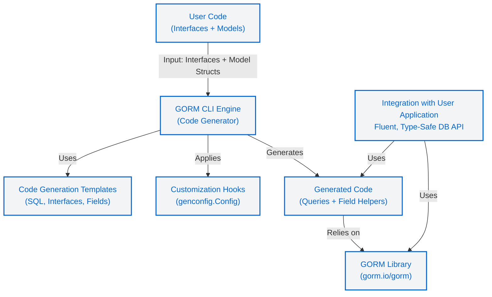

# System Architecture Diagram

Visualize how GORM CLI orchestrates your Go code, generation engine, templates, and resulting output to create robust, type-safe query APIs integrated with GORM. This diagram reveals the components and their relationships that empower you with fluent, compile-time checked database access.

---

## At a Glance: Understanding the Architecture

GORM CLI transforms your Go interfaces (containing SQL templates) and model structs into generated code, producing two complementary artifacts:

- **Interface-Driven Query APIs** for type-safe, expressive queries
- **Model-Driven Field Helpers** that support filtering, updating, and associations

This process is powered by the CLI engine leveraging customizable templates and configuration hooks. The generated code seamlessly plugs into your existing GORM project, delivering a fluent, discoverable API.

---

## Architecture Components and Workflow Overview



---

## Detailed Flow Description

### 1. User Source Code
Bring your **Go interfaces** that define database queries via SQL templated comments alongside your **model structs** that describe your schema.

These inputs form the blueprint for generating type-safe query methods and strongly-typed field helpers.

### 2. GORM CLI Engine
Runs the `gorm gen` command that:

- **Parses** your input Go code,
- **Processes** interfaces, methods, and structs into an AST,
- **Applies** any package-level or file-level configuration overrides,
- **Invokes** templates to convert those parsed definitions into Go source files.

The engine handles everything needed to convert your domain code into maintainable, type-safe querying APIs.

### 3. Code Generation Templates
Templates define how generated code files look:

- Generate **interface implementations** reflecting your query API signatures, injecting SQL templates into methods.
- Create **field helper structs** with typed methods for filtering, updating, and working with associations.

These templates encapsulate best practices for creating fluent, error-resistant APIs.

### 4. Configuration Hooks
Use the `genconfig.Config` struct in your packages to customize generation behavior:

- Specify output paths,
- Include or exclude specific interfaces or structs,
- Map Go types or struct tags to custom field helpers.

This ensures flexibility for different codebases and use cases.

### 5. Generated Code Output
Produces files that:

- Implement your query interfaces with type-safe method signatures,
- Declare strongly typed model field helpers,
- Integrate tightly with GORM's fluent DB API for composition,
- Guarantee compile-time checks to prevent runtime SQL errors.

### 6. Integration into Your Application
Simply import the generated package in your projects. Use the generated query and field helper methods for:

- Constructing complex filters,
- Performing safe updates,
- Managing associations,
- Writing readable, maintainable, and verified database interactions.

---

## Practical Example

Suppose you have:

```go
// User-defined query interface
// SELECT * FROM @@table WHERE id=@id
type Query[T any] interface {
  GetByID(id int) (T, error)
}

// User model struct
type User struct {
  ID   uint
  Name string
}
```

Running GORM CLI generates:

```go
func QueryQuery[T any](db *gorm.DB, opts ...clause.Expression) _QueryInterface[T] {
  return _QueryImpl[T]{Interface: gorm.G[T](db, opts...)}
}

func (e _QueryImpl[T]) GetByID(ctx context.Context, id int) (T, error) {
  // Generated SQL with parameter binding
}

var User = struct {
  ID   field.Number[uint]
  Name field.String
}{
  ID: User.ID.WithColumn("id"),
  Name: User.Name.WithColumn("name"),
}
```

You get strongly typed, discoverable `QueryQuery`, `GetByID` method, and typed field helpers for `User` fields.

---

## Best Practices & Tips

- **Keep your interfaces clean and focused**: Write query methods with clear SQL templates.
- **Organize models and queries per package**: Facilitates config-driven selective generation.
- **Use `genconfig.Config` to tailor generation**: Control output paths, inclusion/exclusion patterns, and type mappings.
- **Leverage generated field helpers**: Build composable, type-safe GORM queries and updates.
- **Run generation as part of your build or CI**: Ensures generated code stays in sync.

---

## Troubleshooting Common Pitfalls

<AccordionGroup title="Common Issues and Solutions">
<Accordion title="Generated Code Not Found or Outdated">
Ensure you have run `gorm gen -i <input> -o <output>` after every interface or model change. Check your `genconfig.Config` for correct `OutPath`.
</Accordion>
<Accordion title="Compilation Errors Due to Missing Field Helpers">
Verify field type mappings in `genconfig.Config`. If your model uses custom Go types or tags, map them to known field helpers.
</Accordion>
<Accordion title="Query Methods Missing Context Parameter">
GORM CLI automatically injects `context.Context` if missing. If you see irregularities, ensure your interface method signatures follow expected patterns.
</Accordion>
<Accordion title="Confusing Output Directory Structure">
Output directory mirrors input structure by default. Check your `FileLevel` config to control per-file or per-package generation.
</Accordion>
</AccordionGroup>

---

## Next Steps

- Explore the [How GORM CLI Works: Architecture Overview](/overview/architecture-concepts/architecture-overview) for a deeper understanding of the internal mechanism.
- Try the [Quick Start: From Models to Queries](/overview/quickstart-features/quickstart-workflow) to generate your first type-safe APIs.
- Consult the [Interface-Driven Query APIs: From Template to Usage](/guides/query-and-model-helpers/interface-driven-queries) guide for advanced templating.

---

By mastering the components and flow illustrated here, you unlock GORM CLI's full potential for safe, scalable, and maintainable database interactions in Go.


---