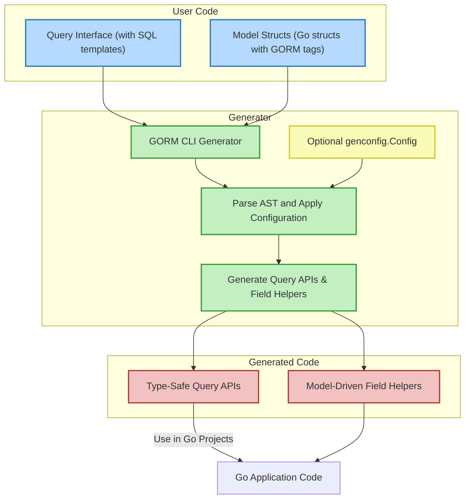

# Architecture Overview

GORM CLI is a powerful code generation tool designed to transform your Go codebase by generating type-safe query APIs alongside model-driven field helpers. This architecture overview provides a clear visualization of how GORM CLI processes your user-defined Go interfaces and model structs to produce tailored, compile-time safe database APIs that seamlessly integrate with your Go applications.

---

## High-Level Architecture

At its core, GORM CLI operates as a code generator that reads your source code—particularly interfaces with SQL annotations and model struct definitions—and produces strongly-typed, idiomatic Go code to facilitate efficient and safe database access.

The process can be broken down into three primary stages:

1. **Input Source Code**
   - User-provided **Query Interfaces** with embedded SQL templates
   - User-defined **Model Structs** representing database tables and relationships

2. **Code Generation Engine**
   - Parses interfaces and structs via Go’s abstract syntax tree (AST)
   - Applies optional configuration (`genconfig.Config`)
   - Generates two main output types:
     - *Type-safe query APIs* for executing complex, templated SQL queries
     - *Model-driven field helpers* that simplify filtering, updating, and association management

3. **Generated Output**
   - Fluent, discoverable Go APIs
   - Compile-time safety in database operations
   - Seamless integration with existing GORM-based projects

This workflow empowers developers to write less boilerplate while improving correctness and maintainability.




---

## Detailed Flow

### 1. Defining Query Interfaces and Models

Users start by writing Go interfaces that describe database queries using standard Go function signatures, augmented by SQL templating in method comments. These queries include placeholders like `@@table`, `@param`, and dynamic conditionals expressed in the SQL template DSL.

Concurrently, users define standard GORM model structs to represent database tables, complete with fields, associations, and GORM tags for relationships and serialization.

### 2. Command-Line Invocation

The GORM CLI is invoked with the `gen` subcommand specifying:
- The input directory or file containing query interfaces and model structs
- The output directory where generated code will be written

```bash
gorm gen -i ./examples -o ./generated
```

### 3. Parsing and Configuration Application

Under the hood, the generator parses Go source files into an Abstract Syntax Tree (AST), extracting interfaces, methods, documentation, and struct fields. It detects optional generation configuration (`genconfig.Config`), enabling customization such as:
- Output paths
- Field type mappings
- Inclusion/exclusion filters

This step ensures that the generated code fits the user’s requirements and project standards.

### 4. Code Generation

Using embedded templates, GORM CLI generates:

- **Query APIs:**
  - Implementations of interfaces with concrete methods
  - Methods perform query compilation, parameter binding, and query execution
  - Support for complex templated queries, dynamic where/set clauses

- **Field Helpers:**
  - Typed field definitions corresponding to model struct fields
  - Helpers for predicates (`Eq`, `Like`, `IsNull`, etc.) and updates (`Set`, `Incr`, `SetExpr`)
  - Association helpers for managing related objects (`Create`, `Update`, `Unlink`, `Delete` operations)

### 5. Integration into Your Go Application

The output code provides a fluent, type-safe API interface for interacting with your database using the GORM ORM. Developers gain:

- Compile-time safety reducing bugs from SQL injection or incorrect queries
- Improved code discovery and autocomplete support
- Streamlined complex queries and association management


---

## Practical Benefits

- **Eliminates Boilerplate:** Auto generates repetitive query and field helper code
- **Improves Safety:** Type safety ensures SQL queries match Go types at compile time
- **Supports Complex Queries:** SQL template DSL allows advanced conditional logic
- **Streamlines Associations:** Built-in helpers simplify creation, updates, and deletions across relationships
- **Customizable:** Flexible configuration to adapt to project naming and structure standards


---

## Example of the Generation Flow

Imagine you write a query interface:

```go
// Query[T any] defines type-safe queries for User model
 type Query[T any] interface {
   // SELECT * FROM @@table WHERE id=@id
   GetByID(id int) (T, error)
   
   // UPDATE @@table
   // {{set}}
   //   {{if user.Name != ""}} name=@user.Name, {{end}}
   // {{end}}
   // WHERE id=@id
   UpdateInfo(user User, id int) error
 }
```

And your `User` model:

```go
type User struct {
  ID   uint
  Name string
  Age  int
}
```

Using GORM CLI, you run the generator specifying input and output paths. The generator outputs:

- An implementation of `Query[T]` with methods like `GetByID` and `UpdateInfo` that embed this SQL logic.
- A `User` field helper struct enabling expressions like `generated.User.Name.Eq("alice")` for filtering.

This code plugs directly into your app with usage like:

```go
user, err := generated.Query[User](db).GetByID(ctx, 123)
```

The result is concise, safe, and easy to maintain SQL-interaction code.

---

## Tips for Success

- **Define clear interfaces:** Use meaningful method names and SQL comments
- **Leverage the configurable generation:** Use `genconfig.Config` to control output structure and field mappings
- **Model relationships carefully:** Associations generate powerful helpers but require correctly annotated structs
- **Use template DSL thoughtfully:** Take advantage of conditional logic for dynamic queries
- **Keep generation output under version control:** Treat generated code as part of your codebase

---

For more details on each step of this architecture and to deepen your understanding, see related documentation in the [Core Concepts & Terminology](../core-concepts-terminology), [Using Generated APIs](../../guides/core-workflows/using-generated-apis), and [Customizing Generation Configuration](../../guides/advanced-features-patterns/customizing-generation-config) pages.

---

<Info>
This page focuses on the overall architecture and flow, not internals of the generator or usage details, which are covered elsewhere.
</Info>
