# How GORM CLI Works: Architecture Overview

GORM CLI revolutionizes how Go developers build type-safe, fluent database query APIs by parsing your Go interface definitions with embedded SQL templates and your model structs. This page explains the architecture behind the GORM CLI generation process, illustrating how a single CLI command analyzes your project files, applies configurable rules, and generates seamless, context-aware Go code that integrates directly with GORM.

---

## What Is This Page About?

This documentation focuses on the internal workflow and architecture of the GORM CLI code generation. It explains how the CLI parses project source files, extracts Go interfaces with SQL annotations and model structs, and produces two core artifact sets:

- **Type-safe query APIs:** Generated from your Go interfaces annotated with SQL templates.
- **Model field helpers:** Generated from your model structs to simplify filters, updates, and associations.

By understanding this, you will appreciate how easily GORM CLI connects your source code with powerful, compile-time checked database access, and how configurable rules shape the generated output.

---

## Core Purpose: Making Query Code Generation Reliable and Developer-Friendly

Manual SQL query code can be repetitive, error-prone, and detached from your Go types. GORM CLI removes this friction by automating the generation of type-safe query interfaces and expressive field helpers:

- **Reduces boilerplate and mistakes:** By generating code that adheres strictly to your Go types and SQL templates.
- **Seamlessly integrates with your models:** The generated helpers follow your struct fields and associations.
- **Runs with a simple CLI:** One command scans your codebase, applies config rules, and emits ready-to-use code.

This architecture ensures that your database queries are strongly typed and maintainable without sacrificing the flexibility of raw SQL where needed.

---

## Architecture Overview

At a high level, GORM CLI's architecture can be visualized as a pipeline with clear stages of parsing, analysis, and code generation:

1. **Source Parsing:**
   - The CLI scans the input directory or file.
   - It parses Go files to extract Abstract Syntax Trees (AST).
   - Interfaces with annotated SQL templates and model structs are identified.

2. **Configuration Application:**
   - Configuration rules, declared optionally using `genconfig.Config`, tailor which interfaces and structs to include or exclude.
   - Custom field mappings and generation options are applied at this stage.

3. **Code Generation:**
   - Two sets of Go code are produced:
     - Query API interfaces and their concrete implementations with methods derived from interface signatures and SQL comments.
     - Field helper structs for all relevant fields and associations, enabling fluent query building.

4. **Output:**
   - Well-formed, idiomatic Go code is written to the configured output directory.
   - Formatting and imports are automatically handled.

---

## Key Components and Data Flow

```mermaid
flowchart TD

  CLICommand["GORM CLI Command (gorm gen -i <input> -o <output>)"] --> Parser["AST Parser & Analyzer"]
  Parser --> ConfigApplier["Configuration Application"]
  ConfigApplier --> Generator["Code Generator"]
  Generator --> FileOutputs["Generated Go Files (Query APIs + Field Helpers)"]

  subgraph Parsing
    Parser --> GoInterfaces["Go Interfaces with SQL Templates"]
    Parser --> ModelStructs["Model Structs"]
  end

  subgraph Configurable Filters
    ConfigApplier --> InterfaceFilters["Include/Exclude Interfaces"]
    ConfigApplier --> StructFilters["Include/Exclude Structs"]
    ConfigApplier --> FieldMappings["FieldTypeMap & FieldNameMap"]
  end

  subgraph Code Generation Details
    Generator --> QueryCode["Query API Implementation"]
    Generator --> FieldHelperCode["Field & Association Helpers"]
  end

  %% Styling
  classDef component fill:#f9f9f9,stroke:#333,stroke-width:1px;
  class CLICommand,Parser,ConfigApplier,Generator,FileOutputs,GoInterfaces,ModelStructs,InterfaceFilters,StructFilters,FieldMappings,QueryCode,FieldHelperCode component;
```



This flow illustrates the following:
- The CLI command orchestrates the process.
- Source files are parsed to extract relevant interfaces and struct definitions.
- Configurations refine what is processed and how fields are mapped.
- The generator produces two main outputs: strongly typed query interfaces and model-driven field helpers.

---

## How Parsing Works

- The **Generator** walks over each Go file in the input path.
- It uses Go’s `go/ast` package to parse files and locate interface declarations and struct types.
- Interfaces are scanned for methods annotated with SQL template comments, which become the basis for type-safe queries.
- Structs are analyzed field-by-field to generate helpers:
  - Basic types map to specific helper types (string, time, number, etc.).
  - Associations are transformed into struct or slice helper types for relationship management.

This parsing is highly contextual and aware of Go scope, packages, and imports to maintain correctness.

---

## Configuration Layer

You can optionally declare `genconfig.Config` objects in your packages to control generation behavior. This includes:

- **Output directory override** for package-specific separation.
- **FieldTypeMap and FieldNameMap** to customize field helper types.
- **Include/Exclude lists** for interfaces and structs, enabling granular control.
- **FileLevel setting** to precisely control generation scope.

Configuration merges and filters are applied automatically during code generation.

---

## Generated Code Structure

### Query API Generation

- For each Go interface, a matching concrete implementation type is generated.
- Methods annotated with SQL templates are implemented with generated code executing those queries safely.
- Parameters and return types align exactly with your original signatures, extended with optional context injection.

### Field Helper Generation

- Each struct field gets a helper property representing its type and column.
- Basic fields provide predicate and setter methods (e.g., `Eq()`, `Set()`, `Between()`).
- Associations yield struct or slice helpers for create, update, unlink, and delete semantics.

Example snippet for a query interface and helpers (emulated):

```go
func Query[T any](db *gorm.DB, opts ...clause.Expression) QueryInterface[T] {
    return QueryImpl[T]{Interface: gorm.G[T](db, opts...)}
}

type QueryInterface[T any] interface {
    GetByID(id int) (T, error)
    FilterByNameAndAge(name string, age int)
}

type QueryImpl[T any] struct {
    gorm.Interface[T]
}

func (e QueryImpl[T]) GetByID(id int) (T, error) {
    // Generated SQL execution with parameter binding
}

var UserFields = struct {
    ID   field.Number[uint]
    Name field.String
}{
    ID:   field.Number[uint]{}.WithColumn("id"),
    Name: field.String{}.WithColumn("name"),
}
```

---

## Why Should You Care?

Understanding this architecture reveals how GORM CLI delivers:

- **Full automation and correctness:** Your type definitions and query annotations become executable code.
- **Reduced errors:** Compile-time checks rather than runtime SQL string errors.
- **Seamless GORM integration:** The generated APIs extend GORM’s features with enhanced type safety.
- **Customizability:** Configurable generation adapts to your project standards and field usage.

Armed with this architectural insight, you’ll know exactly how your inputs translate into powerful generated Go code.

---

## Getting Started Preview

To try this architecture in action:

1. Prepare Go interfaces with SQL templates and your model structs in a package.
2. Run the CLI command:

```bash
gorm gen -i ./path/to/your/code -o ./generated
```

3. Explore the generated code, which will include:
   - Typed query interfaces matching your annotated methods.
   - Struct field helpers for building filters, updates, and associations.

4. Use the generated APIs directly in your applications with confidence.

For detailed tutorials on writing interfaces, configuring generation, and using output, consult the linked documentation sections.

---

# Additional Resources

- [What is GORM CLI?](../overview/introduction-value/what-is-gorm-cli) for product introduction
- [Interface-Driven Query APIs: From Template to Usage](../../guides/query-and-model-helpers/interface-driven-queries) for method annotation and usage patterns
- [Model Field Helpers: Filters, Updates, and Predicates](../../guides/query-and-model-helpers/model-driven-field-helpers) for field helper usage
- [Generation Workflow Overview](../../concepts/core-architecture/generation-workflow) for more on processing steps

---