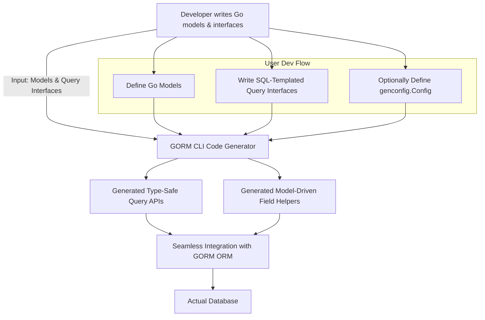

# Core Concepts & Terminology

Unlock the power of GORM CLI by mastering its foundational concepts and terminology. This guide breaks down the essential abstractions that make your database access both safer and more productive: interface-driven query APIs, model-driven field helpers, associations, and the flexible configuration system that shapes code generation.

---

## Interface-Driven Query APIs

### What Are They?
Interface-driven query APIs are Go interfaces where methods are annotated with SQL templates. From these, GORM CLI generates concrete, type-safe query methods automatically.

### Why They Matter
Instead of handcrafting raw SQL or repeating query logic throughout your code, you write an interface that expresses queries with intuitive method signatures. The CLI generates the implementation, offering compile-time safety and fluent, discoverable APIs that keep your code clean and robust.

### Core User Flow
1. Define Go interfaces with methods commented using SQL templates.
2. Run the GORM CLI generator to produce concrete implementations.
3. Call generated interface methods to execute safe, efficient database queries.

### Key Characteristics
- Methods are strongly typed with parameter binding.
- SQL templates support dynamic conditions and iterables.
- The generator adds context parameters and ensures correct method signatures.

### Example
```go
// Interface defining queries
// SELECT * FROM @@table WHERE id=@id
GetByID(id int) (T, error)

// SELECT * FROM @@table WHERE @@column=@value
FilterWithColumn(column string, value string) (T, error)
```
Use the generated API to call:
```go
user, err := generated.Query[User](db).GetByID(ctx, 123)
```

---

## Model-Driven Field Helpers

### What Are They?
Model-driven field helpers are statically generated Go constructs derived from your model structs. They provide strongly-typed field references used for building filter predicates, update setters, ordering clauses, and managing associations.

### The Value
By using these helpers, you avoid stringly-typed SQL. Every field expression is verified at compile time, reducing runtime bugs and improving code readability.

### How They Work
- The generator inspects your model structs.
- For each field, it creates typed helper instances (e.g., `field.String`, `field.Number[int]`).
- Helper methods like `.Eq()`, `.Like()`, `.Between()` produce database expressions for use in queries.

### Examples
```go
// Predicate examples for filtering
generated.User.ID.Eq(1)                // id = 1
generated.User.Name.Like("%jinzhu%") // name LIKE '%jinzhu%'

// Updates with helpers
gorm.G[User](db).
  Where(generated.User.Name.Eq("alice")).
  Set(
    generated.User.Name.Set("jinzhu"),
    generated.User.Age.Incr(1),
  ).
  Update(ctx)
```

---

## Associations Handling

### What Are Associations?
Associations represent relationships between models—such as has one, has many, belongs to, and many-to-many relations—and their management via field helpers.

### User-Centric Interaction
Association helpers let you create, update, unlink, and delete related records with compile-time safety. These operations are composed fluently on top of your parent entity updates or creations.

### Supported Operations
- **Create:** Inserts and associates related rows.
- **CreateInBatch:** Batch create and link multiple associated rows.
- **Update:** Modify associated rows with conditions.
- **Unlink:** Removes association links without deleting (e.g., sets FK to NULL or deletes join table rows).
- **Delete:** Deletes associated rows or join rows.

### Example Usage
```go
// Create user with one pet
gorm.G[User](db).
  Set(
    generated.User.Name.Set("alice"),
    generated.User.Pets.Create(generated.Pet.Name.Set("fido")),
  ).
  Create(ctx)

// Unlink a specific pet
gorm.G[User](db).
  Where(generated.User.ID.Eq(1)).
  Set(generated.User.Pets.Where(generated.Pet.Name.Eq("fido")).Unlink()).
  Update(ctx)
```

### Association Semantics
| Type       | Unlink Behavior                   | Delete Behavior                    |
|------------|---------------------------------|----------------------------------|
| belongs to | Sets parent FK to NULL           | Deletes associated rows           |
| has one/many| Sets child FK to NULL           | Deletes child rows                |
| many2many  | Removes join table rows only     | Removes join table rows only      |

---

## The Config System for Custom Generation

### Purpose
Flexible configuration enables tailoring the generator to your project’s specific needs—filtering which interfaces and structs to include, customizing output paths, and mapping Go types to specialized field helpers.

### How It Works
- You declare a `genconfig.Config` variable in your package.
- The CLI automatically detects and applies it during generation.
- It supports inclusion/exclusion via shell-style patterns for interfaces and structs.
- You can map Go types or field names to custom field helper types.

### Key Config Properties
- **OutPath:** Directory to output generated code.
- **IncludeInterfaces/ExcludeInterfaces:** Whitelist or blacklist interface names.
- **IncludeStructs/ExcludeStructs:** Whitelist or blacklist structs.
- **FieldTypeMap/FieldNameMap:** Map Go types or field tag names to custom helpers.
- **FileLevel:** Whether config applies to a single file or package directory.

### Example Config
```go
var _ = genconfig.Config{
  OutPath: "examples/output",
  IncludeInterfaces: []any{"Query*"},
  FieldNameMap: map[string]any{
    "json": JSON{}, // Custom JSON mapper
  },
}
```

### Practical Tip
Place your config variable near your query interfaces or models. Use patterned includes/excludes to generate selectively in large projects.

---

## Putting It All Together: How These Concepts Simplify Your Workflow

1. **Write your models** that represent your database schema.
2. **Declare interfaces** with SQL templates to express queries clearly.
3. **Optionally configure** generation with `genconfig.Config` for precision and customization.
4. **Run GORM CLI** to generate both your query implementation and strongly-typed field helpers.
5. **Use generated APIs** for concise, safe, and efficient data operations including filtering, updates, and association management.

<LetsEncourageUser>
Leverage these concepts to reduce boilerplate, catch errors early, and write performant, maintainable Go code powered by GORM.
</LetsEncourageUser>

---

## Mermaid Diagram: Core Conceptual Workflow


---

## Common Pitfalls & Recommendations

- **Always include `ctx context.Context`** in your interface method signatures or let the generator add it for you.
- Use **consistent naming conventions** in your model structs and interfaces for maintainability.
- Test generated code early to spot edge cases in SQL templates.
- Use `IncludeInterfaces` and `ExcludeInterfaces` to keep generation focused and efficient.
- Monitor association operations carefully, especially unlink and delete semantics, to avoid accidental data loss.

---

## Next Steps
To deepen your mastery, explore the following related topics:
- [Writing Models and Query Interfaces](/getting-started/first-steps/write-models-interfaces): For practical coding guidance.
- [Generating Code for the First Time](/getting-started/first-steps/run-generator): Run your first generator command.
- [Working with Associations: Patterns and Pitfalls](/guides/real-world-patterns/advanced-associations): Master complex relation management.
- [Customizing Code Generation via Configuration](/guides/real-world-patterns/configuring-generation): Leverage config for project-specific needs.

---

This page empowers you with a strong conceptual foundation so you can confidently design and use GORM CLI to its fullest potential.


