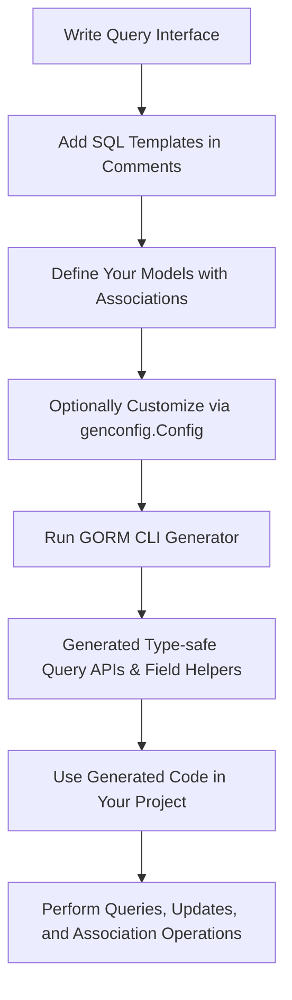

# Core Concepts & Terminology

Master essential GORM CLI vocabulary to gain a deep understanding of how this powerful tool transforms your Go backend development. This page guides you through key terms and concepts such as query interfaces, SQL templates, field helpers, association operations, generation configuration, and CLI usage. By learning these fundamentals with contextual examples, you’ll lower your learning curve and unlock the full potential of GORM CLI.

---

## Why Core Concepts Matter

Before generating code or using GORM CLI in your projects, it’s crucial to understand the foundational terms and patterns that the tool uses. These concepts shape how GORM CLI interprets your models and interfaces to create type-safe, maintainable, and efficient data access layers.

Knowing these concepts enables you to:

- Write custom query interfaces with SQL templates confidently
- Use model-driven helpers effectively for fields and associations
- Customize code generation with configuration options
- Navigate and troubleshoot the CLI commands with ease

---

## Key Concepts & Terminology

### Query Interfaces

**What they are:** Go interfaces where methods are annotated with inline SQL templates as comments.

**Purpose:** Define type-safe, reusable database queries with parameters that the generator uses to create concrete implementations.

**Why it matters:** You write expressive, composable, and checked query methods instead of raw SQL strings or ad-hoc code.

**Example:**
```go
// Query interface example for users
// SELECT * FROM @@table WHERE id=@id
GetByID(id int) (User, error)

// SELECT * FROM @@table WHERE @@column=@value
FilterWithColumn(column string, value string) (User, error)
```

The placeholders `@@table` and `@@column` are replaced dynamically during code generation based on your model.

---

### SQL Templates

**What they are:** Inline SQL snippets used inside interface method comments to define the query's SQL logic.

**Features:**

- Support special directives like `@@table` (model's table), `@@column` (dynamic column), and `@param` (method arguments).
- Allow Go template-style conditionals (`{{if ...}}`, `{{else}}`) and iterations (`{{for ...}}`).
- Enable dynamic construction of WHERE and SET clauses for filtering and updates.

**Benefit:** Template DSL provides flexibility and ensures queries are automatically type-safe and context-aware after generation.

**Example:**
```sql
SELECT * FROM @@table
{{where}}
  {{if name != ""}} name=@name {{end}}
  {{if age > 0}} AND age=@age {{end}}
{{end}}
```

---

### Field Helpers

**What they are:** Generated helper fields that provide methods for building predicates, updates, and ordering on model struct fields.

**Purpose:** Make data filtering and updates simple with methods like `.Eq()`, `.Like()`, `.Between()`, `.Set()`, and `.Incr()`.

**Why use them:** They guarantee correctness by generating typed methods, eliminating manual SQL construction mistakes.

**Example:**
```go
// Generated code for User.Name field
generated.User.Name.Eq("jinzhu")   // name = 'jinzhu'

// For score which is nullable
generated.User.Score.IsNull()        // score IS NULL

// Update name and age
gorm.G[User](db).
  Where(generated.User.ID.Eq(1)).
  Set(
    generated.User.Name.Set("alice"),
    generated.User.Age.Incr(1),
  ).
  Update(ctx)
```

---

### Association Operations

**What they do:** Allow safe, fluent operations on related models (associations) defined by GORM such as has-one, has-many, belongs-to, and many-to-many.

**Key operations include:**

- **Create:** Create and link related records.
- **CreateInBatch:** Batch creation with linking.
- **Update:** Update associated records with filters.
- **Unlink:** Remove association links without deleting data.
- **Delete:** Delete associated records.

**Usage:** Interaction through generated association helpers like `generated.User.Pets.Create()`, which are available depending on your model associations.

**Example:**
```go
gorm.G[User](db).
  Set(
    generated.User.Name.Set("alice"),
    generated.User.Pets.Create(generated.Pet.Name.Set("fido")),
  ).
  Create(ctx)
```

**Semantics by association type:**

| Association Type | Effect of Unlink            | Effect of Delete             |
|------------------|-----------------------------|-----------------------------|
| belongs to       | Sets parent FK to NULL      | Deletes associated rows     |
| has one/has many | Sets child FK to NULL       | Deletes child rows          |
| many2many        | Removes join rows           | Removes join rows only      |


---

### Generation Configuration (`genconfig.Config`)

**What it is:** An optional Go struct placed in your package to customize generation behavior.

**Key options:**

- `OutPath`: Output directory override for generated files.
- `FieldTypeMap`: Map custom Go types to specific field helper types.
- `FieldNameMap`: Map specific struct tags or field names to custom helpers (e.g., JSON).
- `IncludeInterfaces` / `ExcludeInterfaces`: Whitelist or blacklist query interfaces by name or type.
- `IncludeStructs` / `ExcludeStructs`: Same for struct types.
- `FileLevel`: Limit generation scope to current file or full package.

**Benefit:** Tailor generation to project conventions or domain-specific types.

**Example:**
```go
var _ = genconfig.Config{
  OutPath: "examples/output",
  FieldNameMap: map[string]any{
    "json": JSON{},
  },
  IncludeInterfaces: []any{"Query*"},
}
```

---

### CLI Usage Overview

The GORM CLI tool (`gorm gen`) drives generation based on your directory containing model definitions and query interfaces.

- **Basic command:** `gorm gen -i <input-directory> -o <output-directory>`
- Automatically detects `genconfig.Config` if present.
- Generates type-safe query API implementations and field helpers.
- Adds context parameters to methods if missing.

**Tip:** Validate your interfaces and model struct tags before running the CLI to avoid generation errors.

---

## Practical Tips & Common Pitfalls

- **Always annotate your query interface methods with SQL templates for generation to work.**
- **Use `@@table` and `@@column` placeholders to keep queries adaptable and safe.**
- **Define `genconfig.Config` early if you need custom mappings or output paths.**
- **Remember association semantics—Unlink vs Delete have different row effects depending on the association type.**
- **When working with JSON or other custom field types, implement and register custom field helpers via configuration.**
- **Run the CLI generation frequently during development to catch mismatches early.**

---

## Summary Diagram: Workflow of Concepts



---

## Next Steps

Start applying these concepts practically by exploring:

- [What is GORM CLI?](../product-introduction/what-is-gorm-cli) — to see the big picture
- [Core Features Overview](../product-introduction/feature-highlights) — to understand key abilities
- [Getting Started guides](../../getting-started) — to install and begin generating

Mastering these core concepts will accelerate your productive use of GORM CLI and improve the quality of your Go data layers dramatically.


---

<AccordionGroup title="Additional Resources">
<Accordion title="Example: Query Interface with SQL Templates">
```go
// In examples/query.go

// Query interface for users
// SELECT * FROM @@table WHERE id=@id
GetByID(id int) (User, error)

// Dynamic filtering example
// SELECT * FROM @@table
// {{where}}
//   {{if @user.Name }} name=@user.Name {{end}}
//   {{if @user.Age > 0}} AND age=@user.Age {{end}}
// {{end}}
SearchUsers(user User) ([]User, error)
```
</Accordion>

<Accordion title="Example: Field Helper Usage">
```go
// Using generated User helpers
users, err := gorm.G[User](db).
  Where(generated.User.Age.Between(18, 30)).
  Find(ctx)

// Updating via helpers
err = gorm.G[User](db).
  Where(generated.User.ID.Eq(1)).
  Set(generated.User.Name.Set("alice"), generated.User.IsAdult.Set(true)).
  Update(ctx)
```
</Accordion>

<Accordion title="Understanding Association Operations">
- **Create:** Add and link new related rows
- **Unlink:** Detach relationship without deleting data
- **Delete:** Remove relationship and delete related rows

Examples:
```go
// Create associated pets
gorm.G[User](db).
  Set(generated.User.Pets.Create(generated.Pet.Name.Set("fido"))).
  Update(ctx)

// Unlink pets
gorm.G[User](db).
  Set(generated.User.Pets.Unlink()).
  Update(ctx)
```
</Accordion>
</AccordionGroup>

---

## Troubleshooting Common Questions

<AccordionGroup title="Troubleshooting FAQs">
<Accordion title="Why is no code generated for my interface method?">
Ensure your method comment contains a proper SQL template using directives (`@@table`, `@param`) and matches the expected syntax.
</Accordion>
<Accordion title="My custom field type is not generating the helper I want. What now?">
Use `FieldTypeMap` or `FieldNameMap` in `genconfig.Config` to map your custom type or tag to a suitable helper.
</Accordion>
<Accordion title="I get errors on associations during generation."
>
Double-check the GORM tags on your models for associations and ensure your related models are defined correctly and accessible in the same package or directory.
</Accordion>
</AccordionGroup>

---

# Additional References

- [System Architecture with Diagram](../architecture-concepts/system-architecture-diagram) — How GORM CLI works internally
- [Getting Started / Preparing Your Models and Interfaces](../../getting-started/first-run-basic-usage/prepare-code) — Hands-on example setup
- [Configuration and Troubleshooting](../../getting-started/configuration-and-troubleshooting/configuring-generator) — Customize and troubleshoot generation

---

Explore these core concepts thoroughly to build a rock-solid foundation for effective GORM CLI usage and harness the full power of automated type-safe database code generation in Go.


---