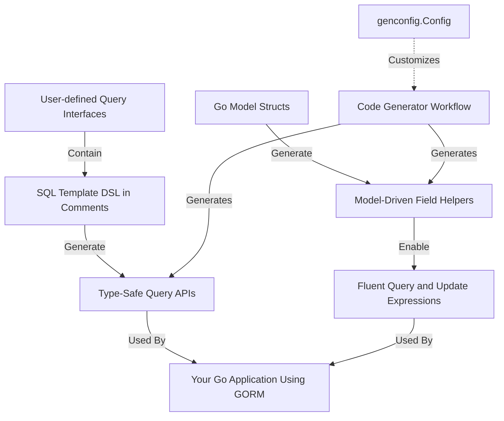

# Core Concepts & Terminology

Welcome to the foundational page that defines the critical ideas and terms you'll encounter when using **GORM CLI**. This guide clarifies the essential components like query interfaces, SQL template DSL, field helpers, associations, and generator configuration. Understanding these concepts early empowers you to harness GORM CLI’s power for safer and more efficient Go ORM development.

---

## Unlocking GORM CLI’s Building Blocks

At its heart, GORM CLI transforms your Go code into type-safe, fluent database APIs by generating two complementary pieces:

- **Query Interfaces**: User-defined Go interfaces enriched with SQL template annotations.
- **Model-Driven Field Helpers**: Strongly typed helpers derived from your Go model structs.

Together, these enable you to write safer, more expressive queries and updates with confidence in compile-time correctness.

### Query Interfaces

Query interfaces are Go interfaces where each method is documented with an SQL template comment. These templates include placeholders and directives that the generator interprets to produce concrete, type-safe query methods.

**What You Do:**
- Define interfaces with methods annotated with SQL templates.
- Use special placeholders like `@@table`, `@@column`, and parameter bindings `@param`.
- Write conditional logic and loops using the embedded DSL (`{{if}}`, `{{where}}`, `{{set}}`, etc.) to build dynamic queries.

**Example:**
```go
// User-defined interface example
// SELECT * FROM @@table WHERE id=@id
GetByID(id int) (T, error)

// Conditional WHERE clause
// {{where}}
//   {{if user.Name != ""}} name=@user.Name {{end}}
//   {{if user.Age > 0}} AND age=@user.Age {{end}}
// {{end}}
SearchUsers(user User) ([]T, error)
```

This method generates a safe, parameterized query that only includes conditions when parameters satisfy the logic.

---

### SQL Template DSL

The SQL template DSL is a mini-language integrated into your interface method comments. It supports placeholders, conditional sections, and iteration to adapt SQL to your input parameters dynamically.

| Directive   | Purpose                                | Example                                  |
| ----------- | ------------------------------------- | ---------------------------------------- |
| `@@table`   | Model’s database table name            | `SELECT * FROM @@table WHERE id=@id`     |
| `@@column`  | Dynamic column binding                  | `@@column=@value`                        |
| `@param`    | Binding Go method parameters           | `WHERE name=@user.Name`                  |
| `{{where}}` | Conditional WHERE clause block          | `{{where}} age>@age {{end}}`             |
| `{{set}}`   | Conditional SET clause for UPDATEs     | `{{set}} name=@name {{end}}`             |
| `{{if}}`    | Conditional fragment insertion          | `{{if age>0}} AND age=@age {{end}}`       |
| `{{for}}`   | Iteration over collections              | `{{for _, t := range tags}} ... {{end}}` |

**Story Example:**
Imagine writing a method that only filters by the user's name if it's non-empty and by age if it’s positive. With the template DSL, you embed this conditional logic directly in your SQL template comments — no manual string building needed.

---

### Model-Driven Field Helpers

From your Go model structs, GORM CLI generates **field helpers**. These helpers provide typed predicates and setters to fluently build queries and updates, guaranteeing compile-time safety.

- **Basic Fields:** Support common Go types like `int`, `string`, `bool`, `time.Time`, and also custom typed fields implementing common interfaces.
- **Field Predicate Examples:**
  - `generated.User.Name.Like("%jinzhu%")` — generates `LIKE` predicate
  - `generated.User.Age.Between(18, 65)` — generates `BETWEEN` predicate
- **Update Setters:**
  - `generated.User.Name.Set("alice")` — sets a column’s new value
  - `generated.User.Age.Incr(1)` — increments a column’s value

**Handling Associations:**
Associations like `hasOne`, `hasMany`, `belongsTo`, or `many2many` are generated as typed helpers to manage related records safely.

```go
// Create a user with a related pet
gorm.G[User](db).
  Set(
    generated.User.Name.Set("alice"),
    generated.User.Pets.Create(generated.Pet.Name.Set("fido")),
  ).
  Create(ctx)
```

This lets you create and link related records in a single, safe operation.

---

### Association Semantics and Operations

Association operations are fully supported with clear semantics:

| Operation  | Effect                                                                                       |
|------------|----------------------------------------------------------------------------------------------|
| `Create`   | Inserts new associated rows and links them to the parent                                    |
| `CreateInBatch` | Batch create/link multiple associated instances simultaneously                          |
| `Update`   | Update associated rows matching optional filters                                           |
| `Unlink`   | Removes the association link without deleting the associated rows; respects FK semantics   |
| `Delete`   | Deletes associated rows or join table rows for many2many associations                      |

**Example:**
```go
// Unlink a pet from a user
gorm.G[User](db).
  Where(generated.User.ID.Eq(1)).
  Set(generated.User.Pets.Unlink()).
  Update(ctx)
```

This clears the foreign key or join entry linking the pet, without deleting the pet record.

---

### Code Generation Configuration

Customizing code generation can be easily done using a `genconfig.Config` variable declared in your package. 
This configuration controls:

- Output directory for generated code
- Mapping Go types or struct tags (`gen:"json"`) to custom field helpers
- Inclusion or exclusion of specific interfaces or structs by name patterns
- File-level or package-level scope for configuration

**Example Configuration:**
```go
var _ = genconfig.Config{
  OutPath: "examples/output",
  FieldTypeMap: map[any]any{
    sql.NullTime{}: field.Time{},
  },
  FieldNameMap: map[string]any{
    "json": JSON{},
  },
  IncludeInterfaces: []any{"Query*"},
  ExcludeStructs: []any{"*DTO"},
}
```

This directs the generator to output files under `examples/output`, use special helpers for `sql.NullTime` and JSON fields, while focusing generation on interfaces prefixed with "Query" and excluding DTO structs.

---

### Summary Diagram of Core Concepts



This flow illustrates the two main input sources — your query interfaces with SQL templates and your model structs — feeding the generator, which emits the type-safe APIs and helpers you use in your Go projects.

---

## Tips & Best Practices

- **Start Small:** Begin with simple query interfaces, then incrementally add SQL template complexity.
- **Leverage Field Helpers:** Use generated field predicates to avoid raw SQL string concatenation and bugs.
- **Use Associations Wisely:** Choose operations (`Create`, `Unlink`, `Delete`) carefully to maintain data integrity.
- **Configure Thoughtfully:** Tailor `genconfig.Config` to streamline output and adjust field mappings to fit your data types.
- **Naming Consistency:** Name your interfaces and structs clearly to use inclusion/exclusion patterns efficiently.

---

## Troubleshooting

- If generated methods don’t appear, verify your interface methods have SQL templates in comments.
- Compilation errors often result from missing or wrongly typed method signatures; ensure the last return value is `error`.
- When queries behave unexpectedly, check your SQL template conditions (`{{if}}`, `{{where}}`) for logical correctness.
- To exclude deprecated or unused types, use the exclusion filters in `genconfig.Config` effectively.


---

## Next Steps

To deepen your understanding, explore these related topics:

- [Architecture Overview](../architecture-concepts/architecture-overview) — Understand the overall generation and integration flow.
- [Template-Based Queries](../guides/core-workflows/template-queries-quickstart) — Learn how to craft dynamic SQL queries.
- [Working With Field Helpers](../guides/advanced-features-patterns/working-with-field-helpers) — Master fluent queries and updates.
- [Customizing Generation Config](../guides/advanced-features-patterns/customizing-generation-config) — Tailor the generator to your project.

Use these to build a solid foundation and smoothly incorporate GORM CLI into your projects.

---

Explore the full reference and start creating type-safe, fluent database code with ease!