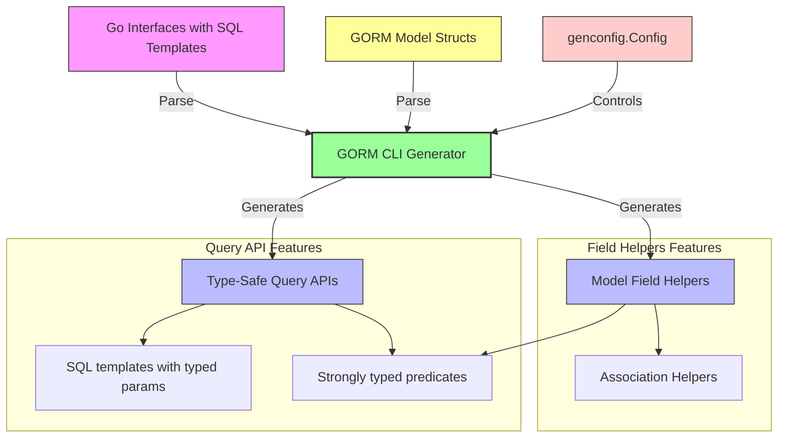

# Key Concepts & Terminology

Mastering GORM CLI requires a clear understanding of its foundational concepts and the terminology you will encounter. This section breaks down the essential building blocks — query interfaces, SQL templates, field helpers, associations, predicates, and configuration mapping — and ties each to their role in the generated code. Grasping these will empower you to utilize the CLI’s type-safe abstractions confidently and effectively.

---

## Query Interfaces

**What They Are:**

At the heart of GORM CLI’s generation are *query interfaces*. These are Go interfaces you write that embed raw SQL templates in their method comments.

- Each method represents a database query or operation.
- SQL templates use placeholders like `@@table`, `@param`, and control directives (`{{where}}`, `{{set}}`) for dynamic, conditional SQL generation.

**Why They Matter:**

You write your database interactions declaratively as interface methods with SQL snippets. The CLI uses these to generate fully typed, fluent APIs that:

- Enforce compile-time safety on parameters and return types.
- Remove the friction of handwritten query code and manual scanning.

**Example:**

```go
// Query interface example
// SELECT * FROM @@table WHERE id=@id
GetByID(id int) (T, error)

// Conditional WHERE with dynamic fields
// {{where}}
//   {{if name != ""}} name=@name {{end}}
//   {{if age > 0}} AND age=@age {{end}}
// {{end}}
FilterByNameAndAge(name string, age int)
```

---

## SQL Templates

**Definition:**

SQL templates define query fragments embedded in comments above interface methods. These templates are parsed and expanded into executable SQL statements with strong type checking.

**Core Components:**

| Directive   | Purpose                                   | Example                                       |
|-------------|-------------------------------------------|-----------------------------------------------|
| `@@table`   | Substitutes the model's table name        | `SELECT * FROM @@table WHERE id=@id`           |
| `@@column`  | Dynamic column binding                     | `WHERE @@column=@value`                        |
| `@param`    | Bind Go method parameters to SQL          | `WHERE name=@user.Name`                        |
| `{{where}}` | Conditional WHERE clauses                   | `{{where}} age > 18 {{end}}`                   |
| `{{set}}`   | Conditional SET clauses (for UPDATE)       | `{{set}} name=@name {{end}}`                   |
| `{{if}}`    | Conditional SQL fragment based on logic    | `{{if age > 0}} AND age=@age {{end}}`          |
| `{{for}}`   | Iterate over collections                    | `{{for _, tag := range tags}} ... {{end}}`     |

**How Templates Work:**

- Placeholders automatically bind provided Go parameters.
- Template directives enable complex logic inside queries without losing type safety.
- Generated code seamlessly injects `context.Context` if missing.

---

## Field Helpers

**What They Are:**

Field helpers are type-safe wrappers generated for each struct field in your GORM models.

- They simplify filter, update, and ordering operations by wrapping different Go types (e.g., `int`, `string`, `time.Time`).
- Support specialized behavior for complex or custom types via configuration.

**How They Work:**

- For a model field like `Age int`, a helper `generated.User.Age` (usually `field.Number[int]`) provides predicates like `.Eq()`, `.Gt()`, `.Between()`.
- Custom tags (e.g., `gen:"json"`) and config mapping allow injecting custom helpers such as a JSON query helper.

**Example:**

```go
// Basic predicates
generated.User.Age.Eq(25)           // age = 25
generated.User.Name.Like("%jinzhu%") // name LIKE '%jinzhu%'

// Custom JSON predicate (with config and tags)
generated.User.Profile.Equal("$.vip", true)
```

---

## Associations

**Definition:**

GORM CLI supports generation of *association helpers* based on the relationships defined in your GORM model structs.

- Covers all relation types: has one/has many, belongs to, many2many, polymorphic associations.

**Why They Matter:**

- Association helpers let you express complex linked entity operations with type safety (create, update, unlink, delete).
- These can be composed into batch operations or conditional updates directly in your generated API.

**Supported Operations:**

- `Create()`: inserts and associates new related rows.
- `Update()`: updates associated rows with optional filtering.
- `Unlink()`: removes the association without deleting related rows.
- `Delete()`: deletes associated rows (or m2m join rows).
- `CreateInBatch()`: batch creation and association.

**Example Use Case:**

```go
// Create a user and a pet linked to the user
gorm.G[User](db).
  Set(
    generated.User.Name.Set("alice"),
    generated.User.Pets.Create(generated.Pet.Name.Set("fido")),
  ).
  Create(ctx)

// Unlink user's pet where pet name = 'fido'
gorm.G[User](db).
  Where(generated.User.ID.Eq(1)).
  Set(generated.User.Pets.Where(generated.Pet.Name.Eq("fido")).Unlink()).
  Update(ctx)
```

---

## Predicates

**What They Are:**

Predicates are methods on field helpers allowing you to build SQL expressions with familiar operators:

- Equality: `.Eq()`, `.Ne()`, `.IsNull()`
- Numeric/Date comparisons: `.Gt()`, `.Lt()`, `.Between()`
- String matching: `.Like()`, `.ILike()` (case-insensitive, depending on DB dialect)

**How to Use:**

- They simplify query construction with direct methods instead of raw SQL.
- Used in `Where()` clauses or as part of generated interface method implementations.

**Example:**

```go
gorm.G[User](db).
  Where(
    generated.User.Age.Gt(18),
    generated.User.Name.Like("%john%"),
  ).
  Find(ctx)
```

---

## Configuration Mapping (`genconfig.Config`)

**Purpose:**

`genconfig.Config` allows you to tailor code generation behavior for your packages and models.

- Control output paths, include/exclude specific interfaces or structs.
- Map Go types or `gen:"name"` tags to custom field helpers.

**Key Configuration Options:**

| Option             | Description                                                                                       |
|--------------------|------------------------------------------------------------------------------------------------|
| `OutPath`          | Override generated code output directory for files in the package                               |
| `FieldTypeMap`     | Map specific Go types (e.g., `sql.NullTime`) to custom wrappers (e.g., `field.Time`)            |
| `FieldNameMap`     | Map custom `gen` tag names to helpers, e.g., tag `json` to JSON helper                         |
| `FileLevel`        | When `true`, applies config only to current file instead of entire package                      |
| `IncludeInterfaces`| Whitelist interface names or patterns to limit code generation                                 |
| `ExcludeInterfaces`| Blacklist interface names or patterns to exclude from generation                               |
| `IncludeStructs`   | Whitelist struct names or patterns                                                             |
| `ExcludeStructs`   | Blacklist struct names or patterns                                                             |

**Example Configuration:**

```go
var _ = genconfig.Config{
  OutPath:      "examples/output",
  FieldTypeMap: map[any]any{sql.NullTime{}: field.Time{}},
  FieldNameMap: map[string]any{"json": JSON{}},
  IncludeInterfaces: []any{"Query*"},
  ExcludeStructs: []any{"*DTO"},
}
```

---

## How These Concepts Connect in Generated Code



---

## Practical Tips and Common Pitfalls

- **Always annotate interfaces with SQL in comments:** The generator depends on these to produce implementations.
- **Use `context.Context` in method signatures or let the generator inject it:** It is required for runtime DB calls.
- **Define configuration close to models if you need custom field helpers:** Use `FieldNameMap` and `FieldTypeMap` wisely to reflect your database customizations.
- **Filter interfaces/structs sensitively:** Use `Include*` to whitelist rather than relying on `Exclude*` to avoid unexpected omissions.
- **Watch for method return type rules:**
  - Finish methods with raw SQL must return one or two values (data and/or error), error must be last.
  - Chain methods return interfaces for further chaining.
- **Be mindful of anonymous embedded fields:** Fields embedded in structs are flattened into the field helpers.

---

## Summary

This section has demystified the pivotal terminology and concepts that form the backbone of GORM CLI's code generation:

- Query interfaces let you declare your intended queries with SQL templates.
- SQL templates provide a dynamic, type-safe way to write complex SQL.
- Field helpers equip your models with fluent, predictable query and update primitives.
- Associations broaden your ability to manage related entities through generated helpers.
- Predicates enable readable, composable query conditions.
- Configuration mapping empowers you to customize how your models and queries get generated.

Understanding these components ensures you harness GORM CLI’s full potential for safer, more efficient database access in Go.

---

## Next Steps

- Explore the [System Architecture](../architecture-concepts/architecture-diagram) for a visual workflow overview.
- Try hands-on with [Quickstart & Typical Workflow](../features-workflows/quickstart-workflow) to connect concepts to practice.
- Dive deeper into [Template-Driven Query Interfaces](../../guides/advanced-patterns/guide-sql-templates) to master writing SQL templates.
- Customize generation with [genconfig.Config guide](../../guides/advanced-patterns/guide-genconfig) for tailored code output.


---

## References

- [Product Overview and Value](../introduction-value/product-overview)
- [Audience and Use Cases](../introduction-value/audience-usecases)
- [Examples Folder and Generated Code Samples](../../examples)

---