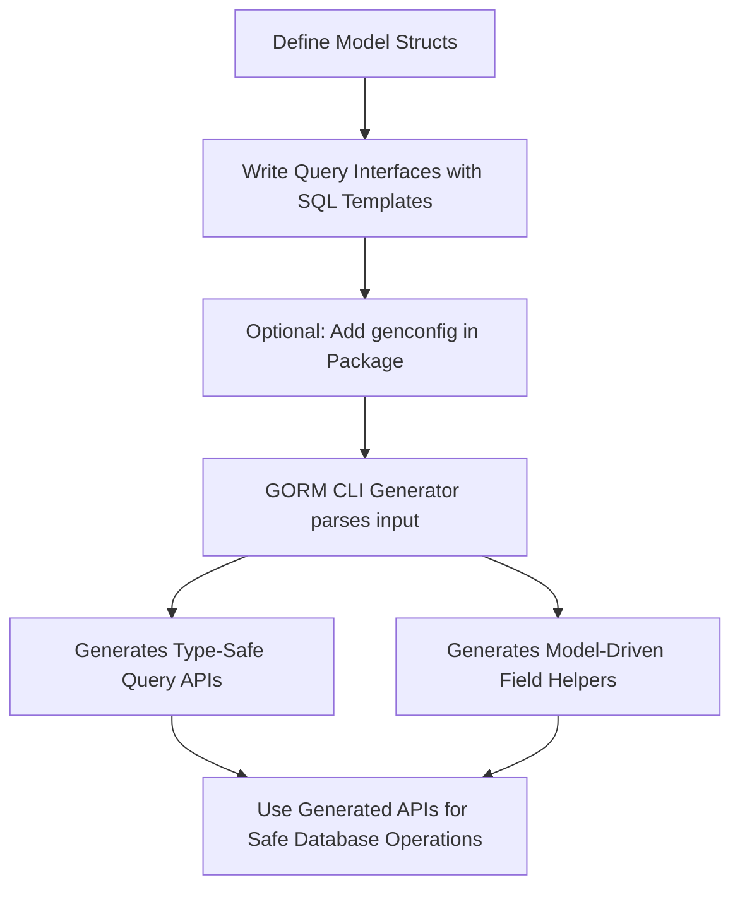

# Core Concepts & Terminology

Welcome to the foundational guide on critical concepts and terminology that empower your effective use of GORM CLI. Mastering these key terms will unlock the full potential of generating type-safe query APIs, model-driven helpers, and harnessing the power of SQL template DSL and generation configuration.

---

## What You Will Learn

- What is a **Type-Safe Query API** and why it matters
- Understanding **Model-Driven Field Helpers** and their value
- The role and usage of **Association Helpers** for relational data
- How to leverage the **SQL Template DSL** for powerful custom queries
- The importance of **genconfig** for customizing generation behavior

---

## Type-Safe Query API

### Definition
A *Type-Safe Query API* is an auto-generated Go interface exposing query methods that correspond to your defined Go interfaces with embedded SQL templates. This API enforces compile-time type safety, ensuring your queries align perfectly with your data models and methods.

### Why It Matters
Imagine querying your database and catching errors *before* your code runs. The type-safe API offers this by generating method signatures, parameters, and return types exactly from your annotated Go interfaces. It prevents runtime SQL errors, boosts developer confidence, and accelerates debugging.

### How It Works
- You define a Go interface with method signatures annotated by SQL query templates.
- GORM CLI parses these interfaces, processes the SQL templates, and produces concrete implementations.
- The API methods return strongly typed results matching your models.

#### Example
```go
// User query interface with SQL annotation
 type Query[T any] interface {
   // SELECT * FROM @@table WHERE id=@id
   GetByID(id int) (T, error)
 }

// Usage
 user, err := generated.Query[User](db).GetByID(ctx, 123)
```

---

## Model-Driven Field Helpers

### Definition
*Field Helpers* are generated, strongly typed objects that correspond to your model fields, providing expressive methods to build predicates and update operations.

### Benefits
Instead of manually writing SQL fragment strings, you use fluent field helpers like `.Eq()`, `.Like()`, `.Set()`, `.Incr()`, which are safer and more discoverable by IDEs.

### Supported Types
- Basic scalar types (int, string, bool, time, []byte)
- Named types implementing interfaces like Scanner/Valuer or custom serializers
- Automatically generated for all exported struct fields in your models

### Example
```go
// Generated field predicate examples
generated.User.Name.Eq("alice")        // WHERE name = 'alice'
generated.User.Age.Between(18, 65)       // WHERE age BETWEEN 18 AND 65

// Update with expressions
gorm.G[User](db).
  Where(generated.User.ID.Eq(1)).
  Set(
    generated.User.Name.Set("jinzhu"),
    generated.User.Age.Incr(1),
  ).
  Update(ctx)
```

---

## Association Helpers

### Role and Value
Modern applications often contain complex data relationships. GORM CLI generates *Association Helpers* for relation fields such as `has one`, `has many`, `belongs to`, and `many2many`. These helpers allow you to perform relational operations with compile-time safety:

- **Create** new related records and link them
- **Update** associated rows conditionally
- **Unlink** associations without deleting data
- **Delete** related records safely
- **Batch operations** for efficiency

### Semantics by Relation Type
| Relation Type | Unlink Behavior             | Delete Behavior                |
|---------------|----------------------------|-------------------------------|
| belongs to    | Sets parent foreign key to NULL | Deletes associated rows       |
| has one/ many | Sets child foreign key to NULL  | Deletes child rows            |
| many2many     | Removes join rows only          | Removes join rows only        |

### Real-World Scenario
```go
// Create a user and a pet (has many)
gorm.G[User](db).
  Set(
    generated.User.Name.Set("alice"),
    generated.User.Pets.Create(generated.Pet.Name.Set("fido")),
  ).
  Create(ctx)

// Unlink a pet without deleting
gorm.G[User](db).
  Where(generated.User.ID.Eq(1)).
  Set(generated.User.Pets.Unlink()).
  Update(ctx)
```

---

## SQL Template DSL

### Purpose
GORM CLI uses a specialized SQL templating syntax embedded in method comments of your query interfaces. This DSL bridges Go method parameters with SQL queries dynamically and safely.

### Core Concepts
- `@@table` — Replaced with the model’s actual database table name
- `@@column` — Dynamic column binding
- `@parameter` — Maps Go method parameters to SQL parameters
- Conditional blocks like `{{if}}`, `{{where}}`, `{{set}}` control query composition based on parameter values
- Iterative blocks `{{for}}` allow building dynamic query fragments

### Example
```go
// Interface method comment with template
// SELECT * FROM @@table WHERE id=@id
GetByID(id int) (T, error)

// More complex example
// UPDATE @@table
// {{set}}
//   {{if user.Name != ""}} name=@user.Name, {{end}}
//   {{if user.Age > 0}} age=@user.Age, {{end}}
// {{end}}
// WHERE id=@id
UpdateUser(user User, id int) error
```

### Benefits
- Bind parameters automatically and safely
- Write conditional SQL that adapts to input values
- Reuse SQL templates with concise, readable syntax

---

## genconfig (Generation Configuration)

### What is genconfig?
`genconfig` is a customizable configuration structure you declare at the package level to control aspects of code generation.

### Key Customizations
- Override output directory paths (`OutPath`)
- Map Go types or struct field tags to custom field helper types
- Whitelist or blacklist specific interfaces and structs for generation
- Control file-level behavior versus package-level config

### Practical Example
```go
package examples

import "gorm.io/cli/gorm/genconfig"

var _ = genconfig.Config{
    OutPath: "examples/output",
    FieldNameMap: map[string]any{
        "json": JSON{},  // map fields with `gen:"json"` tag to custom JSON helper
    },
    IncludeInterfaces: []any{"Query*"},
}
```

### Why Use genconfig?
Customize generated code to suit your project architecture, exclude deprecated interfaces, and extend generation to support advanced types like JSON fields.

---

## How These Concepts Fit Together

1. **Write your Go model structs** describing database tables, including associations.
2. **Declare Go interfaces** with annotated SQL template comments describing query and mutation methods.
3. (Optional) Configure generation behavior with a `genconfig.Config` in your packages.
4. **Run `gorm gen` CLI** to parse your interfaces, models, and configuration, generating:
   - Type-safe query APIs for your interfaces
   - Model-driven field helpers for basic fields and associations
5. Use the generated APIs and helpers in your app code for safe, expressive database operations.

---

## Practical Tips and Best Practices

- Start by defining clear query interfaces reflecting your application needs.
- Leverage association helpers to simplify managing related data and maintain referential integrity.
- Use SQL template DSL features to avoid manually writing repetitive or fragile SQL strings.
- Apply `genconfig` to fine-tune generation as projects grow or require special handling.
- Validate generated code early with the recommended quickstart guides to catch issues quickly.

---

## Common Pitfalls

- Missing method return types or signatures inconsistent with templates cause generator errors.
- Forgetting to include `ctx context.Context` results in added context parameters automatically; be mindful.
- Overcomplicated SQL templates can be hard to maintain; keep templates readable and testable.
- Association operations require understanding unlink vs. delete semantics to avoid data loss.

---

## Visualizing the Workflow


---

By mastering these core concepts and terminology, you are prepared to confidently leverage GORM CLI's powerful code generation capabilities and deliver robust, type-safe data access layers in your Go applications.

---

For continued learning, explore these complementary documentation pages:

- [System Architecture Diagram](/overview/architecture-concepts/system-architecture)
- [Generating Type-Safe Query APIs](/overview/features-quicktour/query-api-generation)
- [Model-Driven Field & Association Helpers](/overview/features-quicktour/model-field-helpers)
- [Generation Configuration](/concepts/extensibility-configuration/generation-configuration)
