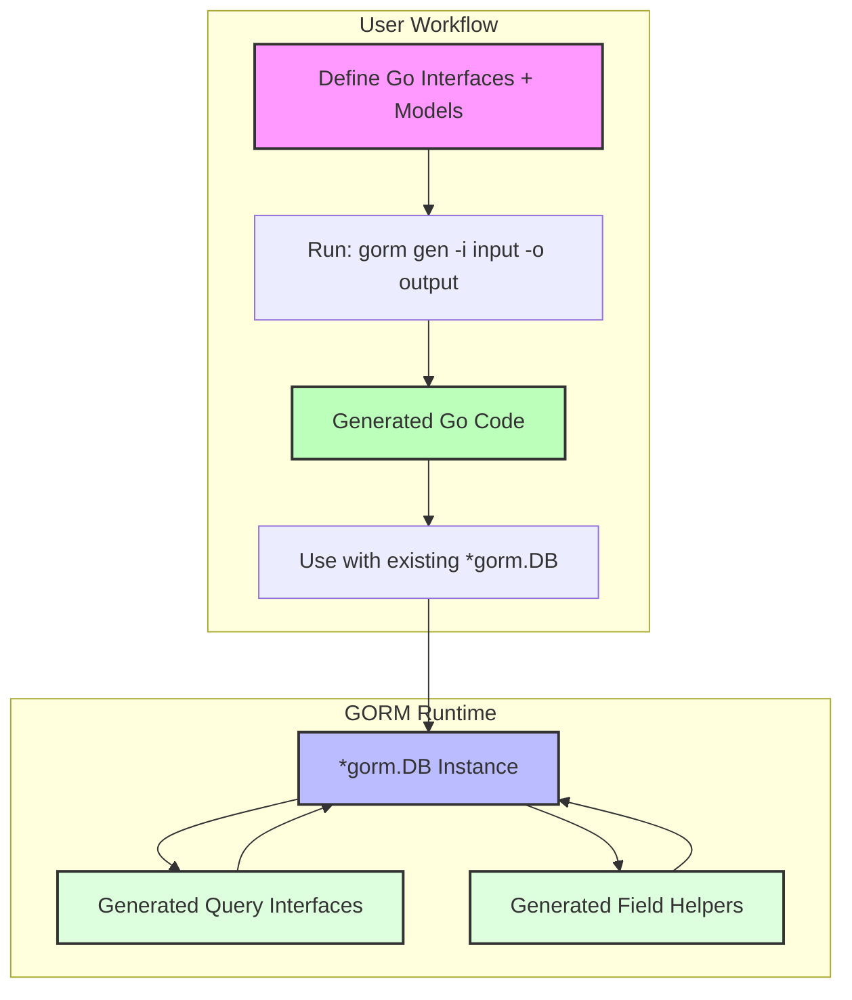

# Seamless GORM Integration

Discover how effortlessly GORM CLI-generated code integrates into your existing GORM projects. This guide explains how the code generation process collaborates smoothly with your familiar GORM setup—requiring nothing more than running a simple CLI command and no disruptive changes to your project structure.

---

## Why Seamless Integration Matters

GORM CLI is designed to augment your workflow without interrupting it. Instead of rebuilding your application or learning a new API, you simply generate type-safe query APIs and field helpers that plug directly into GORM’s existing runtime interfaces.

This means:

- Your current models remain the source of truth.
- Generated code extends `gorm.io/gorm` constructs transparently.
- Your existing database connection, transaction, and context handling patterns don’t change.

The result is a fluid development experience where the benefits of compile-time safety, code fluency, and powerful query creation come naturally.

## Integration Workflow Overview

Seamless integration begins with your Go interfaces and GORM model structs. GORM CLI processes these inputs and outputs strongly-typed query methods and field helpers that work _hand-in-glove_ with your `*gorm.DB` instances and GORM's fluent API.

Here is how it works from the user perspective:

1. **Define SQL-driven interface methods and model structs** – you write simple Go interfaces with embedded SQL templates and standard Go structs representing your database models.

2. **Run the CLI generation command** – call `gorm gen` with your input interfaces and models, specifying output directory.

3. **Use generated code via GORM’s style** – the generated package provides convenient constructors and helpers you call with your `*gorm.DB`, optionally passing GORM clauses.

4. **Continue using GORM idioms** – chaining, context propagation, and expression building work exactly as before but now with added type safety and discoverability.


### Example: Using Generated Query Interface

```go
// Assume a generated package named "generated" with Query interface and User model.

// SELECT * FROM users WHERE id = @id
user, err := generated.Query[models.User](db).GetByID(ctx, 123)

if err != nil {
    // handle error
}

// Using the same GORM db instance, integrating generated queries seamlessly
users, err := gorm.G[models.User](db).
    Where(generated.User.Age.Gt(18)).
    Find(ctx)

// This chaining uses generated field helpers with GORM queries
```

This example shows how the generated query interface and helpers function just like first-class citizens within GORM workflows.


## Under the Hood: What GORM CLI Generates for You

- **Concrete implementations of your query interfaces**: These wrap standard GORM calls with SQL templates bound to parameters, automatically inserting parameters safely and returning typed results.

- **Model field helpers**: Strongly typed field helpers such as `generated.User.Name` or `generated.User.Age` provide expressive methods to build predicates (e.g., `.Eq()`, `.Gt()`) for filtering, updating, and creating.

- **Constructors tailored to your models and interfaces**: Functions like `generated.Query[T any](db *gorm.DB, opts ...clause.Expression)` allow you to instantiate generated interfaces directly from your GORM database handle, passing in query options or pre-loaded clauses naturally.


### What You Don’t Need To Do

- Modify your existing `*gorm.DB` usage or project layout.
- Manually inject dependencies into generated code.
- Learn a new pattern for context passing; the generator adds `context.Context` automatically when missing.

---

## Best Practices for Smooth Integration

- **Keep your models and interfaces close**: Place your query interfaces alongside the GORM models they target to ensure seamless generation.

- **Use standard `gorm.io/gorm` types**: Leverage the existing GORM DB, clause, and expression types in your interfaces for maximum compatibility.

- **Run generation as part of your build or CI process**: Regenerate whenever models or interfaces change to keep your code synchronized.

- **Apply configuration via `genconfig.Config` when needed**: Customize output paths, inclusion/exclusion, and field mappings without disrupting integration.

---

## Troubleshooting Common Integration Situations

<AccordionGroup title="Troubleshooting Seamless GORM Integration">
<Accordion title="The generated code does not compile due to missing imports">
Check that your Go module is correctly set up and that your interfaces and models are in their expected locations. The generation command uses relative imports, so your package structure must be consistent. You can use configuration overrides to align output paths or adjust import paths.
</Accordion>
<Accordion title="I get runtime errors related to missing database connection or context">
Ensure you always pass a valid `*gorm.DB` instance and `context.Context` to generated methods. GORM CLI auto-injects context where missing in method signatures, but your caller must still provide it. Also, check that your assignment or chaining doesn’t discard errors.
</Accordion>
<Accordion title="Generated query method returns unexpected SQL or parameter binding issues">
Review your SQL templates in the interface comments. Confirm correct use of placeholders like `@@table`, `@param`, and template DSL directives such as `{{where}}`. GORM CLI translates these directly into executable SQL with parameters bound safely.
</Accordion>
</AccordionGroup>

---

## Seamless Integration Diagram



This flow shows user code flowing naturally from your model definitions and SQL templates through code generation, then executing safely and fluently with GORM’s runtime.

---

## Getting Started

To integrate GORM CLI-generated code into your project:

1. **Prepare your Go interfaces with embedded SQL and define your GORM models.**
2. **Run the CLI generation command:**

```bash
gorm gen -i ./your/package/path -o ./generated
```

3. **Import the generated package and start using the APIs with your `*gorm.DB` instance:**

```go
import "path/to/generated"

user, err := generated.Query[models.User](db).GetByID(ctx, userID)
```

4. **Enjoy fluent, type-safe, and idiomatic query building, update, and association handling without changing your existing GORM setup.**

For detailed examples and next steps, see the [Quickstart & Typical Workflow](/overview/features-workflows/quickstart-workflow) and [Guide: Generating and Using Model Field Helpers](/guides/core-workflows/guide-field-helpers).

---

## Additional Resources

- [What is GORM CLI? (/overview/introduction-value/product-overview)](/overview/introduction-value/product-overview)
- [System Architecture Diagram (/overview/architecture-concepts/architecture-diagram)](/overview/architecture-concepts/architecture-diagram)
- [Key Concepts & Terminology (/overview/architecture-concepts/core-concepts)](/overview/architecture-concepts/core-concepts)

---

<Tip>
Running the `gorm gen` command automatically outputs code that integrates tightly with your existing GORM usage patterns, allowing you to keep your project structure untouched while gaining robust, type-safe query capabilities.
</Tip>

<Note>
For advanced customization of generated code behavior or output paths, consider using `genconfig.Config` in your packages to tailor generation without sacrificing integration smoothness.
</Note>
