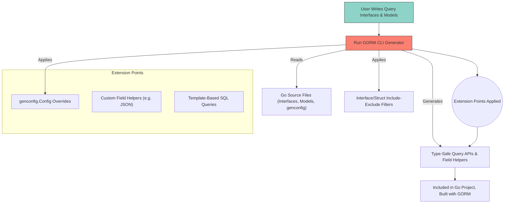

# Integration & Extension Points

Explore how GORM CLI integrates seamlessly with your existing GORM projects and extends standard generation capabilities. This section covers how the CLI fits into your Go build process, how configuration via `genconfig.Config` shapes customized generation, and where you can hook in with custom field helpers and template-based queries. Discover practical strategies to align the generator’s output with GORM’s API, empowering you to build type-safe, customizable, and maintainable data access layers.

---

## Why Integration & Extension Matter

GORM CLI is designed to generate code that directly complements your existing GORM setup, not replace it. Integration points ensure the generated query APIs and field helpers coexist harmoniously within your project’s build, leveraging Go’s standard tooling and GORM’s mature API.

Extensions allow you to tailor code generation beyond the defaults—whether adapting field helpers for custom database types, injecting complex SQL templates, or configuring the generation scope per package or interface.

Together, these integration and extension mechanisms give you full command over how GORM CLI shapes your application’s data layer.

---

## How the CLI Fits into Existing GORM Projects

The GORM CLI operates as a Go code generator invoked during your development cycle. It parses Go interface definitions and model structs annotated with raw SQL and generation configuration, then produces type-safe query APIs and field helpers consistent with GORM's patterns.

**Seamless Integration Highlights:**

- **Source-Based Generation:** The CLI reads your Go interface files and model packages directly.
- **Output Control:** By default, the generated code is placed into a configurable output directory (defaults to `./g`), maintaining package structure.
- **GORM API Harmony:** The generated code wraps GORM’s `*gorm.DB` operations with fluent, compile-time safe APIs permitting type-checked queries and updates.
- **Build Process Compatibility:** Treated as conventional Go source files, generated code compiles alongside your regular code with no special build steps.

### Example CLI Usage

```bash
gorm gen -i ./examples -o ./generated
```

This command directs GORM CLI to process interfaces in the `./examples` folder and save generated files in `./generated`.

---

## Configuring Generation with `genconfig.Config`

For projects needing tailored generation, place a package-level variable of type `genconfig.Config` in your Go files. The CLI automatically detects this configuration and customizes generation accordingly.

Key customization options include:

- **OutPath:** Change where generated files go within your project.
- **FieldTypeMap:** Map Go native or custom types to specialized field helper types, enabling richer query constructs.
- **FieldNameMap:** Override mapping of struct field tags (e.g., `gen:"json"`) to custom field helpers.
- **FileLevel:** Whether the config applies globally to all files in the package tree or only the declaring file.
- **Include/Exclude Filters:** Precisely select interfaces or structs to generate by exact name or shell-style patterns.

### Example Configuration Setup

```go
package examples

import (
  "database/sql"
  "gorm.io/cli/gorm/field"
  "gorm.io/cli/gorm/genconfig"
)

var _ = genconfig.Config{
  OutPath: "examples/output",
  FieldTypeMap: map[any]any{
    sql.NullTime{}: field.Time{}, // Treat sql.NullTime as Time field helper
  },
  FieldNameMap: map[string]any{
    "json": JSON{}, // Map struct fields with 'gen:"json"' tag to custom JSON helper
  },
}
```

By layering configurations, you control granularity of generation, enabling use cases such as isolating legacy code, restricting generation scope during migration, or applying custom field encoding logic.

---

## Extension Points: Custom Field Helpers

Custom field helpers augment the generated code with support for specialized database-backed data types beyond primitives.

### How Custom Field Helpers Work

- **Type Mapping:** Through the `FieldTypeMap` and `FieldNameMap` in your config, specify how custom Go types or tagged struct fields map to custom field helper structs.
- **Helper Implementation:** Define Go types implementing expression builders and setter methods that generate the correct SQL syntax, tailored to different database dialects if needed.

### Concrete Example: JSON Field Helper

Consider a JSON column stored as string or native JSON type in databases. You can create a `JSON` field helper type capable of generating JSON-specific SQL expressions:

```go
// JSON is a custom field helper handling different JSON syntaxes per DB
// Implements comparison operators with dialect awareness

type JSON struct { column clause.Column }

func (j JSON) WithColumn(name string) JSON { /* sets column name for query */ }

func (j JSON) Equal(path string, value any) clause.Expression { /* returns JSON-aware equality expression */ }
```

Using `FieldNameMap`, attach this helper to fields tagged `gen:"json"`, so generated APIs invoke this logic automatically when filtering or updating.

---

## Extension Points: Template-Based Queries

The GORM CLI supports embedding raw SQL with templating directives inside interface method comments. This powerful feature allows you to craft complex, dynamic queries while still benefiting from type safety and code generation.

### Template DSL Fundamentals

- Use placeholders like `@@table` and `@@column` to refer to tables and columns dynamically based on the model.
- Pass method parameters with `@param` for safe, bind-parameter-driven SQL construction.
- Write conditional logic using `{{if}}`, loops with `{{for}}`, and scoped clauses like `{{where}}` and `{{set}}` to assemble SQL dynamically.

### Template Example

```go
// Interface definition

type Query[T any] interface {
  // SELECT * FROM @@table WHERE id=@id
  GetByID(id int) (T, error)

  // UPDATE @@table
  // {{set}}
  //   {{if user.Name != ""}} name=@user.Name, {{end}}
  //   {{if user.Age > 0}} age=@user.Age {{end}}
  // {{end}}
  // WHERE id=@id
  UpdateUser(user User, id int) error
}
```

Generated code uses Go's text/template syntax evaluation to adapt queries for runtime parameter values safely.

### User Benefits

- Empower domain experts to keep complex query logic close to code with maintainable templates.
- Retain compile-time type safety across dynamically generated SQL.
- Avoid error-prone manual query construction or raw SQL scattered in code.

---

## Harmonizing with Go’s Build Process and GORM’s API Surface

GORM CLI fits smoothly into your regular Go build workflow:

- Generated code is pure Go code with no runtime dependencies beyond GORM.
- Code generation typically happens during build or CI pipelines, or manually by developers.
- Generated interfaces embed tightly with GORM’s `*gorm.DB`, continuing to support GORM’s chaining, context-aware operations, and expression building.

This design ensures zero friction adopting the generated code, enabling incremental integration and easing migration of legacy code to a type-safe query layer.

---

## Practical Tips & Common Pitfalls

- **Use Explicit Configuration:** To avoid generating unintended interfaces or structs, specify `IncludeInterfaces` and `IncludeStructs` in your config when your package contains multiple unrelated types.

- **Keep Templates Simple:** Although the template DSL is powerful, excessive complexity can lead to hard-to-debug generated code. Favor readability.

- **Layer Configs Carefully:** File-level versus package-level config distinctions allow precision in large projects; ensure you understand their scope impacts.

- **Custom Field Helpers:** Ensure your helpers generate SQL compatible with all targeted SQL dialects, especially for JSON or other specialized data types.

- **Regenerate Often:** Regenerate after interface or model changes to keep generated code up-to-date and prevent runtime inconsistencies.

---

## Summary Diagram: Integration & Extension Workflow



---

## Next Steps

- Visit [Generating Type-Safe Query APIs](../features-quicktour/query-api-generation) to see how generated interfaces enforce compile-time safety.
- Explore [Defining and Using Custom Field Helpers](../../advanced-patterns/custom-field-helpers) for advanced field customization.
- Continue with [Building Custom Queries with SQL Templates](../../advanced-patterns/template-queries) to master dynamic SQL generation.

---

For detailed examples, configuration patterns, and comprehensive API references, refer to the related sections in this documentation site.


<Source url="https://github.com/go-gorm/cli" paths={[{"path": "examples/query.go", "range": "1-76"},{"path": "README.md", "range": "1-391"},{"path": "internal/gen/gen.go", "range": "1-386"}]} />
