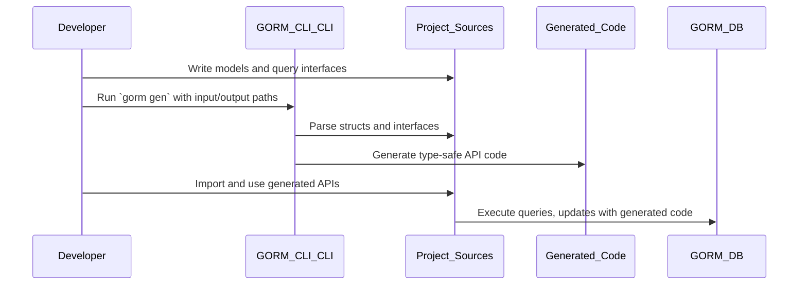

# Integration with GORM and Go Projects

Seamlessly embed GORM CLI into your existing Go codebases leveraging GORM for clean, type-safe data access and management. This page explains how GORM CLI fits naturally into standard Go development workflows powered by generics, detailing prerequisites, integration touchpoints, configuration approaches, and consumption practices with generated code.

---

## Why Integrate GORM CLI with Your Go Project?

Working with GORM CLI enriches your Go projects using GORM by generating intuitive, compile-time safe APIs that reduce runtime errors and boost development velocity. Instead of manually composing repetitive queries and update logic, GORM CLI produces generated code from familiar Go model structs and interface-based SQL templates.

This integration offers:

- **Type safety for queries and updates** preventing common runtime SQL mistakes.
- **Fluent and discoverable APIs** that align with idiomatic Go coding.
- **Seamless augmentations to GORM’s capabilities** without large shifts in architecture.
- **Configuration flexibility** for tailoring generated outputs to your project conventions.


## Prerequisites

Before integrating, ensure your project environment meets these foundational requirements:

- **Go Version 1.18 or newer**: GORM CLI depends on Go generics introduced in 1.18 to generate type-safe code.
- **GORM dependency (`gorm.io/gorm`)** installed and properly configured.
- Models that use Go structs compliant with GORM conventions.


## The Integration Workflow

1. **Define Your Models and Query Interfaces**  
   Use your existing or new Go structs as GORM models and write interface definitions with SQL templates as method comments. This interface-driven approach generates type-safe query APIs and model-driven field helpers.

2. **Generate Code Using GORM CLI**  
   Run the CLI tool specifying input paths (where your models and interfaces live) and output paths for the generated code.

3. **Use Generated Go Code in Your Project**  
   Import and use the generated APIs alongside GORM’s core database operations for queries, updates, and managing associations.

4. **Configure Generation via `genconfig.Config`**  
   Optionally, influence code generation behavior per package using `genconfig.Config` declarations for output paths, inclusion/exclusion rules, type mappings, and file-level control.


---

## Step-by-Step: Using GORM CLI in Your Go Project

### 1. Model and Query Interface Setup

Create your Go structs as GORM models:

```go
package models

import "gorm.io/gorm"

type User struct {
  gorm.Model
  Name string
  Age  int
}
```

Define interfaces with SQL in Go method comments:

```go
package queries

type Query[T any] interface {
  // SELECT * FROM @@table WHERE id=@id
  GetByID(id int) (T, error)

  // where("name=@name AND age=@age")
  FilterByNameAndAge(name string, age int)
}
```

### 2. Running the Code Generator

Install GORM CLI and generate code:

```bash
go install gorm.io/cli/gorm@latest
gorm gen -i ./your/model/and/query/path -o ./path/to/generated
```

This transforms your models and interfaces into fluent, type-safe code including:
- Query API implementations
- Field helpers for filters, updates, and associations

### 3. Using Generated APIs

Use the generated APIs in your business logic with seamless integration to a GORM DB instance:

```go
// Fetch user by ID
user, err := generated.Query[models.User](db).GetByID(ctx, 123)

// Filter users by name and age
users, err := generated.Query[models.User](db).
  FilterByNameAndAge("Alice", 30).
  Find(ctx)

// Use field helpers for expressive queries
users, err := gorm.G[models.User](db).
  Where(generated.User.Age.Gt(18)).
  Find(ctx)
```

---

## Configuration with `genconfig.Config`

You can tailor generation per package with configurations defined as package-level variables:

```go
package yourpackage

import "gorm.io/cli/gorm/genconfig"

var _ = genconfig.Config{
  OutPath: "generated/output/path",
  IncludeInterfaces: []any{"Query*"}, // Only process interfaces starting with "Query"
  FieldTypeMap: map[any]any{
    sql.NullTime{}: field.Time{}, // Map nullable SQL times to field helpers
  },
  FieldNameMap: map[string]any{
    "json": JSON{}, // Use JSON helpers for fields tagged with `gen:"json"`
  },
  FileLevel: true, // Apply config only to this file
}
```

Applying configuration optimizes generation for your coding style and project structure without extra tooling.


---

## How GORM CLI Fits Into Your Development Lifecycle

- **Incremental Adoption**: You can incrementally add generated code to parts of your project where you want strong typing and easier API discovery.
- **Code Regeneration**: Regenerate after model or query interface changes to keep your API in sync.
- **Seamless Migration**: Generated helpers complement existing GORM code, letting you migrate or build new features without disrupting code base quality.

---

## Practical Tips & Best Practices

- Organize query interfaces and models in the same package or directory to simplify code generation.
- Use template SQL techniques in interface comments for dynamic query capabilities.
- Manage associations through generated helpers instead of hand-crafting joins.
- Define clear configuration files (`genconfig.Config`) to reduce noise in generated code and control generation scope.
- Leverage Go’s context passing (ctx) consistently with generated method signatures.


## Troubleshooting Integration Issues

<AccordionGroup title="Common Integration Issues and Solutions">
<Accordion title="Compilation Errors Related to Generics">
Check your Go version to confirm 1.18+ is used since GORM CLI depends on generics.
</Accordion>
<Accordion title="Generated Code Not Found or Not Updated">
Ensure that you run `gorm gen` after every interface or struct change and that output paths are correctly set in config.
File-level configs might restrict where code is generated.
</Accordion>
<Accordion title="Type Mapping Not Applied as Expected">
Verify that `FieldTypeMap` and `FieldNameMap` entries match the precise Go type names or field tags.
</Accordion>
</AccordionGroup>

---

## Visual Overview of Integration



---

## Summary

Integration with GORM CLI transforms your Go + GORM projects by generating expressive, compile-time safe APIs directly from your codebase. By defining simple query interfaces and configuring generation settings, you embed fluent, discoverable database interactions powered by Go generics. This documentation guides you through essential prerequisites, configuration options, everyday usage patterns, and effective troubleshooting to ensure smooth adoption.


---

For full hands-on examples and advanced workflows, see related documentation:

- [Writing Type-Safe Queries from Interfaces](../guides/core-workflows/writing-type-safe-queries.md)
- [Using Field Helpers for Filters & Updates](../guides/core-workflows/using-field-helpers.md)
- [Managing Associations with Helpers](../guides/core-workflows/association-operations.md)
- [Customizing Code Generation via `genconfig`](../guides/advanced-usage-patterns/customizing-generation-config.md)

Review system and architecture insights in the [System Architecture](../overview/architecture-concepts/system-architecture.md) and [Key Concepts and Terminology](../overview/architecture-concepts/key-terminology.md) pages for broader context.

---

<Check>
Ensure your Go environment is version 1.18+ and GORM is configured before generating.
</Check>

<Note>
Plan your directory and package layout so generated code cleanly integrates with your source structure.
</Note>

<Info>
Use `gorm gen -h` to review CLI options for path and generation control.
</Info>

---