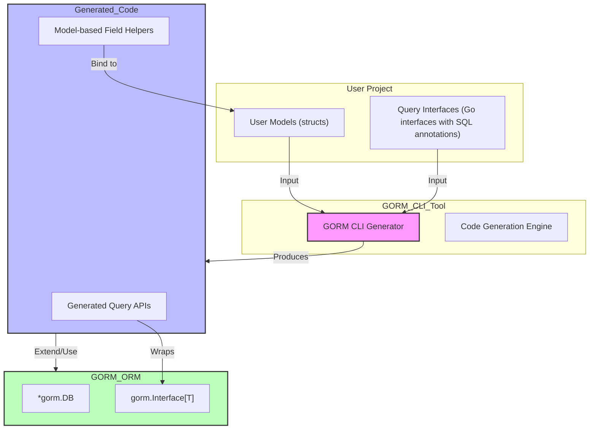

# Integration with GORM & Other Systems

## Seamless Adoption of GORM CLI Generated Code into Go Applications

When building Go applications with GORM CLI, understanding how the generated code integrates with the broader GORM ecosystem is critical. This integration page demystifies the way GORM CLI builds upon the GORM ORM library, showing you how to adopt generated query code and field helpers naturally within your workflows.

### Why This Matters

Typical Go applications using GORM benefit from type-safe, fluent, and discoverable APIs. GORM CLI enhances the developer experience by generating:

- Interface-driven, type-safe query APIs built on your Go interfaces with embedded SQL templates.
- Model-based field helpers that simplify constructing filters, updates, and managing associations.

This page focuses on helping you understand how these pieces tie into standard GORM models and database operations in a way that feels intuitive and interoperable.

---

## Overview: How GORM CLI Fits Into the GORM Workflow

GORM CLI generates Go code that acts as an enhanced extension of GORM’s existing APIs, adding compile-time safety and expressiveness without disrupting how you normally use GORM. Rather than replacing GORM, it builds on top of it, providing:

- **Query APIs:** Concrete implementations of your declared interfaces that translate annotated SQL into type-safe Go methods.
- **Field Helpers:** Strongly typed fields representing struct model columns and associations, enabling expressive and readable filter and update expressions.

By fitting seamlessly on top, the generated code works directly with your `gorm.DB` instances and GORM models.

---

## Typical User Flow

### 1. Define Your Models and SQL-annotated Interfaces

Write your Go structs representing database models using GORM conventions (struct tags, associations). Create interfaces with SQL templating in method comments to express your queries.

```go
// models/user.go
package models

type User struct {
  gorm.Model
  Name  string
  Age   int
  // ... other fields ...
}

// examples/query.go
package examples

type Query[T any] interface {
  // SELECT * FROM @@table WHERE id=@id
  GetByID(id int) (T, error)

  // where("name=@name AND age=@age")
  FilterByNameAndAge(name string, age int)
}
```

### 2. Generate Code Using GORM CLI Tool

Run the CLI with paths to your interfaces and models. The generator parses your code to produce type-safe implementations and field helpers.

```bash
gorm gen -i ./examples -o ./generated
```

### 3. Use Generated APIs in Your Application

Use the generated query interfaces and field helpers in your repository or service layers exactly like native GORM code but with cleaner, safer, and more discoverable usage.

```go
// Use generated Query interface
user, err := generated.Query[models.User](db).GetByID(ctx, 123)

// Use field helpers with GORM’s Generic interface G[T]
users, err := gorm.G[models.User](db).
              Where(generated.User.Age.Gt(18)).
              Find(ctx)
```

---

## Key Integration Points

### Generated Query Interfaces

- Implemented as Go code fulfilling your defined interfaces.
- Wrap underlying `gorm.Interface[T]` for corresponding models.
- Methods translate SQL annotations into structured GORM calls.

This ensures you get the convenience of interface abstraction with the power of GORM.

### Model-Driven Field Helpers

- Auto-generated field expressions map each struct field to a strongly typed SQL predicate builder.
- Supports basic fields (ints, strings, time, bool), as well as associations (has one, has many, belongs to, many to many).
- Enables fluent methods such as `.Eq()`, `.Like()`, `.Between()`, `.Set()`, `.CreateInBatch()`, `.Unlink()`, and `.Delete()` with compile-time type safety.

### Context-Aware SQL Template DSL

- Query methods inject `context.Context` automatically if missing.
- Support for dynamic SQL composition with conditional clauses (`{{where}}`, `{{set}}`) using Go struct fields.

### Configuration and Customization

- `genconfig.Config` allows configuration overrides per package or file.
- Fine-grained control of code generation scope via inclusion/exclusion of structs and interfaces.
- Support for custom field mapping (e.g., JSON helpers) ties into the GORM ecosystem extensions.

---

## Practical Example: Using Generated Code in Go Application

```go
package main

import (
	"context"
	"fmt"

	"gorm.io/driver/sqlite"
	"gorm.io/gorm"

	"yourapp/generated"
	"yourapp/models"
)

func main() {
	db, err := gorm.Open(sqlite.Open("test.db"), &gorm.Config{})
	if err != nil {
		panic(err)
	}

	ctx := context.Background()

	// Fetch user by ID using the generated query interface
	user, err := generated.Query[models.User](db).GetByID(ctx, 1)
	if err != nil {
		fmt.Println("Error fetching user:", err)
	} else {
		fmt.Printf("User: %+v\n", user)
	}

	// Filter users older than 18 using generated field helper
	var adults []models.User
	err = gorm.G[models.User](db).
		Where(generated.User.Age.Gt(18)).
		Find(ctx, &adults)
	if err != nil {
		fmt.Println("Error retrieving adults:", err)
	} else {
		fmt.Println("Adult users count:", len(adults))
	}
}
```

---

## Best Practices for Integration

- **Keep your interfaces and models aligned** in naming and folder structure. GORM CLI expects logical grouping for best code generation.
- **Leverage configuration files** (`genconfig.Config`) to customize output directories, type mappings, and inclusions/exclusions.
- **Use generated field helpers for associations** to manage related records with clear, concise syntax.
- **Adopt context-aware query methods** for scalable, cancellable database operations.
- **Combine raw SQL in templates with GORM’s fluent API** to cover complex querying scenarios safely.

---

## Troubleshooting Common Integration Issues

<AccordionGroup title="Common Issues During GORM CLI Integration">
<Accordion title="Generated Code Not Found or Not Imported">
Make sure your generation command targets the correct directory and output folder. Verify import paths.
Check using `go mod tidy` and build to ensure generated packages resolve.
</Accordion>
<Accordion title="Mismatched Method Signatures or Missing Context Parameter">
The generator automatically injects `context.Context` if missing. Ensure your interfaces declare appropriate method signatures.
Updating the CLI tool to the latest version can fix subtle behavior.
</Accordion>
<Accordion title="Field Helpers Not Recognizing Custom Types">
Use `genconfig.Config` to map custom Go types or struct tags (e.g., JSON) to corresponding field helpers.
Ensure these configs are in the package with your models.
</Accordion>
</AccordionGroup>

---

## Summary

This page has shown how GORM CLI generated code fits naturally and powerfully into GORM-based Go applications. By extending your existing models and interfaces with type-safe generated code, you achieve safer, more maintainable, and expressive data access layers.

Leverage the generated query interfaces for interface-driven development, and the model field helpers for simplified filter and association operations. Configuration options enable you to tune generation behavior and match your project’s requirements.

Ready to see the bigger picture? Explore related documentation such as the [Core Concepts & Terminology](/overview/architecture-concepts/core-concepts-terminology) page for mental models and the [System Architecture Overview](/overview/architecture-concepts/system-architecture) to understand GORM CLI’s internal components.

---

## See Also

- [What is GORM CLI?](/overview/product-intro/what-is-gorm-cli) — Introduction to the tool
- [Primary Use Cases](/overview/product-intro/primary-use-cases) — Real-world scenarios
- [System Architecture Overview](/overview/architecture-concepts/system-architecture) — How components interoperate
- [Core Concepts & Terminology](/overview/architecture-concepts/core-concepts-terminology) — Key building blocks
- [Getting Started Guides](/getting-started) — Installation and first code generation steps


---

## Visualizing Integration Flow



This diagram highlights the flow from your models and query interfaces through GORM CLI’s generation process to the final usable code that integrates with the GORM ORM.

---

Feel confident adopting generated code into your Go applications. The integration is designed for intuitive use, accelerating development with strong safety guarantees and deep GORM compatibility.


---

<Source url="https://github.com/go-gorm/cli" branch="main" paths={[{"path": "internal/gen/gen.go", "range": "1-101"},{"path": "internal/gen/generator.go", "range": "1-278"},{"path": "internal/gen/utils.go", "range": "1-167"},{"path": "internal/gen/template.go", "range": "1-81"}]} />
