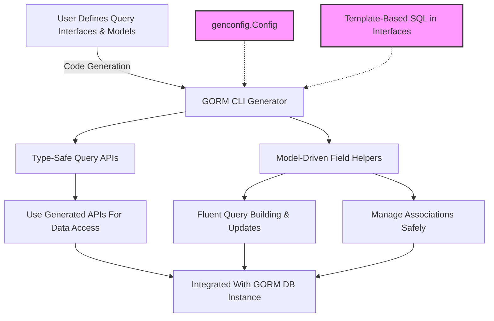

# Quick Feature Overview

Unlock the full power of the GORM CLI by exploring its core features at a glance. This overview highlights the fundamental capabilities that transform your Go GORM projects with type-safe query APIs, expressive, model-driven field helpers, comprehensive association operations, flexible configuration, and powerful template-driven code generation. Discover how each feature addresses common development challenges and elevates your productivity.

---

## Type-Safe Query APIs from Interfaces

### What It Does
Define Go interfaces annotated with SQL templates to automatically generate fully type-safe, fluent query APIs. These methods let you write queries declaratively yet get compile-time safety and autocompletion in your IDE.

### Why It Matters
- Eliminates runtime SQL errors by catching issues during compilation.
- Improves developer confidence and accelerates query authoring.
- Seamlessly integrates with GORM’s familiar DB context.

### Typical Use Case
Define a Query interface with raw SQL in method comments. For example:

```go
// Interface declaration
// SELECT * FROM @@table WHERE id=@id
GetByID(id int) (T, error)
```

Generated code includes a concrete method `GetByID(ctx, id)` that returns strongly typed result structs or errors, simplifying usage:

```go
user, err := generated.Query[User](db).GetByID(ctx, 123)
```

---

## Model-Driven Field Helpers

### What It Does
Automatically generate field helpers for your Go struct models, creating strongly typed fields, predicates, and setters for query filters and updates.

### Why It Matters
- Provides fluent, readable query building.
- Reduces boilerplate for SQL conditions and update expressions.
- Supports a wide range of Go-native and custom field types.

### Key Features
- Predicates like `.Eq(value)`, `.Like(pattern)`, `.Between(a, b)`
- Update setters handling zero values and complex expressions
- Support for scalar fields (int, string, time, bool, etc.) and JSON fields

### Example
```go
generated.User.Name.Eq("alice")           // WHERE name = "alice"
generated.User.Age.Between(18, 65)        // WHERE age BETWEEN 18 AND 65
```

---

## Powerful Association Operations

### What It Does
Generate helpers for relational associations (`has one`, `has many`, `belongs to`, `many2many`) to perform create, update, unlink, and delete operations with compile-time safety.

### Why It Matters
- Simplifies complex operations on related data.
- Enforces correct foreign key handling and join table logic.
- Supports batch creates and filtered conditional unlink/delete.

### Semantics
- `Unlink()` clears foreign keys or removes join rows without deleting associated data.
- `Delete()` removes associated rows or join rows depending on relation type.
- `CreateInBatch()` efficiently links or creates multiple related entities.

### Example
```go
gorm.G[User](db).
  Set(
    generated.User.Pets.Create(generated.Pet.Name.Set("fido")),
  ).
  Create(ctx)
```
This creates a new user and associates a pet named "fido" in a single operation.

---

## Extensible Configuration via `genconfig.Config`

### What It Does
Allows flexible customization of the generation process with declarative config objects in your Go packages.

### Why It Matters
- Tailors code generation to your project’s needs (output paths, filtering, mappings).
- Supports inclusion/exclusion patterns for interfaces and structs.
- Maps custom Go types or struct tags to field helper types.

### Example Configuration Snippet
```go
var _ = genconfig.Config{
  OutPath: "examples/output",
  FieldTypeMap: map[any]any{
    sql.NullTime{}: field.Time{},
  },
  IncludeInterfaces: []any{"Query*"},
}
```

---

## Template-Driven SQL Code Generation

### What It Does
Use a powerful templating DSL embedded in Go interface method comments to write raw SQL with placeholders, conditional, and iterative logic.

### Why It Matters
- Supports dynamic WHERE, SET, and complex conditional logic easily.
- Enables safe SQL parameter binding, avoiding injection risks.
- Keeps your SQL close to Go types and method signatures.

### Supported DSL Constructs
- `@@table` and `@@column` for dynamic table and column binding.
- `@param` for parameter placeholders linked to Go method args.
- `{{where}}...{{end}}` and `{{set}}...{{end}}` blocks for conditional clauses.
- `{{if}}`, `{{else}}`, and `{{for}}` for flexible SQL generation.

### Example
```sql
-- Dynamic WHERE with conditions
SELECT * FROM @@table
{{where}}
  {{if @user.Name != ""}} name=@user.Name {{end}}
  {{if @user.Age > 0}} AND age=@user.Age {{end}}
{{end}}
```

---

## How These Features Fit Together



This flow highlights the user journey: define your interfaces and models, optionally declare configuration, embed SQL templates, then run the generator to produce safe, flexible APIs integrated with GORM.

---

## Practical Benefits

- **Compile-Time Safety:** Detect SQL and type errors before runtime.
- **Reduced Boilerplate:** Write less repetitive query and update code.
- **Improved Developer Experience:** Autocompletion and discoverability in IDEs.
- **Flexible Customization:** Adapt generation per package or file.
- **Simplified Relation Handling:** Manage complex associations confidently.

---

## Typical User Flow

<Steps>
<Step title="Define Query Interfaces and Models">
Write Go interfaces with SQL templates in method comments and define your data models with GORM tags.
</Step>
<Step title="Optional: Declare Generation Configuration">
Add a package-level `genconfig.Config` for custom output paths, type mappings, or filtering.
</Step>
<Step title="Run the CLI Generator">
Execute `gorm gen -i path/to/your/interfaces -o path/to/generated` to generate query APIs and field helpers.
</Step>
<Step title="Use Generated Code in Your Application">
Import and use the generated APIs and field helpers to build safe, fluent database operations.
</Step>
</Steps>

---

## Troubleshooting & Best Practices

<AccordionGroup title="Common Tips">
<Accordion title="Ensure Method Return Signatures Are Correct">
Methods with SQL templates that finish data queries must return a value and an error, with the error typically last.
</Accordion>
<Accordion title="Leverage genconfig.Config for Custom Types">
Map any custom Go types or fields with specific tags to appropriate field helpers to maintain type safety.
</Accordion>
<Accordion title="Keep SQL Templates Clean and Parameterized">
Use the provided DSL to avoid SQL injection and keep complex SQL manageable with conditions and loops.
</Accordion>
<Accordion title="Keep Your Interfaces and Models in the Same Directory">
This helps the generator discover and process related files together for best results.
</Accordion>
</AccordionGroup>

---

For a deeper dive into each feature and practical usage examples, see related documentation on [Template-Based Queries](/concepts/core-concepts/template-dsl), [Association Operations](/guides/advanced-features-patterns/association-operations), and [Customizing Generation Config](/guides/advanced-features-patterns/customizing-generation-config).


---

*This overview serves as the springboard to mastering GORM CLI’s powerful generation capabilities, turning your Go GORM projects into models of clarity, type safety, and maintainability.*


---