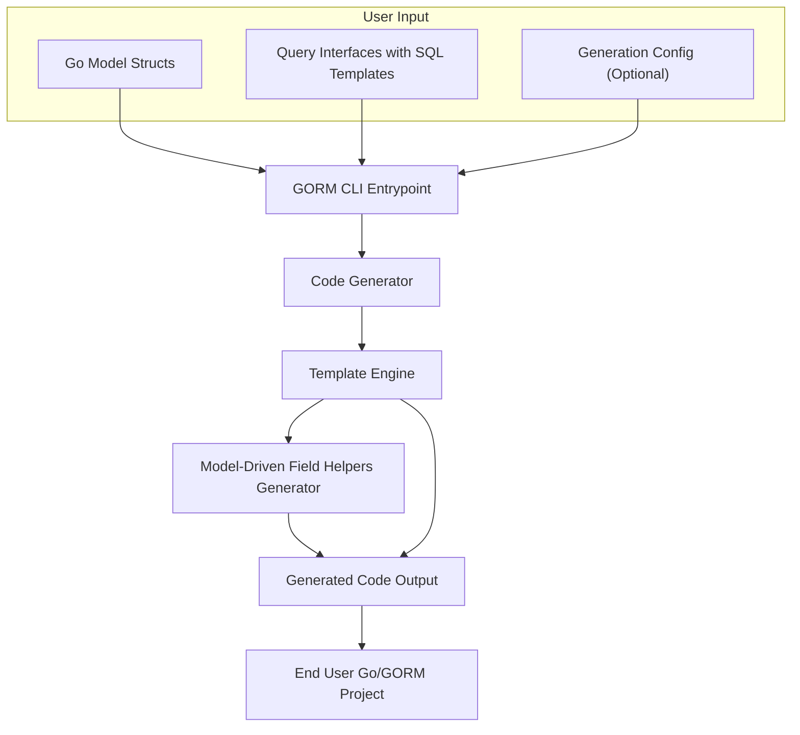

# System Architecture

## Understanding the Core Architecture of GORM CLI

GORM CLI is a powerful code generation tool tailored for Go developers using GORM. This page breaks down its system architecture to explain how your Go models and query interfaces are transformed into efficient, type-safe, and fluent APIs that integrate seamlessly with your projects.

---

## Why This Matters to You

Imagine you have existing Go structs representing your data models and interfaces specifying your database queries using SQL templates. GORM CLI automates the creation of safe, discoverable API layers over those definitions, saving you from writing error-prone boilerplate code manually.

By understanding this architecture, you gain clarity on how your code flows through the generation pipeline, how customizations apply, and where to intervene if advanced configuration or troubleshooting is needed.

---

## High-Level Architectural Flow

The system begins with your input files, which typically include:

- **Model Structs:** Your Go struct definitions representing database tables.
- **Query Interfaces:** Go interfaces annotated with SQL templates specifying the queries you want to perform.
- **Optional Generation Configuration:** Package-level settings that tune how code is produced.

These inputs are processed by the CLI entrypoint, which orchestrates multiple components to parse, analyze, generate, and write the resulting Go source code.

### Mermaid Diagram

### Explanation of Components

- **GORM CLI Entrypoint:** This is the command-line interface you invoke (e.g., `gorm gen`) that acts as the controller. It accepts your inputs and kicks off the generation process.

- **Code Generator:** Parses your Go source files, extracting AST representations of your structs and interfaces. It applies filtering and inclusion/exclusion rules defined in your config.

- **Template Engine:** Takes the parsed metadata and renders Go source code based on predefined templates. It combines information from interfaces and models to generate query APIs and helpers.

- **Field Helpers Generator:** Specifically focuses on creating type-safe, model-driven helpers for fields and associations following GORM conventions.

- **Generated Code Output:** The final Go source files written to disk, structured in the output directory you specify. This includes query implementations and field helper sets.

- **End User Go/GORM Project:** The generated code integrates directly into your existing codebase, enabling type-safe queries and flexible database operations with no extra runtime overhead.

---

## Detailed Workflow

### 1. Input Processing

- The CLI begins by reading your input path (file or directory).
- It recursively scans and parses Go files, building an internal representation of:
  - Structs (Models)
  - Interfaces (Query definitions)
  - Package-level Configs

### 2. Filtering and Configuration Application

- Based on your package-level `genconfig.Config` declarations, the generator filters which interfaces and structs to include or exclude.
- Configurations also influence output paths and type mappings for fields.

### 3. Code Generation Logic

- For each interface:
  - Extract methods and their annotated SQL templates.
  - Validate return types and method signatures for type safety.
  - Prepare method implementations as per the given SQL.

- For each model struct:
  - Generate field helpers that map fields to fluent, type-safe predicates and setters.
  - Generate association helpers for managing relational data operations.

- All code is generated via Go `text/template` to produce idiomatic, readable source code.

### 4. Writing Output

- Generated files honor your specified `OutPath` or default to `./g`.
- Directory structure mirrors your input's package layout.
- Each output file contains clearly marked generated code headers.

### 5. Integration in Your Project

- The generated Go files are ready to use immediately.
- You access generated query APIs via type-safe methods based on your interfaces.
- Field helpers enable expressive filters, updates, and association management with compile-time safety.

---

## Best Practices and Tips

- **Define clear interfaces:** Writing concise, SQL-annotated interfaces drives clean generated code.
- **Use package-level config:** Customize generation behavior for field mappings and file output.
- **Keep input packages organized:** This supports maintainable generated output mirroring your source.
- **Leverage field and association helpers:** They dramatically simplify complex DB operations.

---

## Troubleshooting Common Workflow Issues

<AccordionGroup title="Common Troubleshooting Scenarios">
<Accordion title="Generation Output Directory Not as Expected">
Verify your package-level `genconfig.Config` includes the correct `OutPath`. The CLI respects configs and defaults to `./g`.
</Accordion>
<Accordion title="Interface Methods Fail Validation">
Ensure interface methods return the expected types - either `(T, error)` or `(error)` and that SQL templates are correctly annotated.
</Accordion>
<Accordion title="Struct Fields Missing in Helpers">
Make sure your Go model structs export fields properly and avoid anonymous embedding pitfalls that might mask fields.
</Accordion>
<Accordion title="Configs Not Applied Recursively">
Confirm your `FileLevel` config flag. When set to `false`, configs apply to the directory subtree; when `true`, only to the specific file.
</Accordion>
</AccordionGroup>

---

## Next Steps

- Proceed to [Integration with GORM and Go Projects](/overview/architecture-concepts/integration-overview) to understand practical usage.
- Visit [Writing Type-Safe Queries from Interfaces](/guides/core-workflows/writing-type-safe-queries) for detailed instructions on defining query interfaces.
- Explore [Configuration & Customization](/concepts/scalability-integration/configuration-and-customization) to tailor generation to your project.

---

This architectural insight equips you to leverage GORM CLI at its full potential, empowering your Go applications with robust, type-safe database interactions generated seamlessly from your own code artifacts.
