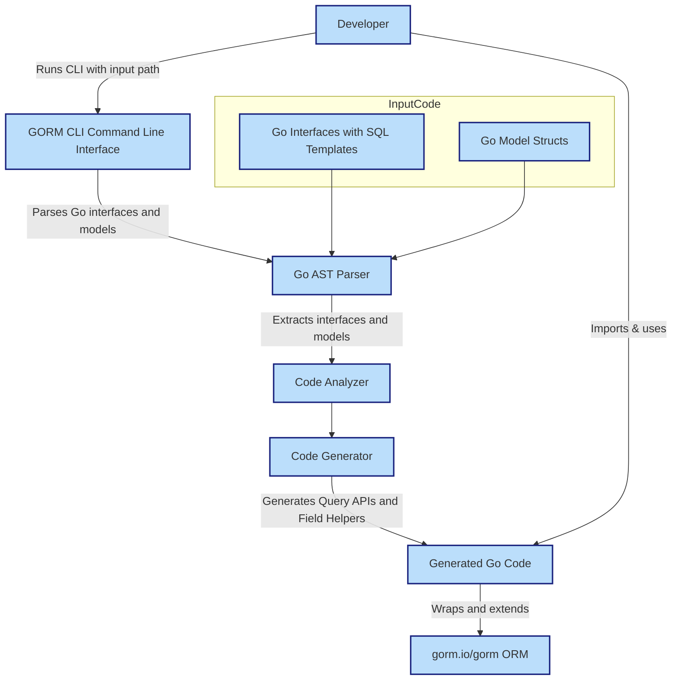

# System Architecture & Workflow

## Visualizing the GORM CLI Workflow

Understanding how GORM CLI transforms Go interfaces and models into powerful, type-safe query APIs is crucial to mastering its usage. This page visually and descriptively breaks down the core workflow, showing how your input evolves through the CLI's generation process into fully integrated code that streamlines your database operations.

---

## What You'll Learn Here

- How your Go interfaces and model structs are processed by the GORM CLI code generator
- The interaction points between developers and the CLI tool
- How generated code integrates seamlessly with the GORM ORM
- A detailed Mermaid.js architecture diagram illustrating these components and their relationships

---

## The GORM CLI Workflow: From Interfaces to Generated Code

At its heart, GORM CLI acts as a bridge that converts your handwritten Go code into fluent, type-safe database interaction layers. Here's how the process unfolds:

1. **User Input:**
   - You provide Go source files defining **interfaces** annotated with raw SQL templates and **struct models** representing database tables.
   - These files form the input to the CLI’s generator.

2. **Code Generator:**
   - Using Go's parser and AST (Abstract Syntax Tree), the generator analyzes the provided interfaces and models.
   - It extracts metadata such as method signatures, SQL templates, and struct fields including associations.
   - This metadata allows it to generate complementary code: type-safe **query APIs** from interfaces and **field helpers** from models.

3. **Integration with GORM:**
   - The generated code, designed to wrap the existing `gorm.io/gorm` ORM, provides you with fluent and compile-time safe methods.
   - This seamless layering eliminates runtime SQL errors and enhances developer productivity by leveraging Go’s type system.

4. **Developer Interaction:**
   - The CLI is driven via command-line commands (e.g., `gorm gen -i input_path -o output_path`).
   - After generation, you import and use the generated APIs in your project for safer, more expressive database operations.

---

## Architecture Diagram



---

## Detailed Explanation of Components

### Developer
You, the Go backend engineer or team, prepare your project with:
- **Query interfaces** containing raw SQL in comments (annotated methods).
- **Go model structs** defining your database schema and relationships.

You invoke the CLI with your input directories and specify an output path.

### GORM CLI Command Line Interface
Receives CLI commands and kicks off the processing chain.
Uses the Cobra library internally to provide command structure and flags such as `-i` for input path and `-o` for output.

### Go AST Parser
Analyzes your Go source files without compiling them, extracting Abstract Syntax Trees that describe interfaces, struct fields, comments, and annotations.

### Code Analyzer
- Extracts metadata from AST, such as interface method SQL templates and model field definitions.
- Recognizes associations and field types to guide helper generation.
- Applies any configuration overrides from package-level `genconfig.Config`.

### Code Generator
- Uses Go templates to create Go source files containing type-safe query methods and field helpers.
- Generates methods implementing your interfaces with safe parameter bindings and dynamic SQL.
- Generates strongly typed field helpers for filters, updates, and association operations.

### Generated Go Code
- Ready-to-use Go code that imports `gorm.io/gorm` and extends it with generated APIs.
- Provides methods like `Query[T any](db)` and `G[T](db)` usage patterns.

### Integration with GORM
The generated code wraps the existing GORM ORM methods, adding compile-time safety and fluent API capabilities that make querying and updating your database easier and less error prone.

---

## How Developers Typically Work With the CLI

1. Define your models (e.g., `User`, `Account`) and query interfaces with SQL templates.
2. Run the CLI generation command:

```bash
gorm gen -i ./path/to/interfaces -o ./generated
```

3. Import the generated package in your application:

```go
import "yourProject/generated"
```

4. Use the generated APIs with compile-time guarantees:

```go
user, err := generated.Query[User](db).GetByID(ctx, 123)
```

5. Update or create records with type-safe helpers:

```go
gorm.G[User](db).
  Set(
    generated.User.Name.Set("alice"),
    generated.User.Age.Incr(1),
  ).
  Update(ctx)
```

---

## Practical Tips

- **Keep interfaces and models together:** Organize your interfaces and model structs in the same package or directory for smooth processing.
- **Leverage configuration:** Use `genconfig.Config` for fine-grained inclusion/exclusion and custom field mappings.
- **Understand association helpers:** Generated code supports complex association operations with compile-time safety—review examples in usage docs.
- **Avoid manual edits on generated files:** All changes should be made in your source interfaces/models.

---

## Common Pitfalls

- Missing `-i` input flag when calling the CLI will cause generation to fail.
- Forgetting to import the generated package leads to compile errors.
- Interface methods that do not return at least an error on finished queries will fail generation.
- Renaming model fields without regenerating code causes mismatches.

---

## Next Steps

To get started with your first code generation or learn how to write your models and query interfaces, visit:

- [Writing Models and Query Interfaces](/getting-started/first-steps/write-models-interfaces)
- [Generating Code for the First Time](/getting-started/first-steps/run-generator)
- [Testing and Using Generated Code](/getting-started/first-steps/validate-usage)

For an in-depth understanding of GORM CLI’s concepts and features, see:

- [What is GORM CLI?](/overview/product-intro-core/what-is-gorm-cli)
- [Value Proposition & Use Cases](/overview/product-intro-core/core-value-proposition)
- [Core Concepts & Terminology](/overview/architecture-concepts/concepts)

---

<Check>
Understanding the flow from your code inputs through the CLI's generation process is essential for harnessing GORM CLI's power. This visualization and breakdown empower you to optimize your development workflow, reduce boilerplate, and catch bugs at compile time using generated type-safe APIs.
</Check>

---