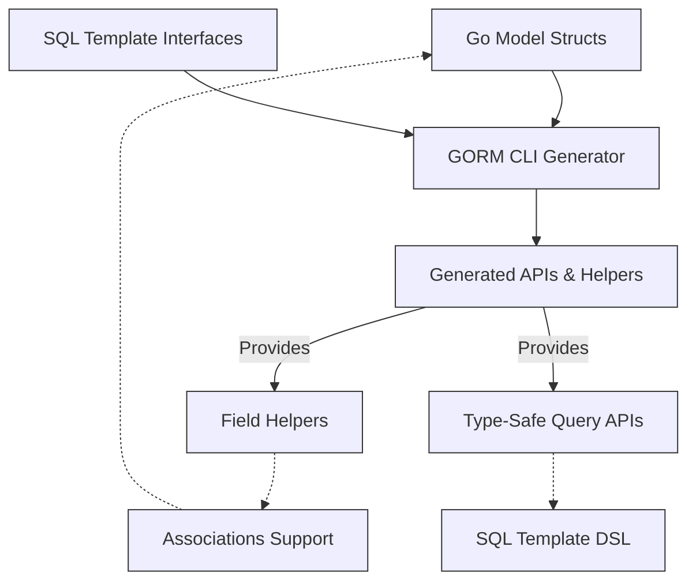

# Core Concepts & Terminology

Discover the fundamental terms and principles that power GORM CLI. This page lays the foundation for understanding the key elements such as field helpers, type-safe query APIs, SQL template interfaces, associations, and code generation configuration. We also explore the philosophy behind GORM CLI’s design, helping you grasp the core concepts essential for effective use.

---

## Understanding GORM CLI’s Core Concepts

GORM CLI is designed to generate powerful, type-safe, and fluent Go code that takes the pain out of database operations. To fully benefit from it, you must understand several foundational concepts that govern how it transforms your Go interfaces and models into intuitive, compile-time safe API layers.

### What Are Field Helpers?
Field helpers are generated constructs that represent your model's fields with type awareness. Instead of manually writing SQL conditions or updates, you interact with these helpers — for example, `generated.User.Name` or `generated.Account.RewardPoints` — which provide methods for common predicates, setters, and expressions.

- **Type Safety:** Field helpers enforce the Go type of the underlying model field, helping prevent common mistakes such as SQL injection or type mismatches.
- **Readable Queries:** Use fluent methods like `.Eq()`, `.Like()`, `.Between()`, `.Set()`, and `.Incr()` to declaratively express your intended operations.

For example:
```go
// Filter users with a specific name
users, err := gorm.G[User](db).Where(generated.User.Name.Eq("alice")).Find(ctx)

// Increase score by 1
err := gorm.G[User](db).Where(generated.User.ID.Eq(1)).Set(generated.User.Score.Incr(1)).Update(ctx)
```

### What Are Type-Safe Query APIs?
GORM CLI transforms Go interfaces annotated with SQL templates into concrete, type-safe query APIs. Your interface methods describe SQL queries or updates using a simple templating DSL; the CLI generates implementation code that ensures:

- **Compile-time Validation:** Method parameters and return types are checked for correctness.
- **Context Awareness:** The generated code automatically injects `context.Context` into method signatures if missing.
- **SQL Template DSL:** Customizable SQL with placeholders like `@@table`, `@param`, and conditional directives (`{{where}}`, `{{set}}`, `{{if}}`, etc.) makes queries dynamic and expressive.

Example Query Interface:
```go
type Query[T any] interface {
	// SELECT * FROM @@table WHERE id=@id
	GetByID(id int) (T, error)

	// UPDATE @@table {{set}} ... {{end}} WHERE id=@id
	UpdateInfo(user models.User, id int) error
}
```

Using the generated API:
```go
user, err := generated.Query[User](db).GetByID(ctx, 123)
err = generated.Query[User](db).UpdateInfo(ctx, updatedUser, 123)
```

### SQL Template Interfaces
These are the Go interfaces where you write method comments using a powerful SQL template DSL. This DSL provides:

- **`@@table` and `@@column`:** Automatically resolve model table names and columns.
- **`@param`:** Bind Go method parameters to SQL parameters safely.
- **Conditional Constructs:** `{{where}}`, `{{set}}`, `{{if}}`, and iteration with `{{for}}` make complex queries easier to write.

This blend allows you to leverage native SQL power combined with Go’s type system.

### Understanding Associations
Your Go models often include relationships (associations) such as “has one”, “has many”, “belongs to”, and “many2many”. GORM CLI generates specialized helpers to manage these associations safely and expressively.

Association helper types include:
- `field.Struct[T]` for single associations
- `field.Slice[T]` for collections

Supported operations on associations include:
- `Create`, `CreateInBatch`
- `Update`
- `Unlink` (removes association link without deleting data)
- `Delete` (removes associated rows or join rows in many2many)

Example:
```go
gorm.G[User](db).
  Set(
    generated.User.Name.Set("alice"),
    generated.User.Pets.Create(generated.Pet.Name.Set("fido")),
  ).
  Create(ctx)
```

### Code Generation Configuration
To customize the generator’s behavior, you may declare a package-level `genconfig.Config`. This config controls:

- Output paths (`OutPath`)
- Inclusion or exclusion filters for interfaces and structs
- Type mappings to override or extend default helper types
- Granularity settings such as file-level application (`FileLevel`)

Example Configuration Snippet:
```go
var _ = genconfig.Config{
  OutPath: "examples/output",
  FieldTypeMap: map[any]any{
    sql.NullTime{}: field.Time{},
  },
  IncludeInterfaces: []any{"Query*"},
  ExcludeStructs: []any{"*DTO"},
}
```

Use configuration to gain precise control over generation scope and helper types.

---

## The Philosophy Behind GORM CLI

GORM CLI was designed to solve core developer pain points in working with databases in Go:

- **Eliminate Boilerplate:** Instead of hand-writing SQL and repetitive query logic, generate forward-compatible type-safe APIs.
- **Strong Typing & Safety:** Catch errors at compile time instead of runtime, avoiding common bugs.
- **Fluent Discoverability:** Provide clear, IDE-assisted APIs that are easier to understand and evolve.
- **Flexibility Through Templates:** Allow complex SQL queries via composable templates, making dynamic queries manageable.
- **Seamless GORM Integration:** Built on top of GORM’s core abstractions to provide a natural extension.

The combination of these principles enables teams to standardize and streamline their database access layers effectively.

---

## Practical User Flow With Core Concepts

### Define your Go Models
Models include usual fields and association declarations using GORM tags:
```go
// examples/models/user.go
package models

type User struct {
  gorm.Model
  Name      string
  Age       int
  Pets      []*Pet
  Languages []Language `gorm:"many2many:UserSpeak"`
  Profile   string `gen:"json"`
}
```

### Write Query Interfaces with Templates
Create flexible and type-safe interfaces with SQL in comments:
```go
type Query[T any] interface {
  // SELECT * FROM @@table WHERE id=@id
  GetByID(id int) (T, error)

  // Updates with conditional SQL
  // UPDATE @@table {{set}} ... {{end}} WHERE id=@id
  UpdateInfo(user User, id int) error
}
```

### Configure Generation (Optional)
Adjust generation scope and mapping using `genconfig.Config`:
```go
var _ = genconfig.Config{
  OutPath: "generated",
  FieldNameMap: map[string]any{"json": JSON{}},
  IncludeInterfaces: []any{"Query*"},
}
```

### Generate Code
Run the CLI tool:
```bash
gorm gen -i ./examples -o ./generated
```

### Use Generated APIs
Consume strongly typed query APIs and field helpers:
```go
user, err := generated.Query[User](db).GetByID(ctx, 123)
err = gorm.G[User](db).Where(generated.User.Name.Eq("alice")).Update(ctx)
```

---

## Common Pitfalls and Tips

- **Missing Context Param:** GORM CLI automatically injects `context.Context` in generated methods if omitted; you do not need to add it manually.
- **Naming Conflicts:** Use `FieldNameMap` and `FieldTypeMap` to resolve type or naming collisions.
- **Associations Setup:** Properly define GORM tags such as `gorm:"many2many:<join_table>"` or `gorm:"polymorphic:<Owner>"` to ensure association helpers generate correctly.
- **Template Accuracy:** Ensure correct use of SQL template DSL with proper directives (`@@table`, `{{where}}` etc.) to avoid generation errors.

---

## Diagram: How Core Concepts Fit Together



---

## Next Steps

- Explore the [Architectural Overview](/overview/architecture-core-concepts/architecture-overview) to see how these core concepts are implemented.
- Dive into [Feature Highlights](/overview/feature-overview-workflows/feature-spotlight) to understand key usage patterns.
- Review [Configuration & Troubleshooting](/getting-started/configuration-troubleshooting/configuring-generator) for customizing generation.

---

## Additional Resources
- [What is GORM CLI?](/overview/product-intro-value/what-is-gorm-cli) — Introduction and main value proposition.
- [Why Choose GORM CLI?](/overview/product-intro-value/value-proposition) — Benefits and business impact.
- [Who Should Use GORM CLI?](/overview/product-intro-value/target-audience-use-cases) — Ideal users and scenarios.

---

By mastering these core concepts and terminology, you gain clarity on GORM CLI’s power and how to wield it effectively in your Go applications.
