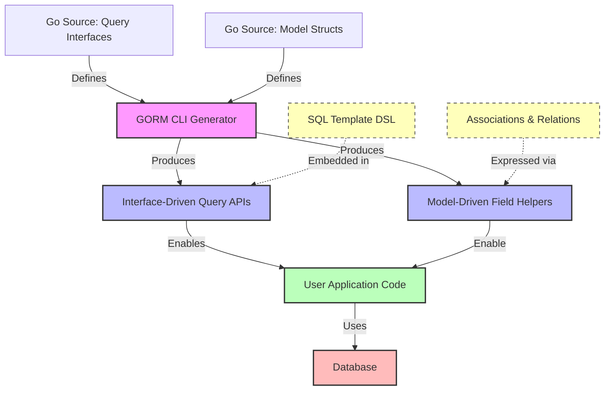

# Core Concepts & Terminology

Understanding the key ideas behind GORM CLI is essential for leveraging its powerful code generation capabilities. This page explains the major concepts that underlie how the tool transforms your Go interfaces and model structs into reliable, maintainable, and type-safe query APIs.

---

## Interface-driven Query APIs

At the heart of GORM CLI is the generation of **interface-driven query APIs**. Developers write Go interfaces annotated with raw SQL templates (inside method comments). The generator processes these interfaces to produce concrete implementations that execute type-safe queries.

- **What it is:** You define Go generic interfaces representing queries, with SQL templates specifying the exact queries to be run.
- **Why it matters:** This approach enforces strong typing at compile time, reducing runtime errors from malformed queries or mismatched parameters.
- **How it works:** The generator recognizes placeholders like `@@table` for table names, `@param` for bound parameters, and directives like `{{where}}` for conditional SQL.

> Example snippet of a query interface method with a SQL template:
>
> ```go
> type Query[T any] interface {
>   // SELECT * FROM @@table WHERE id=@id
>   GetByID(id int) (T, error)
> }
> ```

This method, once generated, allows you to query your data with full Go type safety:

```go
user, err := generated.Query[User](db).GetByID(ctx, 123)
```

---

## Model-driven Field Helpers

GORM CLI complements query APIs with **model-driven field helpers** generated from your Go structs.

- **What it is:** Based on your model struct fields (including basic types and associations), the generator creates typed field helper objects.
- **Purpose:** These helpers make it easy and safe to build filters (`Where` clauses), updates, ordering, and association operations.
- **Associations included:** `has one`, `has many`, `belongs to`, and `many2many`.

This pattern means you don't need to write raw strings for column names or worry about typos. Instead, you get a fluent, discoverable API:

```go
// Filtering users older than 18
users, err := gorm.G[User](db).Where(generated.User.Age.Gt(18)).Find(ctx)

// Updating user name
err := gorm.G[User](db).Where(generated.User.ID.Eq(1)).Set(generated.User.Name.Set("jinzhu")).Update(ctx)
```

The model helpers also support various predicate methods (`Eq`, `Like`, `Between`, `IsNull`) and updating expressions (`Incr`, `SetExpr`).

---

## Compile-time Safety

One of GORM CLI’s standout benefits is **compile-time safety**:

- Your queries and updates are generated in Go code with strict typing.
- Incorrect SQL syntax, parameter mismatches, or field name typos are caught early.
- Association operations (Create, Update, Unlink, Delete) are strongly typed and validated.

This reduces bugs, runtime panics, and the need for excessive manual testing around database access code.

---

## Association Helpers

For relational models, GORM CLI generates **association helpers** to express complex relationship operations with clear semantics:

- These exist as fields like `field.Struct[T]` or `field.Slice[T]` on generated model helpers, e.g., `generated.User.Pets` or `generated.User.Account`.
- Supported operations include:
  - `Create`: New related rows per parent
  - `CreateInBatch`: Batch-create related rows
  - `Update`: Update associated rows optionally filtered
  - `Unlink`: Remove links without deleting actual rows (nullify FK or delete join rows)
  - `Delete`: Fully remove associated rows (for m2m, this means deleting join rows)

### Semantics by Association Type

| Type       | Unlink Behavior              | Delete Behavior                     |
|------------|-----------------------------|-----------------------------------|
| belongs to | Clears parent FK (NULL)      | Deletes associated row             |
| has one    | Clears child FK (NULL)       | Deletes child row                  |
| has many   | Clears child FK (NULL)       | Deletes child rows                 |
| many2many  | Deletes join rows only       | Deletes join rows only             |

This precise control allows you to manage relationships smoothly and safely in one fluent API.

---

## Template SQL

GORM CLI uses a rich **SQL template DSL** within interface method comments for query definition:

| Directive   | Purpose                                | Example                                  |
|-------------|----------------------------------------|------------------------------------------|
| `@@table`   | Resolves to the model’s table name       | `SELECT * FROM @@table WHERE id=@id`     |
| `@@column`  | Dynamic column binding                   | `@@column=@value`                        |
| `@param`    | Binds Go method parameters to SQL parameters | `WHERE name=@user.Name`                  |
| `{{where}}` | Conditional WHERE clause wrapper         | `{{where}} age > 18 {{end}}`             |
| `{{set}}`   | Conditional SET clause (for UPDATE)      | `{{set}} name=@name {{end}}`             |
| `{{if}}`    | Conditional SQL fragment                  | `{{if age > 0}} AND age=@age {{end}}`    |
| `{{for}}`   | Iteration over a collection               | `{{for _, tag := range tags}} ... {{end}}` |

This DSL allows dynamically tailoring SQL within your Go interfaces, generating efficient and readable queries without sacrificing type safety.

> Example template usage:
>
> ```sql
> SELECT * FROM @@table
> {{where}}
>   {{if name != ""}} name=@name {{end}}
>   {{if age > 0}} AND age=@age {{end}}
> {{end}}
> ```

---

## How These Concepts Fit Together

1. You write Go model structs representing your database tables, including associations.
2. You write Go generic interfaces annotated with SQL template comments that declare your queries.
3. The GORM CLI `gen` command parses your models and interfaces:
   - Generates type-safe **field helpers** for all fields and associations.
   - Generates concrete **query API implementations** from your interfaces.
4. The generated code provides compile-time safety and fluent APIs for write, read, and relational data tasks.

Together, these components accelerate your development with GORM by ensuring correctness, clarity, and control over your database interaction.

---

## Practical Example Flow

```go
// Define your model
 type User struct {
   ID   uint
   Name string
   Age  int
 }

// Define your query interface with SQL templates
 type Query[T any] interface {
   // SELECT * FROM @@table WHERE id=@id
   GetByID(id int) (T, error)
 }

// Generate code
 // $ gorm gen -i ./path/to/package -o ./generated

// Use generated API
 user, err := generated.Query[User](db).GetByID(ctx, 123)
```

This simple example surfaces the power of the core concepts: interface-driven queries, model-driven field helpers, and compile-time safety.

---

## Tips for Success

- **Use interface-driven queries** to encapsulate SQL logic clearly and reuse query patterns.
- **Leverage generated field helpers** instead of raw SQL strings to build predicates, updates, and associations.
- **Use association helpers** to manage related data with precise semantics.
- **Write expressive SQL templates** with the DSL directives for dynamic, conditional queries.
- **Configure generation selectively** using `genconfig.Config` for fine control over output.

---

## Common Pitfalls

- Forgetting to include `context.Context` in interface methods will have it inserted automatically, but explicitly declaring it clarifies intent.
- In templates, ensure you escape special characters like `@` when needed (e.g., `\@name`).
- Association operations require understanding of `Unlink` vs `Delete` semantics to avoid unintended data loss.
- Avoid complex SQL in queries that do not map cleanly to single result struct types.

---

Explore the related documentation pages to deepen your understanding and master these concepts:

- [Interface-Driven Query APIs](/concepts/data-models-and-abstractions/interface-driven-query-apis)
- [Model-Driven Field Helpers](/concepts/data-models-and-abstractions/model-driven-field-helpers)
- [Association Semantics](/concepts/data-models-and-abstractions/association-semantics)
- [Template-Based Queries](/guides/best-practices-patterns/template-based-queries)
- [Using Generated APIs in Your Application](/guides/core-workflows/using-generated-apis)

---

For a deeper architectural view and a system walkthrough, see the [System Architecture Overview](/overview/architecture-core-concepts/system-architecture) page.


---

### Diagram: How Key Concepts Interact



---
