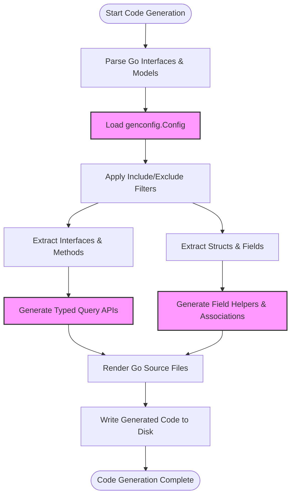

# Features at a Glance

## Quick Overview of GORM CLI’s Core Capabilities

This feature matrix offers a concise summary of the main capabilities that make GORM CLI an indispensable tool for developers working with Go and GORM. Here, you’ll find a snapshot of the product’s powerful, type-safe API generation from annotated interfaces, robust support for complex associations, flexible template-based SQL query generation, and a highly customizable configuration approach. Additionally, this page highlights where these features reside within the codebase to help you quickly identify key entry points and understand practical benefits.

---

## What You’ll Find on This Page

- A consolidated list of GORM CLI’s primary feature sets
- How each feature directly benefits your development workflow
- Guidance on where to explore the corresponding implementation or usage in the code
- Links to further detailed guides and examples

---

## Feature Matrix: Summary of Main Capabilities

| Feature                       | Description                                                                                         | User Benefit                                                         | Primary Code Location              |
|------------------------------|-------------------------------------------------------------------------------------------------|----------------------------------------------------------------------|----------------------------------|
| **Type-Safe API Generation** | Generates compile-time safe query APIs from Go interfaces annotated with SQL templates           | Eliminates runtime SQL errors; provides fluent, intuitive query code | `internal/gen/generator.go`       |
| **Support for Associations** | Creates model-driven field helpers and methods for managing relations (has one/many, belongs to) | Simplifies complex database relations with clear, safe API methods  | Model helpers in `internal/gen/template.go` and generated output |
| **Template-Based Queries**   | Allows embedding parameterized SQL with conditional clauses and iterations in interface comments | Enables flexible, reusable, and expressive queries without hand-writing SQL | Interface parsing in `internal/gen/generator.go`        |
| **Configurable Generation**  | Supports package-level `genconfig.Config` for controlling output path, filters, and mappings    | Targets code generation to project structure and custom field types  | Configuration parsing in `internal/gen/generator.go`    |

---

## Deep Dive Into Key Features

### 1. Type-Safe API Generation

GORM CLI transforms your annotated interfaces into fully typed query APIs. Method signatures reflect your SQL query’s parameters and expected results, providing immediate feedback from your Go compiler if usage does not match expectations.

**Example:**

```go
// Interface method annotated with SQL comment:
type Query[T any] interface {
  // SELECT * FROM @@table WHERE id=@id
  GetByID(id int) (T, error)
}

// Generated usage:
user, err := generated.Query[User](db).GetByID(ctx, 123)
```

*Benefit*: Avoid common SQL injection bugs and runtime errors by catching issues during compile time.

---

### 2. Support for Associations

Beyond simple fields, GORM CLI detects model relationships like has-many or many-to-many and generates specialized helpers to manage these links safely and fluently.

For example, association operations such as `Create`, `Update`, `Unlink`, and `Delete` allow precise control over related data.

**Example:**

```go
gorm.G[User](db).
  Set(
    generated.User.Name.Set("alice"),
    generated.User.Pets.Create(generated.Pet.Name.Set("fido")),
  ).
  Create(ctx)
```

*Benefit*: Manage complex relational data consistently while preserving type safety.

---

### 3. Template-Based Query Generation

Use a powerful templating DSL inside your interface method comments to build versatile SQL queries. Support for `{{where}}`, `{{set}}`, `{{if}}`, and `{{for}}` control flows enable dynamic SQL generation tailored to method parameters.

**Example:**

```go
// Embedded SQL template with conditionals
// {{where}}
//   {{if user.Age > 18}} age > 18 {{end}}
// {{end}}
FilterAdults(user User) ([]T, error)
```

This template gets compiled into efficient Go code that constructs the final SQL with correct parameter bindings.

*Benefit*: Write expressive queries that adapt to inputs, reducing boilerplate and improving maintainability.

---

### 4. Configuration and Customization

GORM CLI’s code generation respects package-level configurations through `genconfig.Config`. This lets you fine-tune the output directory, selectively include or exclude interfaces/structs, and customize how Go types or struct tags map to generated field helpers.

**Example:**

```go
var _ = genconfig.Config{
  OutPath: "examples/output",
  IncludeInterfaces: []any{"Query*"},
  FieldNameMap: map[string]any{
    "json": JSON{},
  },
}
```

*Benefit*: Adapt GORM CLI generation to fit your project layout, coding standards, and type conventions seamlessly.

---

## Where These Features Live in the Code

- **Core Generation Engine:** Located in `internal/gen/generator.go`, it parses your input Go files, extracts interfaces and structs, applies configs, and orchestrates code production.

- **Template Rendering:** `internal/gen/template.go` holds the Go text/template defining how interfaces and struct helpers are rendered to source files.

- **Configuration Parsing:** Integrated within `internal/gen/generator.go`, it processes package-level `genconfig.Config` declarations to influence generation scope and mapping.

- **Entry Point for CLI:** `internal/gen/gen.go` defines the CLI command `gorm gen` that triggers code generation with input and output flags.

---

## Real-World Impact: Why These Features Matter

By combining type safety, association management, expressive query templates, and flexible customization, GORM CLI helps Go developers avoid common pitfalls:

- **Prevent runtime query errors** with type-checked API methods.
- **Work confidently with complex database relations** through generated association helpers.
- **Write adaptable, concise SQL queries** embedded directly in interfaces.
- **Maintain clean project structure** with configurable generation paths and filters.

In a codebase where SQL queries and database models evolve frequently, these benefits compound to deliver safer, cleaner, and faster development cycles.

---

## Next Steps

To deepen your understanding and start taking full advantage of these features:

- Explore **[Product Introduction & Value](/overview/what-is-gorm-cli/product-introduction)** for foundational concepts.
- Review **[Writing Your First Models and Query Interfaces](/getting-started/first-steps-usage/writing-models-interfaces)** to start defining your queries.
- Follow the **[Generating Code with GORM CLI](/getting-started/first-steps-usage/generating-code)** guide to produce type-safe APIs.
- Check advanced guides like **[Working with Associations](/guides/advanced-patterns/association-operations)** and **[Template-based Queries](/guides/advanced-patterns/template-based-queries)** for deeper mastery.

---

## Summary Diagram: GORM CLI Feature Workflow



---

This page is your quick waypoint to identify GORM CLI’s main capabilities at a glance along with pointers to where you can learn or extend each feature.

Start building safer, clearer database-driven Go applications today with practical, type-safe code generation.

---