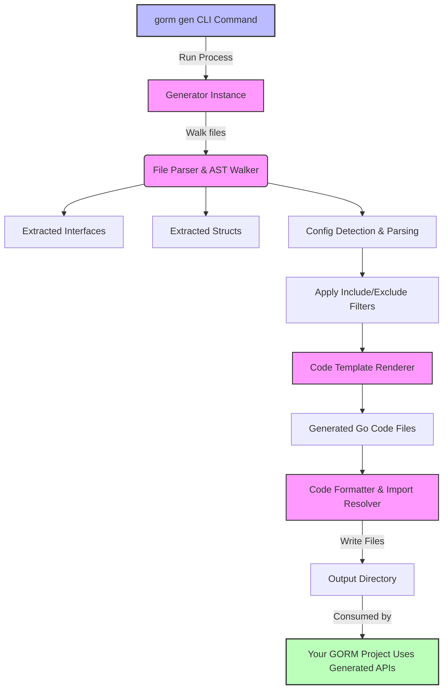

# High-Level Architecture

## Visualizing the Core Structure of GORM CLI

Understanding how GORM CLI operates under the hood empowers you to leverage its full potential and integrate it seamlessly into your workflow. This page guides you through the architecture behind the scenes, detailing the main components involved in the code generation process, how your Go models and interfaces come together with configuration inputs, and how the generated APIs integrate with GORM.

---

## Why This Matters to You

Imagine you're building a Go backend application and want to avoid runtime SQL errors while keeping queries fluent and type-safe. GORM CLI acts as your code-generating assistant, transforming your annotated Go interfaces and model structs into ready-to-use, compile-safe query APIs and field helpers that perfectly align with GORM's ecosystem.

This page explains the life cycle of that transformation — from your source code inputs through configuration and template rendering, culminating in powerful generated code that streamlines your database operations.

---

## Core Components and Workflow

### 1. CLI Entry Point

The user-facing command is `gorm gen`, which acts as the orchestrator:

- **Input**: Accepts paths to your Go files or directories containing interfaces with SQL annotations and model structs.
- **Output Directory**: Where the generated code artifacts will be placed, defaulting to `./g` unless overridden.

This command initializes the main `Generator` instance that powers the whole process.

### 2. File Processing and Parsing

The generator recursively walks through your input files, parsing each Go file to understand:

- **Imports**
- **Interfaces**: Identifies annotated Go interfaces with SQL templates embedded in comments.
- **Structs**: Extracts your model definitions to build type-safe field helpers.
- **Configurations**: Detects package-level generation configurations declared via `genconfig.Config` literals, allowing fine control over which interfaces and structs are included, output paths, and custom type mappings.

The process uses the Go abstract syntax tree (AST) to safely analyze your code without executing it.

### 3. Code Generation Engine

The heart of GORM CLI is its templating system:

- It takes parsed data and applies a robust Go `text/template` to generate:
  - Typed query interface implementations based on your annotated SQL methods.
  - Field helper structs and expressions for models, including basic fields and complex relations.

- The generator respects configuration directives like inclusions, exclusions, and advanced field mapping.
- It produces clean, idiomatic Go code formatted using `golang.org/x/tools/imports` to ensure readability and proper imports.

### 4. Integration with GORM

The generated APIs extend GORM functionality:

- **Query Interfaces** seamlessly wrap around `gorm.Interface[T]`, allowing you to call your typed methods directly on a GORM DB instance.
- **Field Helpers** provide typed predicates and setters that compose naturally with GORM queries and updates.

This tight integration guarantees both compile-time safety and fluent coding style.

---

## At-a-Glance Mermaid Diagram

---

## Practical Example: Your Workflow Walkthrough

Let’s say you have a directory with your models and interfaces:

- Your interfaces have methods annotated with raw SQL or templated SQL in comments.
- Your models are standard Go structs with GORM annotations.

Running `gorm gen -i ./examples -o ./generated` begins the process:

1. The CLI initializes the generator, identifying files and configs.
2. Every Go source file is parsed: interfaces are catalogued, and model structs are inspected for fields and associations.
3. Configuration filters are applied to focus generation only on desired interfaces and structs.
4. Templates generate Go files that implement your interfaces with type-safe methods and helpers.
5. The output is neatly formatted and saved.
6. You immediately start using the generated code in your GORM codebase, confident in the correctness and discoverability it provides.

---

## Tips & Best Practices

- **Consistent Package Structure:** Keep your SQL interfaces and models in close packages or directories to make configuration and generation smooth.
- **Use `genconfig.Config` Wisely:** Leverage include/exclude filters to manage large codebases efficiently.
- **Annotate Precisely:** Properly comment SQL methods for accurate generation.
- **Review Generated Code:** Familiarize yourself with the generated interfaces and helpers to write fluent, type-safe queries.

---

## Troubleshooting Common Issues

<AccordionGroup title="Common Troubleshooting Scenarios">
<Accordion title="No Generated Files Appear">
- Verify the input path is correct and contains Go files with annotated interfaces.
- Check your `genconfig.Config` for exclusion filters that might omit desired files.
- Ensure the CLI command specifies the required `-i` (input).
</Accordion>
<Accordion title="Compilation Errors in Generated Code">
- Generated code depends on your input interfaces and struct annotations being correct.
- Confirm that SQL annotations follow documented DSL syntax.
- Check that your models are properly declared and export fields.
</Accordion>
<Accordion title="Output Directory Is Empty or Incorrect">
- Use the `-o` flag to explicitly set output directory.
- Verify package-level configuration `OutPath` is not overriding your CLI flag unexpectedly.
</Accordion>
</AccordionGroup>

---

## Next Steps

- Proceed to [Defining Models and Query Interfaces](/getting-started/first-run-and-validation/create-models-and-interfaces) for practical guidance on preparing your code for generation.
- Run your first generation with the [Running the Code Generator](/getting-started/first-run-and-validation/run-code-generation) tutorial.
- Explore the [Core Concepts and Terminology](/overview/architecture-core-concepts/core-concepts-terminology) page to deepen your understanding of GORM CLI’s design.

---

## References & Links

- [GORM CLI Overview: What is GORM CLI?](../product-intro/what-is-gorm-cli)
- [GORM CLI Key Features](../product-intro/core-features-overview)
- [Target Audience & Use Cases](../product-intro/target-audience-use-cases)
- [GORM CLI Code Generator Source](https://github.com/go-gorm/cli/blob/main/internal/gen/gen.go)
- [Template & Code Generation Details](https://github.com/go-gorm/cli/blob/main/internal/gen/template.go)

---