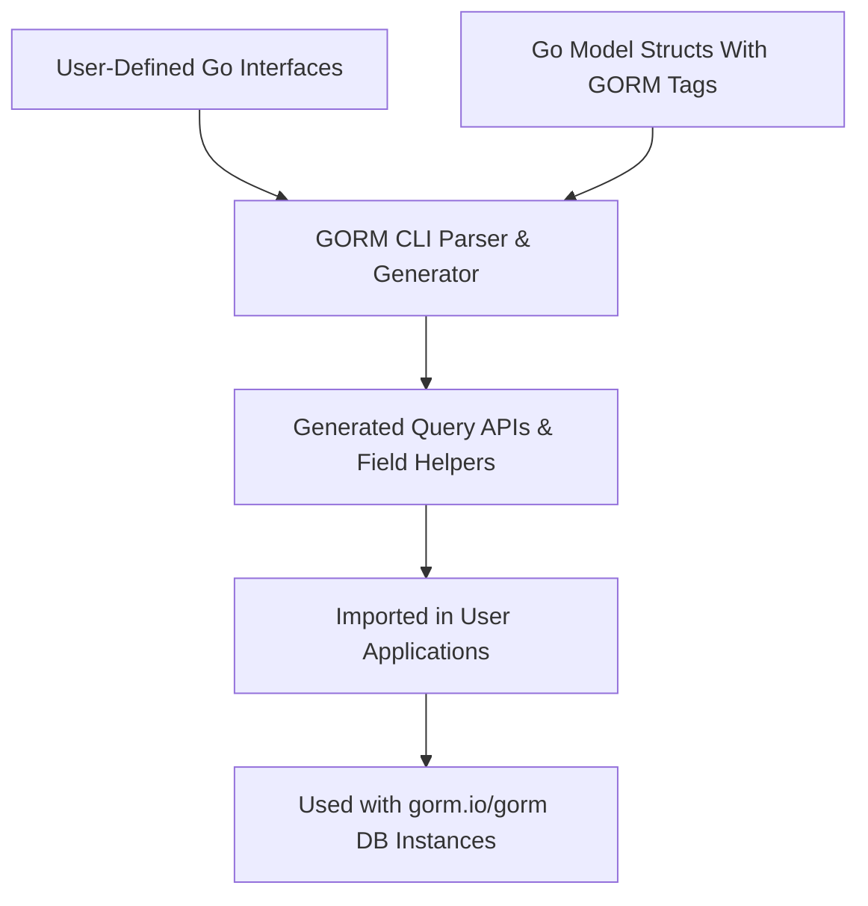

# Integration and Ecosystem

GORM CLI seamlessly integrates into standard Go and GORM-based projects, empowering developers with type-safe, fluent, and highly maintainable database code generation. This page guides you through how GORM CLI fits within your project’s tooling, its typical CLI workflow, supported dependencies, and best practices for extending its capabilities to meet unique requirements.

---

## Why Integration Matters

With GORM CLI’s generated APIs and helpers, you gain the benefits of compile-time safety and easier maintenance without disrupting your existing Go or GORM workflows. Integrating GORM CLI smoothly means you avoid boilerplate code, reduce runtime errors from manual SQL, and stay aligned with standard Go conventions.


## How GORM CLI Fits Into Your Go/GORM Project

1. **Source-Driven Generation**
   - Write Go interfaces annotated with SQL templates, and define your model structs with standard GORM tags.
   - Optionally, configure generation behavior with package-level `genconfig.Config` structs.

2. **Command-Line Trigger**
   - Use the `gorm gen` CLI command to scan input files and produce type-safe query APIs and model-driven field helpers.
   - Output defaults to a configurable directory (e.g., `./g`), keeping generated code cleanly separated.

3. **Compile-Time Safety & Fluent APIs**
   - Generated interfaces enforce method signatures and SQL contracts checked at compile time.
   - Field helpers support expressive predicates and association operations directly in Go code.

4. **Seamless Usage with `gorm.io/gorm`**
   - Generated APIs extend GORM’s `*gorm.DB` builders using generic patterns.
   - Support for associations and complex queries integrate naturally with GORM’s ecosystem.

### Typical User Flow

```bash
# 1. Write your interfaces with embedded SQL templates
# 2. Run the generator
gorm gen -i ./path/to/interfaces -o ./generated

# 3. Import and use the generated code in your application
go run main.go
```


## Dependable Prerequisites and Compatibility

- **Go Generics Support**
  - Requires Go 1.18 or newer, leveraging generics to enable type-safe APIs.
- **GORM ORM Compatibility**
  - Fully compatible with `gorm.io/gorm` (intended for seamless integration). Use GORM’s types, models, and DB builders alongside generated APIs.
- **Standard Go Tooling**
  - Works with native Go tooling and dependency management.

### Important Dependency Notes

- The generator depends on Cobra (`github.com/spf13/cobra`) internally for CLI commands.
- Generated code relies on common GORM packages such as `gorm.io/gorm`, `gorm.io/gorm/clause` and internal `field` and `genconfig` packages.

<Note>
GORM CLI is not a runtime database driver or ORM replacement—it's a code generation tool that augments your existing GORM models and workflows.
</Note>


## Extend and Customize Your Code Generation

Beyond default generation, GORM CLI lets you tailor output for special needs.

- **Custom Generation Configuration**
  - Use the optional `genconfig.Config` struct in your packages to control:
    - Output directory per package
    - Inclusion/exclusion lists for interfaces and structs
    - Custom field mapping (e.g., map JSON or SQL types to custom field helpers)
    - File-level granularity for how and where generation applies

- **Template-Driven Query DSL**
  - Embed SQL templates directly in interface comments, using a powerful DSL that supports dynamic SQL, conditional clauses, and iteration.
  - This enables precise, reusable query operations with strong compile-time checks.

- **Field Helper Extensions**
  - Define custom field helpers for specialized column types and advanced SQL constructs.
  - Use field helper APIs for associations with explicit Create/Update/Unlink/Delete semantics.

- **CLI Flags**
  - Customize generation using CLI options like `-i` (input file/directory) and `-o` (output path).

### Best Practices for Customization

- Organize interfaces and models in coherent packages or directories to leverage package-level generation configurations.
- Prefer whitelist inclusion over blacklists to make generation predictable.
- Use custom field helpers for complex or database-specific column types.


## GORM CLI Command-Line Usage Workflow

Here’s what happens when running the CLI command `gorm gen`:

<Steps>
<Step title="Specify Input and Output">
Define the Go interface file (with annotated SQL methods) using `--input` or `-i` and optionally specify the output directory using `--output` or `-o`.
</Step>
<Step title="Parse and Process Interfaces">
The generator parses the input to identify interfaces and models configured for code generation.
</Step>
<Step title="Generate Safe, Typed APIs">
Generates Go files containing query interface implementations, field helpers, and association methods.
</Step>
<Step title="Write Generated Code">
Output is placed in the chosen directory, ready to be imported and used by your application.
</Step>
<Step title="Integrate and Compile">
You can now import the generated packages and access type-safe query methods linked seamlessly to your GORM models.
</Step>
</Steps>

```bash
# Example command
gorm gen -i ./examples/query.go -o ./generated
```


## Extending GORM CLI for Unique Project Needs

If your project has specialized database usage or domain-specific generation requirements:

- Use customized SQL templates inside interface comments to precisely control query semantics.
- Leverage generation configs to include/exclude specific interfaces or structs to limit output size or scope.
- Extend or replace the field helpers with your own Go types and DSL implementations for custom database behaviors.

<Tip>
Consult the `genconfig.Config` definition and examples for tailoring generation: e.g., remapping JSON fields or excluding deprecated interfaces.
</Tip>


## Troubleshooting Integration Issues

- Ensure Go version >= 1.18 to avoid generic-related errors.
- Verify that your Go interfaces are properly annotated with SQL comments for generation.
- Check the output path and file permissions to avoid write errors.
- Use verbose CLI flags or logging if available to trace parsing errors.

<Warning>
Failing to mark the `input` flag as required will prevent generation. Always provide the `-i` option.
</Warning>


---

## Summary Diagram: How GORM CLI Integrates




---

## Related Documentation and Next Steps

- [What is GORM CLI?](/overview/product-intro-value/what-is-gorm-cli) — Understand core product motivation and value.
- [Quickstart & Basic Workflow](/overview/feature-overview-workflows/quickstart-workflow) — Start generating your first query APIs and helpers.
- [Configuring the Generator](/getting-started/configuration-troubleshooting/configuring-generator) — Learn how to fine-tune generation behavior for your project.
- [Template-Driven Queries: SQL Template DSL](/guides/advanced-patterns/template-dsl) — Master powerful query templating techniques.


With GORM CLI, your Go projects can leverage compile-time safety and fluent database interactions without sacrificing your existing GORM workflows. Start integrating with confidence and extend your data layer with typed, customizable, maintainable APIs today.
