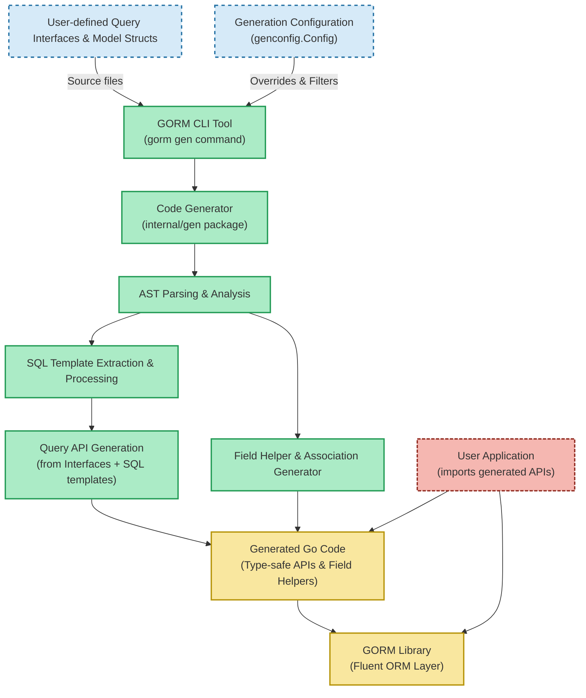

# System Architecture Diagram

## Understanding the Flow: From Your Code to Generated APIs

This diagram provides a high-level view of how **GORM CLI** transforms your Go source code — specifically the user-defined interfaces and model structs — into powerful, type-safe query APIs and field helpers integrated with the GORM ORM library. It also highlights key integration points including the CLI tool, configuration, code generation process, and the resulting output.

---

### Why This Diagram Matters

As a user, your goal is to seamlessly generate reliable, fluent APIs that boost productivity and enforce type safety in your database operations. This diagram visually guides you through that journey, illustrating each stage and the relationships between components. By understanding this workflow, you can better configure, troubleshoot, and extend your usage of GORM CLI.

---

## High-Level Architecture Flow

---

## Walkthrough of the Workflow

### 1. User Code Input
- **Query Interfaces & Model Structs:** You design Go interfaces embedding SQL templates in comments, alongside model structs defining your database schema representation.
- These serve as the primary input for code generation.

### 2. Configuration Layer
- **genconfig.Config:** Provides fine-grained control over which interfaces and structs to include or exclude, custom field mappings, output paths, and more.
- This configuration enables tailored code generation according to your project's needs.

### 3. CLI Tool Invocation
- You invoke the GORM CLI using `gorm gen` with flags specifying your input and output paths.
- The CLI acts as the bridge to start processing your user code and configuration.

### 4. Code Generator
- **AST Parsing:** The generator parses Go source files to extract interfaces, structs, fields, and method comments.
- **SQL Template Extraction:** Parses SQL templates embedded in interface method comments to understand dynamic queries.
- **Field Helper Generation:** Analyzes your model struct fields and associations to create strongly typed helpers for filters, updates, and relationship operations.
- **Query API Generation:** Builds type-safe, interface-driven query APIs from the parsed interfaces and SQL templates.

### 5. Generated Code Output
- Produces Go source files with discoverable, fluent APIs for queries and field-level operations.
- Ensures compile-time type safety and integration with the GORM ORM.

### 6. GORM Library Integration
- The generated code seamlessly operates on a `*gorm.DB` instance, harnessing GORM’s rich ORM capabilities with your type-safe abstractions.

### 7. User Application Usage
- Your application imports the generated code and GORM.
- Makes database operations using the generated query APIs and field helpers, increasing productivity and reducing errors.

---

## Practical Benefits at Each Step

| Step                         | Benefits                                                           |
|------------------------------|--------------------------------------------------------------------|
| User-defined Code             | Maintains idiomatic Go code and full control over models & queries |
| Configuration                | Customizes generation scope and behavior for project alignment     |
| CLI Tool                    | Simple command to generate and re-generate code automatically     |
| Code Generator              | Automates tedious boilerplate creation with precision             |
| Generated Code              | Provides fluent, discoverable, type-safe APIs and helpers          |
| Integration with GORM Library | Enables powerful ORM operations leveraging GORM’s ecosystem        |
| Application Usage            | Streamlines developer workflow and improves maintainability       |

---

## Tips for Success

- **Keep interfaces clean and comment templates fully descriptive:** This directly affects quality and correctness of generated query APIs.
- **Use `genconfig.Config` for fine control:** Especially in large projects, to avoid generating unneeded code and customize field behavior.
- **Leverage associations helpers:** These simplify relational data management including create, update, and unlink operations.
- **Run the CLI often:** Integrate into build pipelines or editors for up-to-date generated code.

---

## Next Steps

- Explore the [Feature Overview](../feature-tour) to see detailed capabilities and examples.
- Review [Using Generated APIs](../../getting-started/onboarding-core/using-generated-apis) to understand how to incorporate generated code into your projects.
- Learn [SQL Template DSL](../../gorm-cli-concepts/customization-and-templates/template-dsl) for advanced templated query writing.
- Configure code generation with [Generator Configuration](../../guides/customization-advanced/generator-configuration) for tailored outputs.

---