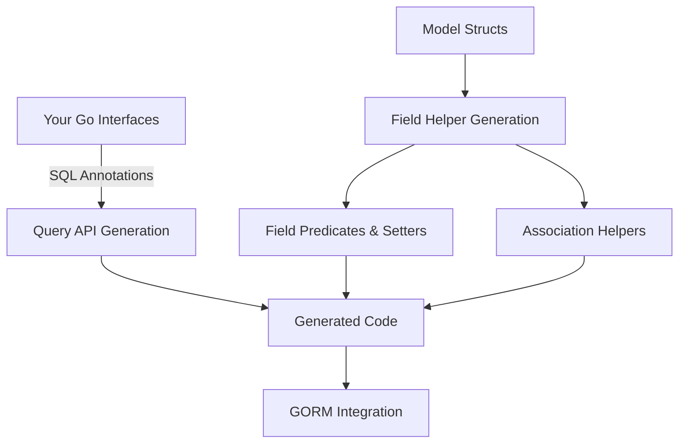

# Feature Overview

Discover the powerful features of GORM CLI that transform your Go projects into strongly-typed, fluent database interfaces and helpers, accelerating development and improving reliability.

## Interface-Driven Query Code Generation

At the heart of GORM CLI lies the ability to generate **type-safe query APIs** directly from Go interfaces with embedded SQL templates. You write plain Go interfaces containing SQL as comments, and the CLI crafts concrete implementations that boost productivity by removing boilerplate, ensuring compile-time safety.

- Write your data access methods as interfaces with SQL templates.
- Generate code that matches your method signatures, returning structs or error values.
- Benefit from automatic context injection and SQL parameter binding.

**Example:**
```go
// Query interface with SQL annotation
 type Query[T any] interface {
   // SELECT * FROM @@table WHERE id=@id
   GetByID(id int) (T, error)
 }
```
Generated code lets you seamlessly call:
```go
user, err := generated.Query[User](db).GetByID(ctx, 123)
```

## Model-Driven Field Helpers

GORM CLI also creates **field helpers** from your model structs. These helpers wrap basic fields and associations in fluent, strongly-typed APIs to simplify building queries, updates, and managing relations.

- Field helpers include predicates like `.Eq()`, `.Like()`, `.Between()`, and setters like `.Set()` and `.Incr()`.
- Supports standard Go and named field types (`int`, `string`, `time.Time`, custom JSON helpers, `sql.NullTime` etc.).
- Handles associations such as `has one`, `has many`, `belongs to`, and `many2many`, generating corresponding helper types.

**Example:**
```go
// Filtering by age and name
users, err := gorm.G[User](db).
                Where(generated.User.Age.Gt(18),
                      generated.User.Name.Like("%alice%"))
                .Find(ctx)
```

## Rich Support for Association Operations

Managing complex relationships is effortless with generated **association helpers** that offer operations tailored to your data model.

Supported association operations include:

- **Create** and **CreateInBatch**: Insert and link related records in one flow.
- **Update**: Modify associated records optionally filtered with predicates.
- **Unlink**: Remove association references without deleting data.
- **Delete**: Delete associated records or join table rows in many2many relations.

Behaviors vary by association type—for example, `Unlink()` nulls foreign keys for `belongs to` relations, or removes join rows in `many2many` associations.

**Example:** Creating a user with pets in one command:
```go
gorm.G[User](db).
  Set(
    generated.User.Name.Set("alice"),
    generated.User.Pets.Create(generated.Pet.Name.Set("fido")),
  ).
  Create(ctx)
```

## Flexible SQL Template DSL

The CLI leverages a specialized SQL templating DSL embedded in method comments for maximum flexibility:

- `@@table`: Dynamically resolves the underlying table name.
- `@@column`: Supports dynamic column names.
- `@param`: Binds Go method parameters safely as SQL parameters.
- Conditional blocks (`{{if}}`, `{{else}}`, `{{for}}`) enable dynamic SQL generation.
- `{{where}}` and `{{set}}` blocks simplify conditionals for WHERE and SET clauses.

This enables crafting highly expressive and optimized queries without repetitive code.

**Example:**
```sql
// SELECT * FROM @@table WHERE @@column=@value
FilterWithColumn(column string, value string) (T, error)
```

## Configurable Generation

Customization drives seamless integration into your existing workflow:

- Define package-level `genconfig.Config` structs to control output paths, included/excluded interfaces and structs, and field type mappings.
- Map Go types or field tags to custom helpers (e.g., JSON fields).
- File-level or directory-wide application of configuration.
- Support for shell-style patterns and type-literal selectors.

**Example:**
```go
var _ = genconfig.Config{
  OutPath: "examples/output",
  FieldTypeMap: map[any]any{sql.NullTime{}: field.Time{}},
  FieldNameMap: map[string]any{"json": JSON{}},
  IncludeInterfaces: []any{"Query*"},
}
```

## Seamless GORM Integration

The generated code fits naturally into your GORM-based backend:

- Fluent chaining and composition with `*gorm.DB` instances.
- Operates through the standard `gorm.io/gorm` and supports clauses.
- Type-safe query building with generated predicates avoids runtime SQL errors.

This tight coupling dramatically reduces cycling between runtime errors and code fixes.

---

## Practical Tips & Common Pitfalls

- **Start with clean interfaces and models:** Use simple Go interfaces annotated with clear SQL comments.
- **Map custom types early:** Leverage `genconfig.Config` to map non-standard types.
- **Understand association operation semantics:** `Unlink()` and `Delete()` differ significantly by relationship.
- **Use the template DSL for dynamic queries:** Exploit `{{where}}` and conditionals for flexible filtering.
- **Check generated output:** Use `gorm gen -i ./path -o ./output` and review generated files.

## Summary

This feature overview serves as your quick tour to see how GORM CLI works to boost safety, productivity, and flexibility in database layer code generation—from interfaces to associations and configuration.

For detailed examples, installation, and step-by-step usage, explore the related documentation pages in this guide.

---

## Diagram: How Features Interact



## Next Steps

- Define your query interfaces and model structs.
- Configure optional generation rules with `genconfig.Config`.
- Generate your code using the CLI command.
- Use generated APIs to write type-safe, expressive database logic effortlessly.

Refer to the [Using Field Helpers](../guides/core-usage-patterns/using-field-helpers), [Association Operations](../guides/core-usage-patterns/association-operations), and [Template-Based Queries](../guides/core-usage-patterns/template-based-queries) guides for deep dives into key capabilities.

---

> Empower your Go backend development with GORM CLI's intelligent code generation — making your SQL both safe and succinct.
