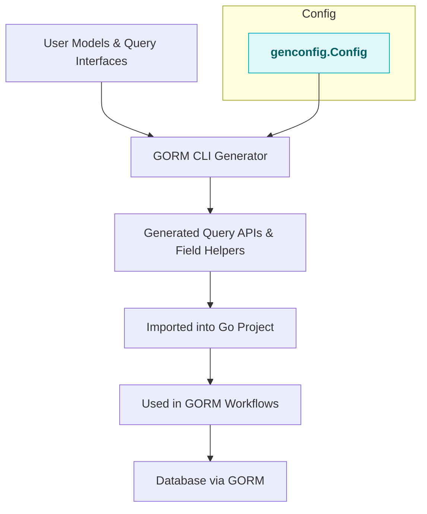

# Integration with GORM & Go Projects

Seamlessly incorporate the powerful, type-safe code generated by GORM CLI into your existing Go projects that use GORM. This page guides you through how the generated query APIs and model-driven field helpers fit naturally into standard GORM workflows. It also clarifies how to configure generation with `genconfig.Config` to tailor output for your project structure and coding patterns.

---

## Why Integration Matters

GORM CLI doesn’t just generate isolated code—it produces fully compatible, idiomatic Go code that plugs into your GORM-based application. By following these integration patterns, you can achieve:

- **Consistency:** Use familiar GORM constructs enhanced by powerful generated APIs.
- **Safety & Discoverability:** Access compile-time checked queries and fluent field helpers that reduce runtime errors.
- **Flexibility:** Configure generation to match your project’s organization and extend functionality with custom settings.

Whether you are expanding existing projects or starting fresh, understanding how to consume and customize generated code is essential to unlock the full productivity boost.

---

## How Generated Code is Consumed

### Generated Query APIs

After defining your query interfaces and generating code, use the resulting APIs much like standard GORM operations, but with type safety and fluent methods:

```go
// Import the generated package
import "your_project/generated"

// Use generated Query method for your model
userQuery := generated.Query[models.User](db)

// Fetch user by ID with type-safe method
user, err := userQuery.GetByID(ctx, 123)
if err != nil {
  log.Fatalf("user not found: %v", err)
}

// Filter users with typed filtering
users, err := userQuery.FilterByNameAndAge(ctx, "jinzhu", 25)
```

- The generated `Query[T]` functions wrap GORM’s `*gorm.DB` inside a type-safe interface.
- Methods declared on your query interface become concrete, auto-generated functions providing fluent query construction.
- Context (`ctx`) is automatically incorporated for compatibility with standard Go practices.

### Model-Driven Field Helpers

Field helpers from your model structs integrate with GORM’s expressive query building:

```go
import "your_project/generated"

// Use field helper predicates in conditions
users := []models.User{}
err := gorm.G[models.User](db).
  Where(generated.User.Name.Eq("alice"), generated.User.Age.Gt(18)).
  Find(ctx, &users).Error

if err != nil {
  log.Fatal(err)
}

// Updates
err = gorm.G[models.User](db).
  Where(generated.User.ID.Eq(1)).
  Set(
    generated.User.Name.Set("newname"),
    generated.User.IsActive.Set(true),
  ).
  Update(ctx)
```

These helpers let you build SQL clauses with compile-time safety, providing:

- Methods for common SQL predicates like `Eq()`, `Like()`, `Between()`, and null checks
- Typed setters for Create and Update operations
- Composition with GORM’s `Where` and `Set` constructs

### Association Helpers

Work seamlessly with associations (`has one`, `has many`, `belongs to`, `many2many`) using specialized generated helpers:

```go
// Creating a parent with an associated record
err := gorm.G[models.User](db).
 Set(
   generated.User.Name.Set("alice"),
   generated.User.Pets.Create(generated.Pet.Name.Set("fido")), // has many association
 ).
 Create(ctx)

// Updating associated entities
err = gorm.G[models.User](db).
 Where(generated.User.ID.Eq(1)).
 Set(
   generated.User.Pets.Where(generated.Pet.Name.Eq("fido")).Update(generated.Pet.Name.Set("rex")),
 ).
 Update(ctx)

// Unlinking/deleting associations with conditions
err = gorm.G[models.User](db).
 Where(generated.User.ID.Eq(1)).
 Set(
   generated.User.Pets.Where(generated.Pet.Name.Eq("old")).Delete(),
 ).
 Update(ctx)
```

This tight integration simplifies complex relational operations while maintaining strong typing and safety.

---

## Configuring Code Generation

Fine-tuning code generation ensures a smooth fit with your project’s layout and coding practices. Use a package-level variable of type `genconfig.Config` to customize:

```go
package examples

import (
  "database/sql"
  "gorm.io/cli/gorm/field"
  "gorm.io/cli/gorm/genconfig"
)

var _ = genconfig.Config{
  // Directory where generated files are placed
  OutPath: "./generated",

  // Map Go types to custom or built-in field helpers
  FieldTypeMap: map[any]any{
    sql.NullTime{}: field.Time{},
  },

  // Customize field helper mapping by field name
  FieldNameMap: map[string]any{
    "json": JSON{},
  },

  // File-level generation toggle (apply only to current file)
  FileLevel: false,

  // Filters (wildcard patterns or types) to include or exclude interfaces and structs
  IncludeInterfaces: []any{"Query*"},
  ExcludeInterfaces: []any{"*Deprecated*"},
  IncludeStructs: []any{"User", "Account*"},
  ExcludeStructs: []any{"*Temp"},
}
```

### Key Configuration Options

- **OutPath**: Defines where the generated code files will be saved.
- **FieldTypeMap**: Maps Go standard or custom types to field helpers to extend functionality.
- **FieldNameMap**: Allows targeting specific model fields to use custom field helpers.
- **Include/Exclude Interfaces and Structs**: Control which query interfaces and models participate in generation using wildcard patterns or type literals.
- **FileLevel**: When enabled, generation applies only to the file containing the config instead of the entire package.

<Note>
This configuration is automatically detected if declared in the package being generated. You do not need additional CLI arguments to enable it.
</Note>

---

## Best Practices for Smooth Integration

- **Keep models and interfaces within the same Go module** to leverage accurate package imports and generation paths.
- **Use context.Context in your interface methods** to align generated APIs with Go best practices.
- **Employ configuration to manage large repositories** where only subsets of interfaces or models require generation.
- **Explore extending field helpers for custom data types** to maximize type safety and query expressiveness.
- **Consistent naming conventions** for interfaces and structs help make inclusion/exclusion filtering straightforward.

---

## Troubleshooting Common Integration Issues

<AccordionGroup title="Common Integration Pitfalls & Solutions">
<Accordion title="Generated Code Not Found or Import Errors">
Ensure the generation output path is set correctly (`OutPath`), and your Go module is refreshed.

Run `go mod tidy` and verify the generated files are present in the expected location.
</Accordion>

<Accordion title="Type Mismatches or Missing Methods in Generated APIs">
Confirm your query interfaces use supported constructs and context parameters.

Check your config for correct inclusion/exclusion filters that might inadvertently omit needed interfaces or structs.
</Accordion>

<Accordion title="Association Helpers Not Working as Expected">
Verify your model struct tags and GORM associations are correctly defined.

Inspect generated helpers in the output to confirm they exist and match your model definitions.
</Accordion>
</AccordionGroup>

---

## Summary Diagram: Integration Workflow



This flowchart visualizes how your input Go models and interface definitions flow through the CLI generator influenced by configuration, producing ready-to-use code that fits into normal GORM data operations.

---

## Next Steps

- If you haven’t already, explore the [Getting Started Setup & Installation](/getting-started/setup-and-installation/installation) to prepare your environment.
- Learn how to define query interfaces and models in the [Defining Query Interfaces & Models](/guides/getting-started-workflows/defining-interfaces-models) guide.
- Dive deeper into advanced query patterns and templating in [Template-Based Queries & SQL DSL](/guides/advanced-usage-patterns/template-based-queries).
- For architectural context, review the [System Architecture Overview](/overview/architecture-features-integration/system-architecture-diagram).

Integrating GORM CLI’s generated code effectively will boost the maintainability, robustness, and clarity of your database access layers.

---

## Related Resources

- [What is GORM CLI?](/overview/product-intro-basics/what-is-gorm-cli) — Overview of the product’s purpose and architecture
- [Core Concepts & Terminology](/overview/product-intro-basics/core-concepts-terminology) — Key ideas behind generation and usage
- [Key Features at a Glance](/overview/architecture-features-integration/feature-overview) — Feature highlights
- [Installation & Quick Start](/guides/getting-started-workflows/installation-quickstart) — Practical steps for first usage


---

<Tip>
Efficient integration begins with proper project structure and configuration. Use the `genconfig.Config` settings proactively to handle complex repositories and maximize generated code relevance.
</Tip>  