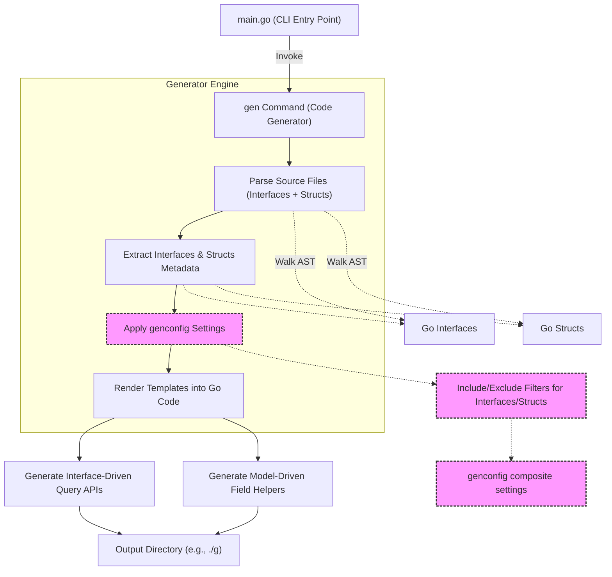

# System Architecture & Data Flow

GORM CLI transforms your Go source code into robust, type-safe query APIs and model-driven field helpers through a clear and streamlined workflow. This page provides a visual and narrative overview of the core CLI workflow—from the initial source inputs to the final generated output—with an emphasis on how different components interact to enable seamless developer experience.

---

## Visualizing the GORM CLI Workflow

At the heart of GORM CLI is a process that converts your annotated Go interfaces and model structs into powerful helper code. The workflow begins with your source code files (e.g., models and interfaces) and ultimately produces type-safe, fluent APIs for constructing queries and handling fields.

We use a Mermaid diagram to illustrate the relationships and flow between the main entry points, generators, templates, and output artifacts.



## Workflow Breakdown

### 1. CLI Entry Point (`main.go`)
The `main.go` file is the starting point where the GORM CLI initializes its command structure using [Cobra](https://github.com/spf13/cobra). When you run `gorm gen`, it invokes the generator command responsible for the next phase.

### 2. Generator Command (`gen.go`)
The `gen` package defines a Cobra command that:

- Accepts input (file or directory) containing Go interfaces and model structs.
- Optionally accepts an output directory for generated code (defaults to `./g`).
- Validates required flags like the input path.
- Triggers the generator engine by calling `Process` and `Gen`.

### 3. Parsing and AST Walk
The generator walks the Go abstract syntax trees (AST) of your input source files to extract:

- **Interfaces:** Defined query APIs with embedded SQL templates in method comments.
- **Structs:** Model definitions with fields, including associated GORM tags.

This phase gathers all essential metadata needed for code generation.

### 4. Configuration Application
As the AST is processed, any `genconfig.Config` variables declared in the source are recognized. These configurations allow:

- Inclusion or exclusion of specific interfaces or structs.
- Customization of output paths.
- Field type and name mappings for specialized handling (e.g., JSON fields).

### 5. Code Generation via Templates
Using the extracted metadata and configuration, the generator renders Go source files from templates:

- **Interface-Driven Query APIs:** Methods are generated to match the SQL templates defined within your Go interfaces, providing compile-time safety and discoverability.
- **Model-Driven Field Helpers:** Field predicates and setters are generated for each struct field, enabling easy and type-safe filtering, updates, and ordering.

### 6. Output Production
The final generated Go files are written to the specified output directory, ready to be imported in your project. The code integrates seamlessly with GORM’s API.

---

## Why This Architecture Matters

This architecture:

- **Empowers Type Safety:** By generating explicit Go code from your interfaces and models, you eliminate runtime errors caused by SQL string mismatches.
- **Streamlines Workflow:** Clear separation of CLI, parsing, configuration, and generation stages helps maintainable and extensible tooling.
- **Supports Customization:** The layered config mechanism offers granular control without changing the generator core.

---

## Practical Example: Running the CLI

Suppose you have a directory with interfaces and model structs representing your database schema and queries.

```bash
gorm gen -i ./examples -o ./generated
```

This command triggers the workflow:

- The CLI (`main.go`) captures your command.
- The generator (`gen.go`) processes your input source, walking AST to extract interfaces and structs.
- Configuration settings are applied if present.
- The templates are rendered into Go source files—one providing query APIs, the other field helpers.
- Files are saved into `./generated`.

You then import and use these generated APIs in your application with full type safety and IDE code completion.

---

## Tips and Best Practices

- **Organize Input Sources Clearly:** Keep your interface files and model structs logically grouped to optimize generator input.
- **Leverage Configuration Files:** Use `genconfig.Config` in your packages to customize generation behavior precisely.
- **Annotate Interfaces Thoughtfully:** Embed SQL template DSL comments that reflect the queries you want; the generator picks these up to create target methods.
- **Check Output for Changes:** Always review generated code after changes in your interfaces or models to catch generation errors early.

---

## Troubleshooting Common Issues

<AccordionGroup title="Troubleshooting Tips">
<Accordion title="Generator Doesn't Output Files">
Ensure your input path is correctly specified and contains interfaces or structs that match your config inclusion rules. Confirm that your input isn't empty or filtered out.
</Accordion>
<Accordion title="Compilation Errors in Generated Code">
Verify that SQL templates in interface comments are syntactically correct and consistent with method signatures. Also, check your field mappings and type aliases in `genconfig` for correctness.
</Accordion>
<Accordion title="Output Directory Not Created">
Check file system permissions and path correctness. The generator attempts to create directories recursively; permission errors will be reported.
</Accordion>
</AccordionGroup>

---

## Next Steps

- Explore the [Quick Start: Generate and Use APIs](https://docs.gorm.io/getting-started/first-run/quickstart-sample) to see the full CLI flow from code to API usage.
- Learn about [Configuration and Customization](https://docs.gorm.io/getting-started/first-run/configuration-setup) for advanced generation control.
- Deep dive into the internal workings with [The Code Generation Pipeline](https://docs.gorm.io/concepts/architecture-overview/code-generation-pipeline) to understand processing in detail.

---

This architecture visualization page grounds your understanding of how GORM CLI transforms code inputs into rich, maintainable Go APIs with type safety at its core.


---

## Source Reference

This overview references core source files:

- [`main.go`](https://github.com/go-gorm/cli/blob/main/main.go): CLI entry point.
- [`internal/gen/gen.go`](https://github.com/go-gorm/cli/blob/main/internal/gen/gen.go): Generator command setup.
- [`internal/gen/generator.go`](https://github.com/go-gorm/cli/blob/main/internal/gen/generator.go): Parsing, processing, and template execution logic.

You can review the complete source code on [GitHub](https://github.com/go-gorm/cli).


---