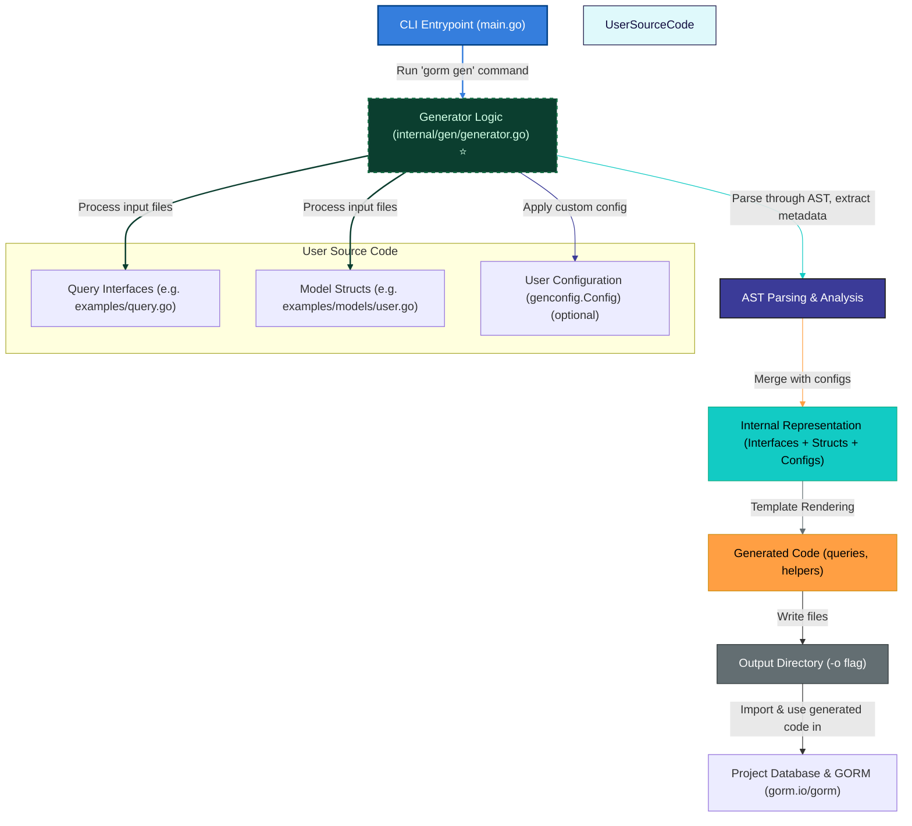

# Architecture Overview

Understanding how GORM CLI transforms your Go code into powerful, type-safe query APIs and field helpers is essential for mastering its workflow. This overview presents a clear architectural diagram and explanation of how your source code—query interfaces and models—flows through the CLI tool and generation engine, culminating in the production of ready-to-use Go code integrated into your project.

---

## Why Architecture Matters

When you invoke the GORM CLI tool, it’s not just generating code blindly; it orchestrates an intelligent process that parses your source Go files, extracts raw SQL from annotated interfaces, analyzes model structs for field helpers, merges optional user configurations, and renders clean, type-safe Go code. Understanding this pipeline empowers you to customize, debug, and extend the tool effectively.

---

## High-Level Architecture

---

## Architecture Components Explained

### 1. CLI Entrypoint (`main.go`)
Acts as the command-line interface receiving user commands. The root command initializes the generation command, handling flags such as input path and output directory.

### 2. Generator Logic (`internal/gen/generator.go`)
This core engine:
- Parses all provided Go source files containing query interfaces and model structs.
- Applies any user-defined `genconfig.Config` for customization.
- Extracts SQL templates and method metadata from interface comments.
- Analyzes model structs to generate field and association helpers.
- Uses abstract syntax tree (AST) processing for precise code analysis and mapping.

### 3. User Source Code (Interfaces, Models, and Config)
- **Query Interfaces:** Go interfaces annotated with raw SQL in comments defining your queries.
- **Model Structs:** Your GORM model definitions, reflecting table schemas and associations.
- **User Configuration:** Optional package-level config that tailors code generation options like output paths or type mappings.

### 4. AST Parsing & Internal Representation
Transforms your Go code into structured data capturing interfaces, methods, structs, and config details. This representation forms the input for the template renderer.

### 5. Template Rendering
Generates fully typed, idiomatic Go code that includes:
- Interface implementations providing type-safe query methods.
- Model-based field helpers with common filter and update operations.
- Association helpers supporting create, rename, unlink, and delete semantics.

### 6. Output Directory
Your generated code is written to the specified output path (default is `./g`). This code integrates directly into your project for seamless compilation.

### 7. Project Database Integration
The generated APIs and helpers operate over your database via standard `gorm.io/gorm` patterns, enhancing code safety and fluency without changes to your database or GORM hooks.

---

## User Flow Scenario: From Code to Ready-to-Use API

1. **Define Query Interfaces and Models:** Write interfaces with SQL templates and model structs in your project.
2. **Run the CLI:** Execute `gorm gen -i ./path/to/source -o ./generated`.
3. **Generation Process:** The CLI parses your code, interprets SQL templates, and generates typed APIs.
4. **Use Generated Code:** Import and use the generated packages in your application to run type-safe, fluent database queries.

---

## Practical Tips & Best Practices

- Organize query interfaces and models logically to maximize generation clarity.
- Use `genconfig.Config` to control output paths and field mappings.
- Keep your interfaces clean with accurate SQL templates for precise generation.
- Treat the generated code as part of your source tree for version control.

---

## Troubleshooting Common Scenarios

<AccordionGroup title="Common Issues in Generation and How to Solve">
<Accordion title="Generation Fails on Missing Input Flag">
Make sure to always specify the input file or directory containing your interfaces using the `-i` or `--input` flag. Without this, generation will not proceed.
</Accordion>
<Accordion title="Unexpected SQL Template Parsing Errors">
Check SQL comments in your interfaces for typo or template syntax errors. Use Go template notation carefully within method comments.
</Accordion>
<Accordion title="Generated Code Does Not Compile">
Verify imported packages and your Go environment. Ensure your model struct and interface packages are importable and that Go modules are tidy.
</Accordion>
</AccordionGroup>

---

## Next Steps
- Explore [Quickstart Workflow](/overview/architecture-usage-integration/quickstart-workflow) to see the generation in action.
- Learn about [Integration with GORM and Your Projects](/overview/architecture-usage-integration/integration-with-gorm-and-projects) to adopt the generated code smoothly.
- Deepen your understanding with [Core Features and Value Proposition](/overview/intro-value-core-concepts/core-features-and-value).

---