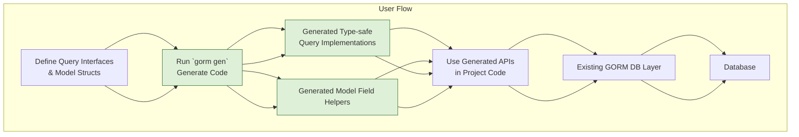

# Integration with GORM & Project Workflows

GORM CLI is designed to augment your existing GORM workflows seamlessly. It does not replace how you currently develop with GORM but enhances your project with type‑safe, interface-driven query APIs and model-derived field helpers. This page explains how to integrate GORM CLI-generated code into your project, align with existing models and interfaces, run code generation, and use the generated APIs effectively in your code.

---

## Why Integrate GORM CLI?

Integrating GORM CLI alongside your existing GORM code provides a powerful combination of compile-time safety and developer productivity without forcing a rewrite. You continue using GORM’s core features, while GORM CLI adds:

- **Type-safe, interface-driven query methods** that reduce runtime errors and improve IDE discoverability.
- **Field helpers for filters, updates, and associations** generated from your existing structs.
- **Support for complex association operations** such as batch create, update, unlink, and delete with compile-time validation.

This allows you to write more maintainable, clean, and efficient data layer code.

---

## Overview of the Integration Workflow

1. **Define Query Interfaces and Models** in your existing Go packages
2. **Run GORM CLI Code Generation** targeting those packages/interfaces
3. **Use Generated APIs in Your Code** alongside your usual GORM usage

This approach respects your project structure and existing design, embedding GORM CLI as a robust extension.

---

## Step 1: Defining Interfaces and Models

### Interface-Driven Query APIs

Write Go interfaces in your package representing the queries you need, annotating methods with SQL templates inside comments. GORM CLI reads these to generate type-safe implementations.

Example:

```go
// examples/query.go
package examples

type Query[T any] interface {
  // SELECT * FROM @@table WHERE id=@id
  GetByID(id int) (T, error)

  // SELECT * FROM @@table WHERE @@column=@value
  FilterWithColumn(column string, value string) (T, error)

  // UPDATE @@table
  // {{set}}
  //   {{if user.Name != ""}} name=@user.Name, {{end}}
  //   {{if user.Age > 0}} age=@user.Age, {{end}}
  // {{end}}
  // WHERE id=@id
  UpdateInfo(user User, id int) error
}
```

### Define Your Models Normally

Your existing structs—representing database tables with GORM tags—are the basis for the generated field helpers.

```go
// examples/models/user.go
package models

type User struct {
  ID   uint
  Name string
  Age  int
}
```

These models empower the generator to output helpers for filtering, updating, and managing associations.

---

## Step 2: Run the GORM CLI Generator

Use the CLI to generate code from your interfaces and models with a command like:

```bash
gorm gen -i ./examples -o ./generated
```

- `-i ./examples` points to the directory containing your interfaces and models
- `-o ./generated` sets the output directory for generated code

The generator produces:

- Concrete implementations for your query interfaces
- Structs with field helpers for your models to write filters, sets, and association operations

### Important CLI Flags

| Flag   | Description                                    |
|--------|------------------------------------------------|
| `-i`   | Input path to Go package or interface file    |
| `-o`   | Output directory for generated code            |

Ensure your input directory contains both interface definitions annotated with SQL templates and your model structs for the best generation experience.

---

## Step 3: Using Generated APIs Alongside GORM

The generated code is meant to be used seamlessly with your existing GORM DB instance, extending functionality without disruption.

### Using the Query API

Invoke generated queries using the interface name to access type-safe methods:

```go
// SELECT * FROM users WHERE id=123
user, err := generated.Query[models.User](db).GetByID(ctx, 123)

// SELECT * FROM users WHERE name="jinzhu" AND age=25
users, err := generated.Query[models.User](db).FilterByNameAndAge("jinzhu", 25).Find(ctx)

// UPDATE users SET name="jinzhu", age=20 WHERE id=1
err = generated.Query[models.User](db).UpdateInfo(ctx, models.User{Name: "jinzhu", Age: 20}, 1)
```

### Using Model Field Helpers

Generate predicates and setters from your model fields to build expressive queries:

```go
// Simple where filters
users, err := gorm.G[models.User](db).
  Where(generated.User.Name.Eq("alice"),
        generated.User.Age.Between(18, 30)).
  Find(ctx)

// Update with zero-values and custom expressions
err := gorm.G[models.User](db).
  Where(generated.User.ID.Eq(1)).
  Set(generated.User.Name.Set("bob"),
      generated.User.Age.Incr(1)).
  Update(ctx)
```

### Association Operations

Take advantage of generated helpers for creating, updating, unlinking, or deleting related records:

```go
// Create user along with pets
err := gorm.G[models.User](db).
  Set(
    generated.User.Name.Set("alice"),
    generated.User.Pets.Create(generated.Pet.Name.Set("fido")),
  ).
  Create(ctx)

// Unlink pets matching condition
err = gorm.G[models.User](db).
  Where(generated.User.ID.Eq(1)).
  Set(generated.User.Pets.Where(generated.Pet.Name.Eq("fido")).Unlink()).
  Update(ctx)
```

---

## Best Practices & Tips

- **Keep Interface and Model Code Organized:** Place interfaces and models you want to generate from in the same or clearly related directories.
- **Leverage GORM CLI Configs for Customization:** Use `genconfig.Config` in your packages to customize output, map custom types, or set generation inclusions/exclusions.
- **Run Code Generation Regularly:** Integrate the `gorm gen` command into your build process or run it before building to ensure APIs stay up to date.
- **Combine Generated and Manual Queries:** You don’t have to generate every query; mix generated APIs with manual GORM queries as needed.

---

## Troubleshooting Common Integration Issues

<AccordionGroup title="Common Issues & Solutions">
<Accordion title="Generated code not found or import errors">
- Confirm the `-o` output path is within your module’s source tree.
- Import generated packages explicitly where used.
- Make sure to run code generation after every interface/model change.
</Accordion>
<Accordion title="Missing methods or fields in generated code">
- Verify correct annotation formatting in your interfaces.
- Check model struct tags and fields for compatibility.
- Review your `genconfig.Config` for any exclusion patterns.
</Accordion>
<Accordion title="Conflicts with existing code or compilation errors">
- Ensure generated package names do not clash with existing code.
- Avoid modifying generated files directly; instead, change inputs and regenerate.
</Accordion>
</AccordionGroup>

---

## Visual Workflow Diagram



---

## Next Steps

1. Explore [Quickstart: Generate Type-Safe APIs](../getting-started/quickstart-workflow) for a practical, hands-on introduction.
2. Consult [Building Queries with Generated APIs](../guides/core-patterns/building-queries) to deepen your knowledge of writing fluent queries.
3. Refer to [Updates, Filters, and Field Helpers](../guides/core-patterns/using-field-helpers) and [Working with Associations](../guides/core-patterns/association-operations) for advanced scenarios.

For detailed configuration options, see the [Customizing Code Generation](../guides/advanced/customizing-generation) guide.

---

This integration strategy ensures you harness the best of GORM’s flexibility and GORM CLI’s safety and productivity enhancements side-by-side, letting your project grow with confidence and speed.
