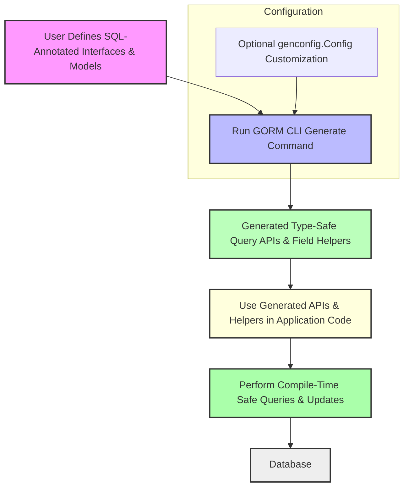

# Feature Highlights at a Glance

Unlock the power of GORM CLI with an at-a-glance overview of its main features that transform your Go database workflow into a type-safe, maintainable, and efficient experience. This page summarizes the core capabilities and points you to detailed guides to master each aspect.

---

## Why GORM CLI?

GORM CLI bridges the gap between flexible SQL and Go’s strong typing, generating expressive, interface-driven query APIs along with model-based field helpers. It empowers you to write complex queries with confidence, reduce runtime errors, and accelerate development.

## Summary of Key Features

### 1. Type-Safe Query API Generation

Write simple Go interfaces annotated with SQL template comments, and GORM CLI generates concrete, type-safe query APIs for your models.

- **Benefit:** Catch query errors at compile time, not runtime.
- **Example Use:** Define an interface method with a SQL template, run the generator, and immediately use the generated method to fetch or update database rows.

```go
// Interface example
// Select by ID
GetByID(id int) (T, error)

// Generated usage
user, err := generated.Query[User](db).GetByID(ctx, 123)
```

### 2. Model-Driven Field Helpers

Generate strongly typed field helpers derived from your GORM models, enabling fluent construction of predicates and updates.

- **Benefit:** Intellisense-friendly, discoverable, and less error-prone query building.
- **Example:** Build conditions like `generated.User.Age.Between(18, 65)` or set values in updates.

### 3. Flexible SQL Templating DSL

Leverage a powerful templating system in SQL comment annotations to express dynamic and conditional SQL logic that fits real-world use cases.

- **Directives:** `@@table`, `@@column`, `@param` bindings
- **Templating Constructs:** `{{where}}`, `{{set}}`, `{{if}}`, `{{for}}`
- **Example:** Conditionally build WHERE clauses and SET updates based on input parameters.

### 4. Support for Associations

Generate helpers and query API support for GORM associations such as has one, has many, belongs to, and many2many.

- **Benefit:** Manage related entities with type safety and expressive operations for create, update, unlink, and delete operations.

### 5. Compile-Time Safety Guarantees

Errors and mismatches in your query interfaces and model field references are caught by Go's compiler.

- **Benefit:** Increased confidence and fewer runtime database errors.

### 6. Pluggable Configuration

Customize generation behavior via a dedicated `genconfig.Config` struct in your package.

- **Capabilities:** Override output paths, include/exclude patterns, map Go types to custom field helpers, and set generation scopes.

```go
var _ = genconfig.Config{
  OutPath: "examples/output",
  IncludeInterfaces: []any{"Query*"},
  FieldTypeMap: map[any]any{
    sql.NullTime{}: field.Time{},
  },
}
```

---

## Visual Overview of GORM CLI Workflow



---

## Real-World Scenarios Solved by GORM CLI

- **Safe Query Prototyping:** Define flexible queries with rich SQL templating and get instant compile-time feedback.
- **Maintainable Data Layers:** Avoid scattered SQL strings and reflection-based Generic interfaces by generating explicit, discoverable APIs.
- **Dynamic Filters and Updates:** Use generated field helpers to build complex conditional queries and update statements fluently.
- **Evolving Schemas Safely:** Add or remove fields and queries with minimal risk, thanks to explicit interface-driven code generation.

---

## Dive Deeper

Each feature summarized here is explained in detail in subsequent guides:

| Feature                    | Link to Guide                                                  |
|----------------------------|----------------------------------------------------------------|
| Type-Safe Query APIs        | [Building Queries with Generated APIs](/guides/core-patterns/building-queries) |
| Field Helpers              | [Updates, Filters, and Field Helpers](/guides/core-patterns/using-field-helpers) |
| SQL Template DSL           | [Mastering the SQL Template DSL](/guides/advanced/sql-template-dsl) |
| Association Operations     | [Working with Associations](/guides/core-patterns/association-operations) |
| Custom Generation          | [Customizing Code Generation](/guides/advanced/customizing-generation) |

---

## Getting Started Snapshot

1. **Write annotated Go interfaces with SQL templates.**
2. **Run `gorm gen` CLI to generate code.**
3. **Use generated APIs and helpers in your Go app to perform type-safe queries and updates.**

> For a complete beginner-friendly introduction, visit our [Quickstart: Generate Type-Safe APIs](/guides/getting-started/quickstart-workflow).

---

## Tips & Best Practices

- Use `genconfig.Config` to customize output location and field mappings for consistent generation.
- Leverage the templating DSL for conditional WHERE and SET clauses to prevent redundant SQL code.
- Keep your interface methods minimal and focused to maintain readability and clarity.
- Test generated code behavior early to catch misconfigurations or unexpected SQL.

## Troubleshooting Common Issues

- **Missing generated code?** Verify `-i` and `-o` flags point to the correct directories.
- **Errors in template syntax?** Review SQL template comments for proper DSL directives.
- **Incompatible return types?** Ensure method signatures comply with expected return type patterns (error as last return).


---

Harness these features to accelerate your GORM-based development with confidence and precision. For implementation details, examples, and step-by-step walkthroughs, explore our broader documentation.

---

<Callout>
> **Explore Related Topics:**
> - [What is GORM CLI?](/overview/intro-value-core/what-is-gorm-cli)
> - [Using Your Generated APIs](/getting-started/first-codegen/using-generated)
> - [How Code Generation Works](/guides/getting-started/understanding-generation)
> 
> Unlock the full potential of your data layer with GORM CLI.
</Callout>
