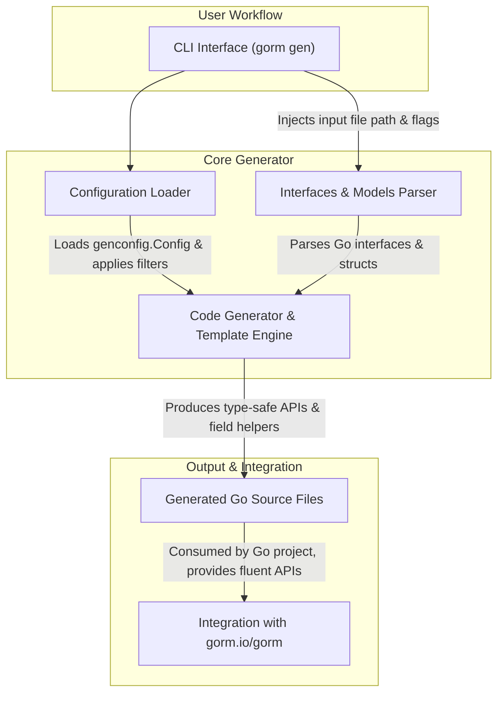

# System Architecture Overview

Discover how the different parts of GORM CLI come together to streamline your development workflow. This page presents a high-level architecture diagram paired with a clear narrative that maps core components — the CLI interface, code generators, configuration sources, and output targets — directly to user goals and workflows.

---

## Unlocking Type-Safe Database Operations with GORM CLI

GORM CLI is designed to transform your raw Go interface definitions and model structs into robust, compile-time safe query APIs and field helpers. The system architecture frames this transformation as a seamless, straightforward process where each component plays a vital role in enabling rapid code generation and integration with your GORM projects.

### Key Benefits You'll Gain

- **Effortless Code Generation:** Run a single `gorm gen` CLI command to generate comprehensive, type-safe APIs.
- **Configurable Customization:** Tailor the output via code-level configs that fine-tune inclusion/exclusion, mappings, and generation scope.
- **Discoverable Fluent APIs:** Generated helpers and query interfaces provide intuitive, compile-time checked methods for reads, writes, and associations.
- **Smooth Integration:** Everything fits naturally with `gorm.io/gorm` ensuring compatibility and minimal learning curve.

### Who is this for?

If you are a Go developer working with GORM who wants to avoid boilerplate, reduce runtime errors, and write expressive database queries with confidence, this architecture overview will ground you in how the pieces work together to help you achieve those goals.

---

## Architecture Overview

Below is a high-level diagram mapping the major system components of GORM CLI and illustrating the flow from user input through code generation to integration.



---

## How It Works: The User Journey

1. **Initiate Generation with CLI:**
   You start by running the CLI command `gorm gen -i <input-path> -o <output-path>`, specifying the Go file or directory containing your interfaces and models.

2. **Parsing Interfaces and Models:**
   The system reads your Go source files, identifying annotated interfaces with raw SQL and your model structs. It uses Go’s AST to extract method signatures, SQL templates, and field definitions.

3. **Loading Configuration:**
   Alongside, any `genconfig.Config` variables declared in the package or files are loaded. These configs govern output directories, type mappings, inclusion/exclusion rules, and new field helper mappings.

4. **Generating Code:**
   The generator stitches these inputs together with template files to produce concrete Go sources. It creates:
   - Query API interfaces and implementations based on your annotated interfaces
   - Model-driven field helpers that provide filters, updates, and association operations

5. **Writing Output:**
   Generated files are written to your specified output directory. The output paths and packaging maintain the project structure for easy usage.

6. **Using Generated Code:**
   You consume these generated APIs in your application code, leveraging fluent, type-safe methods for database operations fully integrated with GORM.

---

## Component Deep Dive

### CLI Interface (`gorm gen`)
- Accepts user input parameters `-i` for input source and `-o` for output destination.
- Invokes the generator workflow.

### Interfaces & Models Parser
- Parses Go source code using Go’s `go/ast` package.
- Extracts interfaces annotated with SQL templates and model struct fields.
- Validates interface methods to ensure compatibility with code generation rules.

### Configuration Loader
- Detects and aggregates `genconfig.Config` structs defined in the source.
- Applies include/exclude filters on interfaces and structs.
- Maps custom types to field helpers.

### Code Generator & Template Engine
- Uses Go `text/template` with embedded code snippets.
- Generates interface implementations, model helper structs, and method bodies.
- Automatically formats generated code.

### Output Files
- Write well-structured Go source files.
- Include comments to denote generated code, discouraging manual editing.

### Integration with GORM
- Generated APIs extend and integrate seamlessly with `gorm.io/gorm`.
- Allows using generated code in place of raw queries or boilerplate structures.

---

## Practical Example of User Workflow

Suppose you define an interface with SQL templates and a user model. Running the CLI command triggers the parsing of these declarations, applies config rules, and generates:

- Type-safe query methods like `GetByID` with automatic binding.
- Fluent field helpers to filter or update based on the User struct’s fields.
- Strong association helpers for related models (pets, companies, languages).

You can then use these generated APIs as:

```go
u, err := generated.Query[User](db).GetByID(ctx, 123)
users, err := gorm.G[User](db).Where(generated.User.Age.Gt(18)).Find(ctx)
```

These utilize the generated code to enforce compile-time safety and improve developer productivity.

---

## Tips and Best Practices

- **Organize Interfaces and Models Together:** Keep related interfaces and model structs in the same package or directory for best results.
- **Use Configurations to Manage Scope:** Customize generation using `genconfig.Config` to include or exclude interfaces and models, and to map custom field helpers.
- **Leverage Association Helpers:** Generated code supports complex association operations with clear semantics for create, update, unlink, and delete.
- **Write SQL Templates Thoughtfully:** Use the embedded SQL template DSL to express dynamic queries idiomatically.

## Troubleshooting

- Make sure your interface method signatures follow expected patterns with proper return types for the generator to work.
- Verify configuration scopes if you notice some interfaces or structs are not generated.
- Run the CLI with proper `-i` (input path) and `-o` (output path) flags to align source and output directories.

---

Explore the rest of the documentation to dive deeper into code generation patterns, SQL template DSL, and advanced configuration.

---

For more details, visit the [GORM CLI GitHub repository](https://github.com/go-gorm/cli).


---

<Info>
This page is part of a broader documentation set that includes concepts, setup instructions, and in-depth guides on using GORM CLI effectively.
</Info>
