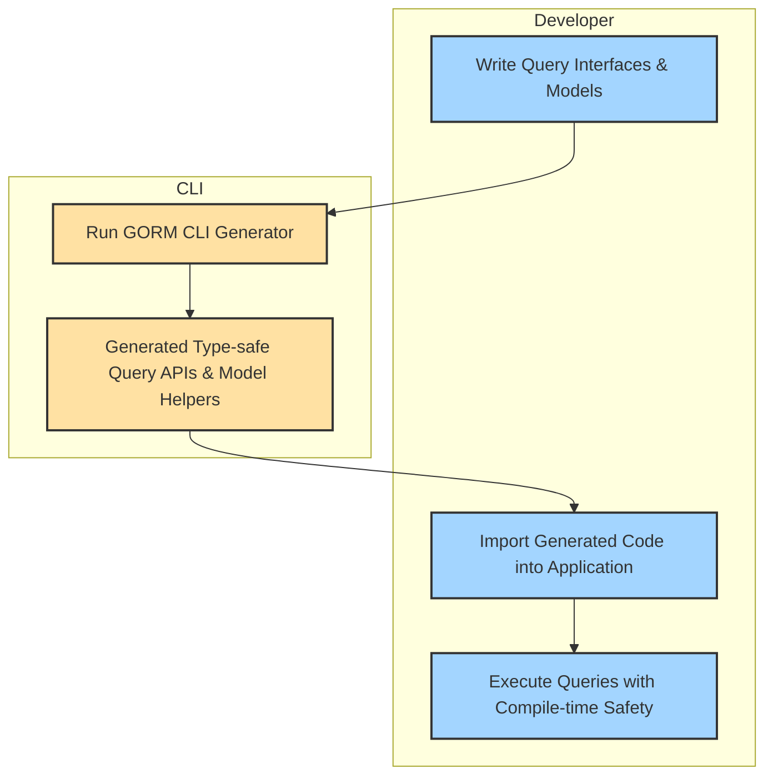

# Quickstart & Main Workflow

Welcome to the essential guide for getting started with **GORM CLI**. This page walks you through the fundamental steps to write your query interfaces and models, run the generation process, and use the resulting safe and fluent APIs within your Go application. If you are onboarding GORM CLI for the first time, this workflow will get you coding productively from the outset.

---

## Introduction

GORM CLI empowers Go developers to automatically generate type-safe, fluent query APIs and model-driven helpers based on your raw SQL interface definitions and data models. This documentation focuses exclusively on the main workflow — the practical, end-to-end journey from interface design to code generation and usage.

By following this guide, you will:
- Understand how to author query interfaces with SQL templates
- Structure your model definitions for field and association helpers
- Run the CLI generator tool to produce code
- Integrate the generated code directly in your applications

This page complements deeper conceptual references under **Overview > Architecture, Workflows & Integrations** and practical usage examples under **Guides**.

---

## Key Workflow Steps

### 1. Define Query Interfaces and Models

Start within a Go package by describing your database query intentions as interfaces. Each interface method includes inline SQL templates in comments, describing the intent and conditions.

Example:

```go
// examples/query.go
package examples

type Query[T any] interface {
  // SELECT * FROM @@table WHERE id=@id
  GetByID(id int) (T, error)

  // where("name=@name AND age=@age")
  FilterByNameAndAge(name string, age int) ([]T, error)

  // UPDATE @@table
  // {{set}}
  //   {{if user.Name != ""}} name=@user.Name, {{end}}
  //   {{if user.Age > 0}} age=@user.Age, {{end}}
  // {{end}}
  // WHERE id=@id
  UpdateUser(user User, id int) error
}
```

Simultaneously, declare your data models in the same package or directory, ensuring all fields are exported to enable generation of field helpers and associations.

```go
// examples/models/user.go
package models

type User struct {
    ID    uint
    Name  string
    Age   int
}
```

<Tip>
Always keep interfaces and models close to facilitate matching and generation. Use consistent naming for best results.
</Tip>

---

### 2. Run the Generator Tool

With Go 1.18+ installed and your code in place, run the GORM CLI generator:

```bash
gorm gen -i ./examples -o ./generated
```

- **-i** points to the package or interface file containing your query interfaces
- **-o** specifies output directory for generated code

The generator parses your interfaces and structs, applies any configured mapping rules or filters, and produces fluent, type-safe APIs.

<Note>
No configuration file is mandatory to get started — the generator works out of the box with conventions.
</Note>

---

### 3. Use the Generated Code in Your Application

Import and use the generated packages to interact with your database in a fluent and type-safe way.

Example usage of a generated query interface:

```go
import (
  "context"
  "gorm.io/gorm"
  "yourproject/generated"
  "yourproject/models"
)

func Example(db *gorm.DB, ctx context.Context) error {
  q := generated.Query[models.User](db)

  // Fetch user by id
  user, err := q.GetByID(ctx, 123)
  if err != nil {
    return err
  }

  // Filter users by name and age
  users, err := q.FilterByNameAndAge(ctx, "alice", 30)
  if err != nil {
    return err
  }

  // Update user data
  err = q.UpdateUser(ctx, models.User{Name: "Alice", Age: 31}, 123)
  if err != nil {
    return err
  }

  return nil
}
```

Additionally, generated model field helpers let you build expressive GORM filters and update commands:

```go
db.Where(
  generated.User.Name.Eq("alice"),
  generated.User.Age.Gt(18),
).Find(&users)

// Updating a user
err := gorm.G[models.User](db).
  Where(generated.User.ID.Eq(123)).
  Set(generated.User.Age.Set(31)).
  Update(ctx)
```

---

## Practical Tips & Best Practices

- **Keep interfaces simple and focused:** Use one interface per logical query group to keep code generation manageable.
- **Use SQL templates judiciously:** Leverage directives like `@@table`, `{{where}}`, and `@param` for clear, maintainable queries.
- **Match package and directory structure:** Consistency helps the generator find and link models and interfaces.
- **Explore generator configuration:** For larger projects, use `genconfig.Config` to customize output paths, filtering, and type mappings.

---

## What Happens Under the Hood

The GORM CLI generator performs these core actions:

1. Parses your interface files and extracts SQL templates from comments.
2. Processes your struct models to create strongly typed field helpers.
3. Combines both to generate code containing:
   - Interface implementations with concrete method bodies
   - Strongly typed predicates, setters, and association helpers
   - Fluent chaining methods compatible with GORM's query builder

This automated output gives you immediate safety checks at compile-time and discoverability in your IDE.

---

## Troubleshooting

<AccordionGroup title="Common Issues">  
<Accordion title="Generator does not produce files">  
Make sure you specify the `-i` flag correctly pointing to your interface package or Go interface file. Also verify your Go code parses without errors.
</Accordion>  
<Accordion title="Methods missing return types error">  
Every interface method with an SQL template that returns data must declare return values ending with `error`. The generator enforces this for safety.
</Accordion>  
<Accordion title="Generated code import errors">  
Check `OutPath` configuration if mixing multiple configurations. Use consistent package naming and directory layout.
</Accordion>  
</AccordionGroup>

---

## Next Steps

After mastering this primary workflow, deepen your knowledge by exploring:

- [Prepare Your Project](../getting-started/first-usage-configuration/project-structure) — Project layout and configuration
- [Using Generated APIs](../getting-started/first-usage-configuration/using-generated-code) — Practical usage patterns
- [Key Features & Value Proposition](../../overview/intro-product-value-core-concepts/key-features-and-value) — Details on GORM CLI capabilities
- [Template-Based SQL DSL](../../guides/using-generated-apis/template-based-queries) — How to write complex SQL templates

---

## Diagram: Main Workflow Overview



---