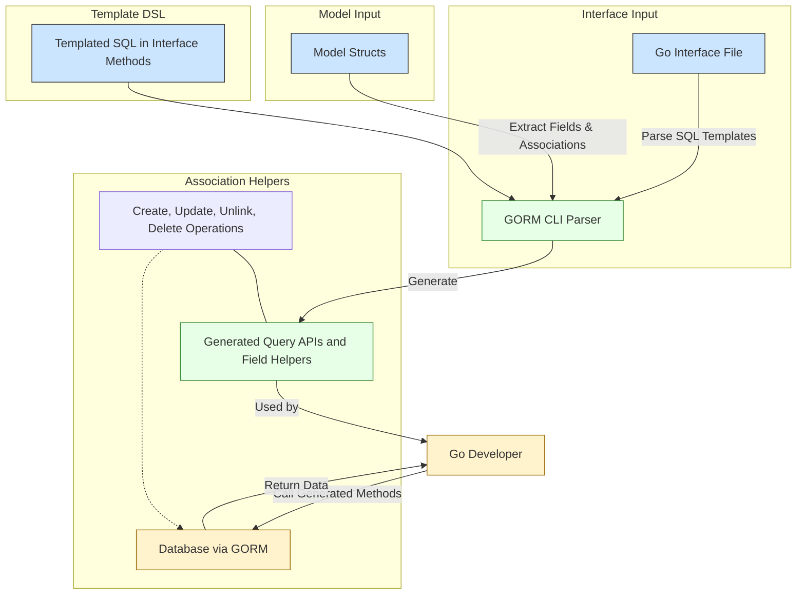

# Core Concepts & Terminology

Welcome to the foundational guide for GORM CLI’s core concepts and terminology. This page unpacks the essential ideas you need to confidently understand, navigate, and leverage GORM CLI’s powerful code generation features. You will learn how query APIs are generated from interfaces, how model-driven field helpers work, the semantics around association operations, and the flexibility of the template-based SQL DSL — all underpinned by strong typing and intuitive DSL constructs.

---

## Why Core Concepts Matter

When you first use GORM CLI, many pieces come together: interfaces with SQL annotations, model structs, generated helpers, and complex association operations. Understanding these core concepts lets you read the generated code effortlessly and craft your own interfaces and models with confidence.

This chapter creates the shared vocabulary and mental models every GORM CLI user must have, serving as the foundation for exploring architectural overviews, integration points, and advanced features.

---

## 1. Query API Generation from Interfaces

The centerpiece of GORM CLI is how it produces **type-safe query APIs** from Go **interfaces** annotated with SQL templates:

- **Interfaces** define your queries using method signatures and specially formatted comments containing raw or templated SQL.
- GORM CLI parses these interfaces, interprets the embedded SQL templates, and generates **concrete implementations** with strong typing.

This lets you write database queries declaratively using Go's syntax while gaining compile-time safety and autocompletion.

### User Flow Example

Imagine you want to fetch a User by ID:

```go
// Interface
// SELECT * FROM @@table WHERE id=@id
GetByID(id int) (User, error)
```

1. You declare this method in a Go interface with the SQL in the comment.
2. Running `gorm gen` generates an implementation method you call like:

```go
user, err := generated.Query[User](db).GetByID(ctx, 123)
```

3. Behind the scenes, GORM CLI replaced `@@table` with your model’s table name and mapped the `@id` parameter safely.

### Key Points

- The generator detects methods returning one or more values with an `error` as the last return type for validation.
- If a method lacks a `context.Context` parameter, GORM CLI automatically injects it.
- Both raw SQL and powerful DSL-driven templating are supported.

---

## 2. Model-Driven Field Helpers

Alongside query APIs, GORM CLI creates **field helpers** from your model structs, enabling:

- Fluent, type-safe predicates (e.g., `User.Name.Like("%jinzhu%")`)
- Updates with expressions and zero values
- Strongly typed handling of complex types and named fields

### How This Works

From each exported struct field, GORM CLI generates a corresponding typed helper. Helpers are tailored to the field’s Go type:

| Go Type       | Generated Helper Type          |
|---------------|-------------------------------|
| `string`      | `field.String`                 |
| `int`, `float`| `field.Number[int|float]`     |
| `bool`        | `field.Bool`                  |
| `time.Time`   | `field.Time`                  |
| Named types   | Custom helpers via mapping     |

#### Example Helpers Usage

```go
gorm.G[User](db).
  Where(generated.User.Age.Gt(18)).
  Set(generated.User.Name.Set("alice"), generated.User.IsAdult.Set(true)).
  Update(ctx)
```

This constructs an update statement ensuring compile-time safety on columns and values.

### Custom Mapping

You can map your own Go types or struct tags to custom field helpers using the generation config (`genconfig.Config`), allowing support for JSON fields or SQL `NullTime` mappings.

---

## 3. Association Operations

GORM CLI understands your data model’s associations — including **belongs to**, **has one**, **has many**, and **many-to-many** — and generates comprehensive helpers with rich semantics:

- **Create**: Insert and link new associated records safely
- **CreateInBatch**: Batch insert associated rows
- **Update**: Update existing associated rows based on filters
- **Unlink**: Remove association links without deleting data
- **Delete**: Remove associated records or join table entries

### Association Helpers

Generated as `field.Struct[T]` or `field.Slice[T]` helpers attached to parent models.

Example:

```go
// User has many Pets
generated.User.Pets.Create(generated.Pet.Name.Set("fido")).Create(ctx)
```

### Semantics by Association Type

- **Belongs to**: `Unlink()` clears foreign key on the child, `Delete()` removes the associated data.
- **Has one/has many**: `Unlink()` clears child foreign keys, `Delete()` removes child records.
- **Many to many**: `Unlink()` and `Delete()` remove join table entries, preserving parent and child rows.

### User Flow

When you run `Set(...).Update(ctx)` on a parent model, association operations execute in the order specified, ensuring safe and transactional updates.

---

## 4. Template-Based SQL DSL

GORM CLI allows you to embed SQL templates in interface method comments using a simple, powerful DSL:

| Directive    | Purpose                                | Example                                            |
|--------------|--------------------------------------|----------------------------------------------------|
| `@@table`    | Model table name placeholder           | `SELECT * FROM @@table WHERE id=@id`               |
| `@@column`   | Dynamic column binding                  | `WHERE @@column=@value`                             |
| `@param`     | Bind method parameters to SQL parameters | `WHERE name=@user.Name`                              |
| `{{where}}`  | Conditional WHERE clause                  | `{{where}} age > 18 {{end}}`                        |
| `{{set}}`    | Conditional SET clause (e.g. UPDATE)     | `{{set}} name=@name {{end}}`                        |
| `{{if}}`     | Conditional template fragment            | `{{if age > 0}} AND age=@age {{end}}`               |
| `{{for}}`    | Collection iteration                     | `{{for _, tag := range tags}}...{{end}}`           |

### Practical Example

```sql
-- Select with dynamic where
SELECT * FROM @@table
{{where}}
  {{if @user.Name != ""}} name=@user.Name {{end}}
  {{if @user.Age > 0}} AND age=@user.Age {{end}}
{{end}}
```

- If `user.Name` is empty, the name condition is omitted automatically.
- Parameter binding is safe and type-checked.

### Advantages

- Allows dynamic query building without verbose boilerplate.
- Keeps SQL readable and maintainable within Go interfaces.
- Enables conditional and iterative query constructs, reducing manual coding.

---

## 5. Strongly Typed Filters and Updates

Generated APIs and helpers provide strongly typed filters for common operations:

| Predicate Examples           | Usage Example                         |
|-----------------------------|-------------------------------------|
| Equality and inequality      | `User.Name.Eq("alice")`            |
| LIKE and pattern matching    | `User.Name.Like("%jinzhu%")`      |
| Range and BETWEEN            | `User.Age.Between(18, 65)`           |
| IS NULL / IS NOT NULL       | `User.Score.IsNull()`                 |
| Increment and SET Expression | `User.Age.Incr(1)`, `User.Age.SetExpr(...)` |

This declarative style accelerates development and guards against SQL errors.

---

## 6. Mastering GORM CLI Lexicon

To confidently read generated code and config, familiarize yourself with these terms:

| Term                  | Meaning and Examples                              |
|-----------------------|--------------------------------------------------|
| **Interface**         | Go interface describing query methods with SQL annotations
| **Struct**            | Go model struct from which field helpers derive
| **Field Helper**      | Typed helpers for fields, e.g., `field.String` or `field.Slice[T]`
| **Association Helper**| Field helpers specialized for relations
| **SQL Template**      | Annotated SQL inside interface method comments
| **`@@table`**         | Template placeholder for underlying SQL table
| **`{{where}}`**       | Template block to conditionally add WHERE clauses
| **`genconfig.Config`**| Configuration struct for customizing generation

---

## Summary

Understanding GORM CLI’s core concepts empowers you to harness its full potential:

- **Query API Generation** from annotated interfaces delivers type-safe, fluent query methods.
- **Model-Driven Field Helpers** translate Go model fields into expressive, typed SQL predicates and setters.
- **Association Operations** provide rich, compile-time-safe ways to handle relations.
- **Template SQL DSL** gives you a powerful, yet elegant system for writing dynamic queries inside your interfaces.
- **Strong Typing** across filters and updates minimizes errors, improves productivity, and provides direct insights into database operations.

Next, deepen your understanding by exploring the [System Overview & Data Flow](/overview/architecture_concepts/system_overview_diagram) to visualize these components working together. Then, move to the [Integration with GORM & Go](/overview/architecture_concepts/integration_points) page to learn seamless usage in your projects.

---

## Troubleshooting Tips & Best Practices

- Always use **exported fields** in structs to ensure field helpers are generated.
- Place **SQL templates in interface method comments exactly**; GORM CLI parses these literally.
- Use **context.Context** for all query methods — GORM CLI injects it if omitted, but explicit use is best.
- When customizing via `genconfig.Config`, verify your type and field name mappings carefully.
- Remember to run `gorm gen` after modifying interfaces or models to keep generated code up-to-date.

---

<AccordionGroup title="Additional Resources">
<Accordion title="Template DSL Syntax Reference">
For a complete list and examples of template DSL directives and syntax, see the [Template SQL DSL](https://gorm.io/cli/guides/advanced-use-cases/template-sql-dsl) guide.
</Accordion>
<Accordion title="Working with Associations">
Details, patterns, and edge cases for association helpers and operations are covered in [Working with Associations: Patterns & Best Practices](https://gorm.io/cli/guides/advanced-use-cases/associations-best-practices).
</Accordion>
<Accordion title="Defining Query Interfaces and Models">
Step-by-step instructions to define Go interfaces and models for code generation exist in [Defining Models and Query Interfaces](https://gorm.io/cli/getting-started/first-code-generation/defining-models-and-interfaces).
</Accordion>
</AccordionGroup>

---

## Diagram: Conceptual Workflow of GORM CLI Core Concepts



---

## Final Notes
Mastering these core concepts will transform your experience with GORM CLI from daunting to empowering. You’ll write safer, more efficient data access layers with ease, harness the full power of Go’s type system, and maintain clean, expressive code optimized for productivity.

Happy coding!
