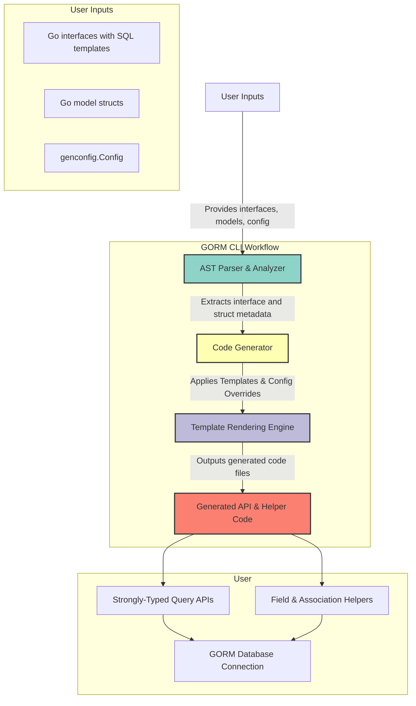

# Architecture Overview

## Visualizing GORM CLI's High-Level Architecture

Welcome to the Architecture Overview of GORM CLI. This page provides a clear, user-focused explanation of how your source input — including Go interfaces with embedded SQL templates, model structs, and optional configuration files — flows through the GORM CLI command-line tool, transforming into powerful, type-safe APIs and field helpers. Understanding this process will empower you to harness GORM CLI effectively and optimize your workflow.

---

## Why Care About the Architecture?

Imagine writing your database queries and model helpers once, and then having consistent, compile-time safe, idiomatic Go code automatically generated for you. GORM CLI’s architecture is designed to make this effortless. By grasping how your input drives the generation process, you’ll confidently craft interfaces and models, and diagnose or customize generation when needed.

---

## User Input: Interfaces, Models, and Config

At the heart of GORM CLI’s architecture is user input:

- **Query Interfaces**: Your annotated Go interfaces define query methods with embedded SQL templates. These are the blueprints for your type-safe query APIs.
- **Model Structs**: Struct definitions of your database models feed the generation of field helpers for filters, updates, and associations.
- **Configuration (`genconfig.Config`)** (Optional): Control output directory, inclusion/exclusion patterns, and custom field mappings.

These inputs live as files or packages in your project, ready for GORM CLI to analyze and transform.

---

## Command-Line Interface: The Entrypoint

You interact with GORM CLI primarily through its command-line tool:

```bash
gorm gen -i ./path/to/interfaces -o ./generated
```

This triggers the **`gen`** subcommand, which accepts your input path and output directory. Internally, this starts the generation engine, orchestrating file discovery, parsing, and code emission.

---

## Core Components & Data Flow



**How it works:**

1. **Parser:** GORM CLI reads your input files, parses the Go code to retrieve Abstract Syntax Trees (ASTs), and extracts metadata about interfaces and structs, including SQL template annotations and config directives.

2. **Generator:** Using this metadata, the generator applies config filters (e.g., which interfaces/structs to include/exclude), resolves imports, and prepares data for code emission.

3. **Template Rendering Engine:** Code templates are applied, combining the structural metadata with SQL templates and field definitions to produce idiomatic, type-safe Go code.

4. **Output:** Finally, the generated code files with query APIs and field helpers are placed in your designated output directory.

---

## Key Architectural Highlights

### 1. AST Parsing & Metadata Extraction
- Uses Go’s `go/parser` and `go/ast` packages.
- Walks Go code to locate interfaces and struct types.
- Extracts method signatures, comments with SQL templates, and struct fields.
- Recognizes configs declared programmatically within packages.

### 2. Configuration-Driven Inclusion & Filtering
- Supports `genconfig.Config` declarations that specify:
  - Output path override
  - Whitelist/blacklist filtering for interfaces and structs (shell-style pattern matching)
  - Field type and name mappings for custom helper generation
  - File-level or package-level application

This ensures granular control over code generation per module or package.

### 3. Template-Based Code Generation
- Uses Go’s `text/template` to apply code generation templates.
- Generates:
  - Interface implementations with strongly typed SQL query methods.
  - Struct-level field helper variables for predicates and setters.
- Injects context support automatically if not declared.

### 4. Output Formatting & Writing
- After template generation, source code is processed and formatted with Go imports sorted and formatted (via `golang.org/x/tools/imports`).
- Writes generated files preserving directory structure relative to input path.

---

## Real-World Use Case Flow

1. You define interface `Query[T any]` with SQL template comments controlling the generated query methods.
2. You declare your model structs such as `User`, `Account`, with optional config mappings.
3. Run `gorm gen -i ./examples -o ./generated` on your project.
4. GORM CLI parses interfaces and models, applies config filters, generates strongly typed APIs in `./generated`.
5. Your code calls, for example, `generated.Query[User](db).GetByID(ctx, 1)` with full type safety and autocompletion.
6. You use field helpers like `generated.User.Name.Eq("alice")` for expressive filter building.

---

## Tips & Best Practices

- **Separate Concerns:** Keep your query interfaces, model structs, and configurations well organized in package folders to leverage file-level filtering effectively.

- **Use Config For Customization:** Utilize `genconfig.Config` to map custom types or exclude deprecated interfaces to keep generated code clean.

- **Leverage SQL Templates:** Use the DSL for conditional logic and iterations to craft advanced, dynamic queries.

- **Version Control Generated Code Selectively:** Consider committing the generated code or integrating generation in your CI pipeline.

---

## Troubleshooting Common Pitfalls

<AccordionGroup title="Common Issues and Solutions">
<Accordion title="Generated Code Not Appearing">
Check your input path and output directory flags. Ensure interfaces/models have no syntax errors and that `genconfig.Config` filters are not excluding your targets unintentionally.
</Accordion>
<Accordion title="Compilation Errors in Generated Code">
Review the SQL templates and method signatures. Missing error return types or incorrect template markers can cause failures. Confirm that your methods return error types as required.
</Accordion>
<Accordion title="Custom Field Helper Not Applying">
Verify that your custom type mappings are correctly defined in the `FieldTypeMap` or `FieldNameMap` within `genconfig.Config`.
</Accordion>
</AccordionGroup>

---

## Next Steps

Ready to dive deeper? Proceed to:

- [Core Concepts & Terminology](/overview/concepts-architecture-flow/core-concepts-terminology) — Understand foundational ideas behind query interfaces, templating, and field helpers.
- [Using Generated Field Helpers](/guides/getting-started-workflows/using-field-helpers) — Master how to employ generated model helpers in queries and updates.
- [Template-Based SQL Queries](/guides/advanced-usage-patterns/template-queries) — Learn the full power of the SQL templating DSL.

---

By understanding this architecture overview, you’re equipped to leverage GORM CLI’s powerful generation workflow, enabling safer, more productive Go database development.

---

### Additional Resources

- [GORM CLI GitHub Repository](https://github.com/go-gorm/cli)
- [Installation & Quickstart](https://gorm.io/cli/gorm/#installation)
- [Full Documentation Navigation](#)


---