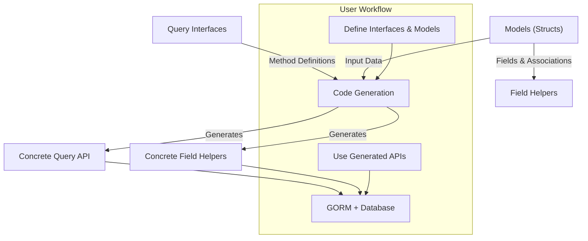

# Core Concepts & Terminology

Gain clarity on fundamental GORM CLI terms including query interfaces, SQL templates, field helpers, model associations, and the code generation workflow. This page builds a solid mental model of how these primary concepts interlock to empower expressive, type-safe database operations.

---

## Understanding GORM CLI’s Foundations

GORM CLI bridges the gap between compile-time safety and dynamic database operations in Go projects using GORM. To harness its power, it's crucial to grasp these core components and how they fit together:

1. **Query Interfaces**
2. **SQL Templates**
3. **Field Helpers**
4. **Model Associations**
5. **Code Generation Workflow**

Each piece plays a vital role in delivering a fluent, strongly typed experience that eliminates runtime errors and dramatically improves developer productivity.

---

## 1. Query Interfaces: Defining Type-Safe Queries at the Interface Level

At the heart of GORM CLI lies the concept of **interface-driven query APIs**. You define database queries by declaring Go interfaces where each method represents a database operation.

- **Purpose:** Provide a declarative way to specify queries and updates using familiar Go method signatures.
- **User Intent:** Write clean, reusable, and type-safe query signatures without manually writing boilerplate code.

### How It Works:

Consider the `Query[T any]` interface:

```go
// Query interface with SQL template comments
 type Query[T any] interface {
  // SELECT * FROM @@table WHERE id=@id
  GetByID(id int) (T, error)

  // where("name=@name AND age=@age")
  FilterByNameAndAge(name string, age int)

  // SELECT * FROM @@table
  // {{where}}
  //   {{if @user.Name }} name=@user.Name {{end}}
  //   {{if @user.Age > 0}} AND age=@user.Age {{end}}
  // {{end}}
  SearchUsers(user User) ([]T, error)

  // UPDATE @@table
  // {{set}}
  //   {{if user.Name != ""}} name=@user.Name, {{end}}
  //   {{if user.Age > 0}} age=@user.Age, {{end}}
  //   {{if user.Age >= 18}} is_adult=1 {{else}} is_adult=0 {{end}}
  // {{end}}
  // WHERE id=@id
  UpdateUser(user User, id int) error
}
```

> The method comments serve as SQL templates, binding method parameters to the query.

### Benefits to You:

- Write query logic once as interface method definitions.
- Gain automatic generation of type-safe implementations.
- Avoid SQL injection risks with safe parameter binding.

---

## 2. SQL Templates: Dynamic Query Construction within Method Comments

GORM CLI leverages a lightweight SQL template DSL inside method documentation to add dynamic query parts, conditions, and iterations.

### Key Template Constructs:

| Directive   | Purpose                            | Example                                    |
|-------------|----------------------------------|--------------------------------------------|
| `@@table`   | Resolves to the model’s table name | `SELECT * FROM @@table WHERE id=@id`       |
| `@@column`  | Dynamic column binding            | `WHERE @@column=@value`                    |
| `@param`    | Bind Go method parameters         | `WHERE name=@user.Name`                     |
| `{{where}}` | Conditional WHERE clause          | `{{where}} age > 18 {{end}}`                |
| `{{set}}`   | Conditional UPDATE SET clause     | `{{set}} name=@name {{end}}`                |
| `{{if}}`    | If-else conditional fragments    | `{{if age > 0}} AND age=@age {{end}}`       |
| `{{for}}`   | Loop over collections             | `{{for _, t := range tags}} ... {{end}}`    |

### Real-World Example:

```sql
UPDATE @@table
{{set}}
  {{if user.Name != ""}} name=@user.Name, {{end}}
  {{if user.Age > 0}} age=@user.Age, {{end}}
  {{if user.Age >= 18}} is_adult=1 {{else}} is_adult=0 {{end}}
{{end}}
WHERE id=@id
```

Template directives bring expressive, flexible querying without losing type safety.

---

## 3. Field Helpers: Type-Safe Wrappers for Struct Fields

Beyond queries, GORM CLI generates **field helpers** based on your Go model structs. These helpers expose strongly typed predicates and setters for filtering, updating, and association operations.

### What Are Field Helpers?

They are Go variables representing model fields that enable fluent, type-safe SQL expressions.

Example generated helpers for a `User` model:

```go
var User = struct {
  ID        field.Number[uint]
  Name      field.String
  Age       field.Number[int]
  Profile   examples.JSON
  Pets      field.Slice[models.Pet] // Association helper
  // ... other fields
} {
  ID:        field.Number[uint]{}.WithColumn("id"),
  Name:      field.String{}.WithColumn("name"),
  Age:       field.Number[int]{}.WithColumn("age"),
  Profile:   examples.JSON{}.WithColumn("profile"),
  Pets:      field.Slice[models.Pet]{}.WithName("Pets"),
}
```

### Why Field Helpers Matter:

- Offer fluent methods like `.Eq()`, `.Like()`, `.Between()`, `.Set()`, `.Create()`, and `.Unlink()`.
- Support common data types and NULL-aware types (e.g., `sql.NullInt64`).
- Automatically generate relation-aware helpers for has one/many, belongs to, many to many.

### Example Usage:

```go
// Filter users where age is between 18 and 65
users, err := gorm.G[User](db).Where(generated.User.Age.Between(18, 65)).Find(ctx)

// Create a new user and associated pet in one atomic operation
gorm.G[User](db).
  Set(generated.User.Name.Set("alice"),
    generated.User.Pets.Create(generated.Pet.Name.Set("fido")),
  ).
  Create(ctx)
```

---

## 4. Model Associations: Fluent Handling of Relationships

GORM CLI generates helpers for model associations that correspond to GORM’s native relation types:

| Association Type | Description                          | Helper Type        | Supported Operations                                   |
|------------------|------------------------------------|--------------------|--------------------------------------------------------|
| `has one`        | One related entity                  | `field.Struct[T]`  | Create, Update, Unlink, Delete                         |
| `has many`       | Multiple related entities           | `field.Slice[T]`   | CreateInBatch, Create, Update, Unlink, Delete          |
| `belongs to`     | Parent association (foreign key)    | `field.Struct[T]`  | Unlink (null FK), Delete associated                     |
| `many2many`      | Many-to-many via join table         | `field.Slice[T]`   | CreateInBatch, Unlink (remove join rows), Delete join  |

### Example: Association Operations

```go
// Unlink pets from user with ID=1
err := gorm.G[User](db).
  Where(generated.User.ID.Eq(1)).
  Set(generated.User.Pets.Unlink()).
  Update(ctx)

// Batch create and link languages
gorm.G[User](db).
  Where(generated.User.ID.Eq(1)).
  Set(generated.User.Languages.CreateInBatch([]models.Language{{Code: "EN"}, {Code: "FR"}})).
  Update(ctx)
```

Relations are first-class citizens in the generated API, enabling complex linked operations in straightforward code.

---

## 5. Code Generation Workflow: From Source to Generated Code

GORM CLI automates the creation of both query APIs and field helpers based on your source code:

### Workflow Steps:

1. **Parse Interfaces & Structs:**
   - GORM CLI scans Go files or directories.
   - Extracts interface definitions with SQL templates.
   - Extracts model structs and analyzes fields, tags, and associations.

2. **Apply Configurations:**
   - Configurable generation via `genconfig.Config` lets you specify output paths, inclusion/exclusion patterns, and custom field mappings.

3. **Generate Source Code:**
   - Produces concrete Go code implementing query interfaces with type-safe methods.
   - Produces strongly typed field helper variables for model fields and relations.

4. **Inject Context & Format:**
   - Context (`ctx context.Context`) is injected automatically when missing.
   - Output is gofmt-compliant and ready to use.

### Example Config Snippet:

```go
var _ = genconfig.Config{
  OutPath: "examples/output",
  FieldTypeMap: map[any]any{
    sql.NullTime{}: field.Time{},
  },
  IncludeInterfaces: []any{"Query*"},
  ExcludeStructs: []any{"*DTO"},
}
```

### User Flow:

<Steps>
  <Step title="Write Your Interfaces and Models">
    Define your query interfaces with SQL template comments and your Go models with GORM tags.
  </Step>
  <Step title="Run GORM CLI Generator">
    Execute `gorm gen -i ./yourpackage -o ./generated` to produce API and helpers.
  </Step>
  <Step title="Use Generated Code in Your Application">
    Use the generated APIs and field helpers with type safety and discoverability.
  </Step>
</Steps>

---

## Visualization of Core Concepts Interaction



This shows how models and query interfaces feed into code generation, producing robust, type-safe query and field helper APIs that interact with GORM and the database.

---

## Practical Tips & Best Practices

- **Leverage Template Directives:** Use `{{where}}` and `{{set}}` to build dynamic queries with conditional logic.
- **Use `genconfig.Config` to Customize Generation:** Align output paths and field mappings to your project structure.
- **Define Queries to Return Typed Results:** Always ensure interface methods return `(T, error)` or `(error)` where appropriate.
- **Exploit Field Helpers for Updates and Filters:** Prefer fluent predicates over raw SQL for safer code.
- **Handle Associations Mindfully:** Use unlink and delete carefully; know association semantics by type.

---

## Troubleshooting Common Pitfalls

<AccordionGroup title="Common Issues and How To Resolve">
<Accordion title="Interface Methods Without Return Values">
Methods with SQL `WHERE` or `SELECT` clauses must return results or errors. Ensure methods like:

```go
GetByID(id int) (T, error)
```

are properly defined.
</Accordion>
<Accordion title="Generation Omits Interfaces or Structs">
Check `genconfig.Config` filters – inclusion and exclusion lists affect what is generated. Patterns are shell-style wildcards.
</Accordion>
<Accordion title="SQL Template Parsing Errors">
Verify SQL templates in comments are valid and bind to parameters correctly. Watch for typos in directives like `@@table`.
</Accordion>
<Accordion title="Missing Context Parameter"
>
GORM CLI auto-injects `ctx context.Context` if omitted, but passing context explicitly is good practice.
</Accordion>
</AccordionGroup>

---

## Next Steps

To move from understanding to practice:

- Visit the [Feature Summary](../feature-quickstart/feature-summary) page to see capabilities at a glance.
- Explore [Integration with GORM & Your Codebase](../concepts-architecture-flow/integration-points) to learn how to use generated code.
- Follow the Quickstart guides in the Getting Started tab for hands-on tutorials.

---

*This page anchors your understanding of GORM CLI’s critical concepts, paving the way for mastery of its powerful type-safe ORM tools.*

---