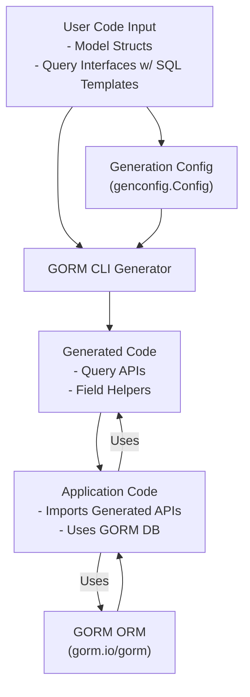

# Integration with GORM & Your Codebase

Seamlessly harness GORM CLI’s generated code alongside the `gorm.io/gorm` ORM and your existing Go project. This page demystifies where generated files fit within your application structure, how configuration and models shape interactions, and how GORM CLI empowers your workflow from defining models and queries to managing database migrations.

---

## Why Integration Matters

Every Go project using GORM faces the challenge of writing repetitive and error-prone database access code. GORM CLI eliminates these pain points by generating type-safe, discoverable APIs that are fully compatible with GORM’s idioms. But to unlock this synergy, understanding how the generated code is organized and interacts with your codebase is essential.

This page guides you on embedding generated query interfaces and field helpers into your project, how configuration influences code placement and behavior, and best practices for connecting these generated components to your runtime logic.

---

## How the Generated Code Fits in Your Project

GORM CLI generates two primary pieces of code from your input interfaces and models:

- **Query APIs:** Interfaces with SQL template comments become concrete, type-safe query implementations.
- **Field Helpers:** Model structs generate strong typed helpers for filter expressions, updates, and associations.

### Typical Output Location

By default, generated files appear under the output path configured in your `genconfig.Config` (or via the CLI `-o` flag). These files will match your input directory structure, preserving package hierarchies and enabling straightforward imports.

Example:

- Input interfaces and structs in `example/models` and `example/query.go`
- Generated code placed in `example/output/models` plus accompanying query files

This arrangement keeps your generated code version-controlled and separated yet easily accessible for imports.

### Package Structure and Imports

Generated code packages align with the original packages from which you wrote your interfaces and models. This means:

- Query APIs and field helpers exist in the same or mirrored package path.
- You can import generated packages naturally using Go’s module system, e.g., `import "yourproject/generated/models"`.
- The generated code imports `gorm.io/gorm` and related modules to function seamlessly.

---

## Configuration Files Impact on Integration

Your integration experience is shaped by your configuration files defined as package-level variables using `genconfig.Config`. These lets you control generation behavior and output:

- **OutPath:** Controls where generated files are saved, allowing you to colocate or centralize code suitably.
- **Include/Exclude Filters:** Allows selection of specific interfaces or structs to generate code for, enabling incremental adoption.
- **Field Mappings:** Customize how field types map to generated field helpers for specialized use cases.
- **FileLevel:** Control whether generation occurs per file or package, affecting namespace and import layouts.

By carefully structuring these configs, you maintain a predictable and maintainable generation output that fits your existing code and build system.

---

## Workflow for Using Generated Code

### Step 1: Define Models and Query Interfaces

Write model structs and query interfaces with embedded SQL templates in your codebase. For example, a typical query interface might look like:

```go
// examples/query.go
package examples

type Query[T any] interface {
  // SELECT * FROM @@table WHERE id=@id
  GetByID(id int) (T, error)

  // where("name=@name AND age=@age")
  FilterByNameAndAge(name string, age int)
}

// examples/models/user.go
package examples

type User struct {
  ID   uint
  Name string
  Age  int
}
```

### Step 2: Generate Code

Run GORM CLI with paths for your interfaces and output:

```bash
gorm gen -i ./examples -o ./generated
```

This command produces query implementations and field helpers matching your models.

### Step 3: Import and Use Generated Code

In your application code, import the generated package and use the fluent APIs seamlessly with GORM’s `*gorm.DB` objects:

```go
import (
  "context"
  "yourproject/generated/examples"
  "gorm.io/gorm"
)

func loadUser(ctx context.Context, db *gorm.DB, id int) (*examples.User, error) {
  return examples.Query[examples.User](db).GetByID(ctx, id)
}

func filterAdults(ctx context.Context, db *gorm.DB) ([]examples.User, error) {
  users, err := examples.Query[examples.User](db).
    FilterByNameAndAge("", 18).
    Find(ctx)
  return users, err
}
```

This code composes gorm queries with generated field helpers and query methods type-safely.

---

## Interaction Between Generated Components and Your Code

### Models and Components

Generated field helpers wrap your model fields as strongly typed expressions that integrate into GORM’s query building. Association helpers provide simple semantics for related entity operations like creating, updating, unlinking, and deleting associated rows without manual SQL.

### Queries and Database Migrations

While GORM CLI focuses on query code generation, it fits naturally with GORM’s migration tools. Generated query methods use known table names and model structures that align with migration schemas.

Example:

- A model `User` used by the generator corresponds to a GORM migration `AutoMigrate(&User{})` ensuring table consistency.
- Generated queries reference table and column names detected from structs, reducing mismatch errors.

---

## Best Practices for Integration

- **Maintain Configuration Close to Models:** Place your `genconfig.Config` near models/interfaces or in the base package to keep related generation rules organized.
- **Keep Generated Code Under Version Control:** Review diffs and keep generated files checked-in for reproducibility and team collaboration.
- **Structure Packages Thoughtfully:** Use output paths and package-level generation controls to avoid import conflicts or overly deep package nesting.
- **Leverage Generated Field Helpers:** Use the provided comprehensive helpers for filters and associations rather than crafting raw SQL or GORM clauses.
- **Link Generation to CI/CD:** Automate generation steps as part of your build or deployment process to ensure codebase integrity.

---

## Troubleshooting Common Integration Issues

<AccordionGroup title="Common Integration Issues and Solutions">
<Accordion title="Generated Files Not Found or Import Errors">
Ensure your `OutPath` is correctly configured, and that your project’s module imports match the output package path. Use `go mod tidy` or `replace` directives if needed to resolve paths.
</Accordion>
<Accordion title="Type Conflicts or Missing Methods in Generated Code">
Verify your interface and struct definitions meet GORM CLI’s requirements. Check for missing SQL template comments or unsupported return types that could impair generation.
</Accordion>
<Accordion title="Runtime Errors Using Generated Query APIs">
Confirm your DB instance is properly passed and configured at runtime. Context parameters are auto-injected if omitted but ensure your calls align with generated method signatures.
</Accordion>
<Accordion title="Mismatched Table or Column Names in Queries">
Check for correct GORM tags on struct fields and whether any custom mappings via `genconfig.Config` are required for your naming conventions.
</Accordion>
</AccordionGroup>

---

## Diagram: How GORM CLI Generated Code Integrates with Your Go Project



---

## Next Steps

To dive deeper and get hands-on:

- Explore [Feature Summary](../feature-quickstart/feature-summary) to understand capabilities at a glance.
- Start with the [Quickstart: Generating Type-Safe APIs](../../guides/getting-started-workflows/quickstart-complete-workflow) to see full codegen in action.
- Customize behavior with [Basic Configuration](../../getting-started/configuration-troubleshooting/basic-configuration).

For architecture deep-dives, see [Architecture Overview](../../concepts-architecture-flow/architecture-overview) explaining the code generation internals.

---

Harnessing GORM CLI with GORM and your Go codebase unlocks a robust, type-safe, and maintainable database workflow. By understanding integration points and workflow, you accelerate development without sacrificing safety or flexibility.