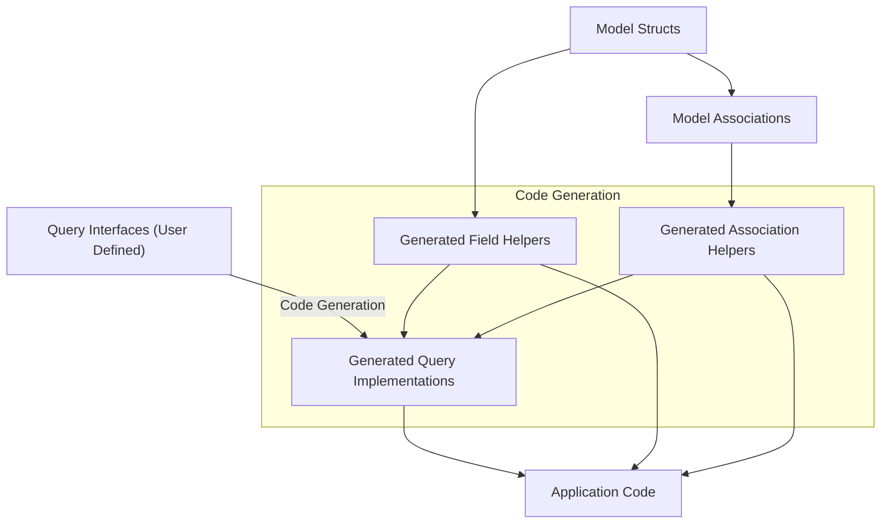

# Core Concepts & Terminology

Understanding the key terminology of GORM CLI is essential to mastering its workflow and unlocking its full potential. This page demystifies domain-specific concepts like *field helpers*, *query interfaces*, and *association helpers* by anchoring them in user-centric mental models and typical workflows. With clear definitions and examples, you’ll see exactly how these pieces fit together to streamline database operations in Go projects using GORM.

---

## Field Helpers

### What Are Field Helpers?
Field helpers are generated, type-safe constructs that correspond to fields in your Go model structs. They serve as building blocks for constructing database queries, updates, and filters without resorting to raw SQL strings.

### Purpose and Value
- Provide *compile-time safety* by leveraging Go’s type system.
- Make query construction *fluent* and *discoverable* through method chaining.
- Abstract raw SQL conditions, making code more readable and less error-prone.

### Typical Workflow
1. Define your model struct in Go.
2. Run GORM CLI to generate corresponding field helpers.
3. Use these helpers in your query or update expressions to build type-safe predicates and setters.

### Example
Given a `User` model:
```go
// User model snippet
type User struct {
  ID    uint
  Name  string
  Age   int
  Score sql.NullInt64
}
```
The generated field helpers might be used like this:
```go
// Query users where age is between 18 and 65
users, err := gorm.G[User](db).
  Where(generated.User.Age.Between(18, 65)).
  Find(ctx)

// Update user's name and increment age
err := gorm.G[User](db).
  Where(generated.User.ID.Eq(1)).
  Set(
    generated.User.Name.Set("Alice"),
    generated.User.Age.Incr(1),
  ).
  Update(ctx)
```

---

## Query Interfaces

### What Are Query Interfaces?
Query interfaces are user-defined Go interfaces annotated with SQL template comments that describe the desired database operations. GORM CLI generates type-safe implementations of these interfaces.

### Purpose and Value
- Combine the flexibility of custom SQL with type safety and code generation.
- Enable clear separation of query definitions and their implementations.
- Simplify complex queries by embedding SQL templates directly in Go interface methods.

### Typical Workflow
1. Define a generic Go interface with methods and annotate each with SQL templates.
2. Run the generator to produce concrete implementations for the specified model.
3. Use these generated query methods to perform database operations in a type-safe way.

### Example
```go
// Custom query interface
 type Query[T any] interface {
   // SELECT * FROM @@table WHERE id=@id
   GetByID(id int) (T, error)

   // SELECT * FROM @@table WHERE name=@name AND age=@age
   FilterByNameAndAge(name string, age int) ([]T, error)
 }
```
Once generated, you use it like:
```go
user, err := generated.Query[User](db).GetByID(ctx, 123)
users, err := generated.Query[User](db).FilterByNameAndAge(ctx, "jinzhu", 25)
```

---

## Association Helpers

### What Are Association Helpers?
Association helpers are specialized field helpers that enable safe, fluent operations on model relationships — including `has one`, `has many`, `belongs to`, and `many to many` associations.

### Purpose and Value
- Provide compile-time checked operations for creating, updating, unlinking, and deleting associations.
- Simplify complex association management with clear method calls.
- Avoid raw SQL or manual foreign key handling.

### Typical Association Operations
- **Create:** Insert a related record and link it to the parent.
- **Update:** Change fields of associated records based on conditions.
- **Unlink:** Remove linkage without deleting data (e.g., nullify foreign keys).
- **Delete:** Remove associated records, including join rows in many-to-many relations.
- **CreateInBatch:** Batch create multiple associated records efficiently.

### Examples
```go
// Create a user and a pet linked to that user
gorm.G[User](db).
  Set(
    generated.User.Name.Set("alice"),
    generated.User.Pets.Create(generated.Pet.Name.Set("fido")),
  ).
  Create(ctx)

// Unlink a user's pet where pet name is ‘fido’
gorm.G[User](db).
  Where(generated.User.ID.Eq(1)).
  Set(generated.User.Pets.Where(generated.Pet.Name.Eq("fido")).Unlink()).
  Update(ctx)
```

---

## How These Concepts Fit Together

Your typical workflow with GORM CLI integrates these concepts into a seamless developer experience:

1. **Model Definition:** Start by defining your Go model structs with fields and associations.
2. **Interface Definition:** Optionally define query interfaces with SQL templates to express queries.
3. **Code Generation:** Run GORM CLI (`gorm gen`) to generate:
   - Field helpers for each model to provide safe predicates and setters.
   - Implementations of query interfaces with type-checked methods.
   - Association helpers embedded within generated models.
4. **Usage:** In your application code, combine generated APIs:
   - Use field helpers to build expressive, type-safe filters and updates.
   - Use query interfaces for custom queries with SQL templates.
   - Perform association operations via association helpers ensuring relational integrity.

This synergy drastically reduces runtime errors, enhances code readability, and accelerates development.

---

## Key Terminology Summary

| Term               | Definition                                                                                  | Typical Use Case                             |
|--------------------|---------------------------------------------------------------------------------------------|---------------------------------------------|
| **Field Helpers**   | Type-safe generators tied to model fields to assist in building queries and updates          | Filtering, setting values, constructing predicates |
| **Query Interfaces**| Go interfaces with SQL template annotations allowing custom queries with generated implementations | Defining and using reusable complex queries  |
| **Association Helpers** | Specialized helpers for managing model relationships safely and fluently                  | Creating, updating, unlinking, or deleting related records |

---

## Visualizing Relationships



This diagram shows that your model definitions are the foundation. From them, GORM CLI generates field helpers and association helpers. These helpers, together with user-defined query interfaces, feed into generated query implementations, which your application code consumes safely and fluently.

---

## Practical Tips

- **Start with your models:** Precise model definitions enable accurate field and association helper generation.
- **Use interfaces for complex queries:** When standard filtering via field helpers isn’t enough, leverage query interfaces with SQL templates.
- **Manage associations via helpers:** Avoid manual foreign key operations; use association helpers to maintain data integrity.
- **Customize generation:** Use `genconfig.Config` to include or exclude specific models/interfaces or map custom types to helpers.

## Common Pitfalls to Avoid

- Trying to write raw SQL strings directly instead of using generated field helpers leads to bugs and type-unsafety.
- Forgetting to regenerate code after changing model fields or associations causes stale helpers.
- Misusing association operations by mixing unlink and delete semantics without understanding FK impacts.

---

## Next Steps

Explore these documentation pages to deepen your mastery:
- [Model-Driven Field Helpers and Updates](../guides/core-workflows/model-driven-field-helpers)
- [Using Type-Safe Query APIs](../guides/core-workflows/using-type-safe-query-apis)
- [Working with Associations](../guides/advanced-patterns/working-with-associations)

These will guide you from terminology understanding to hands-on implementation strategies.

---

