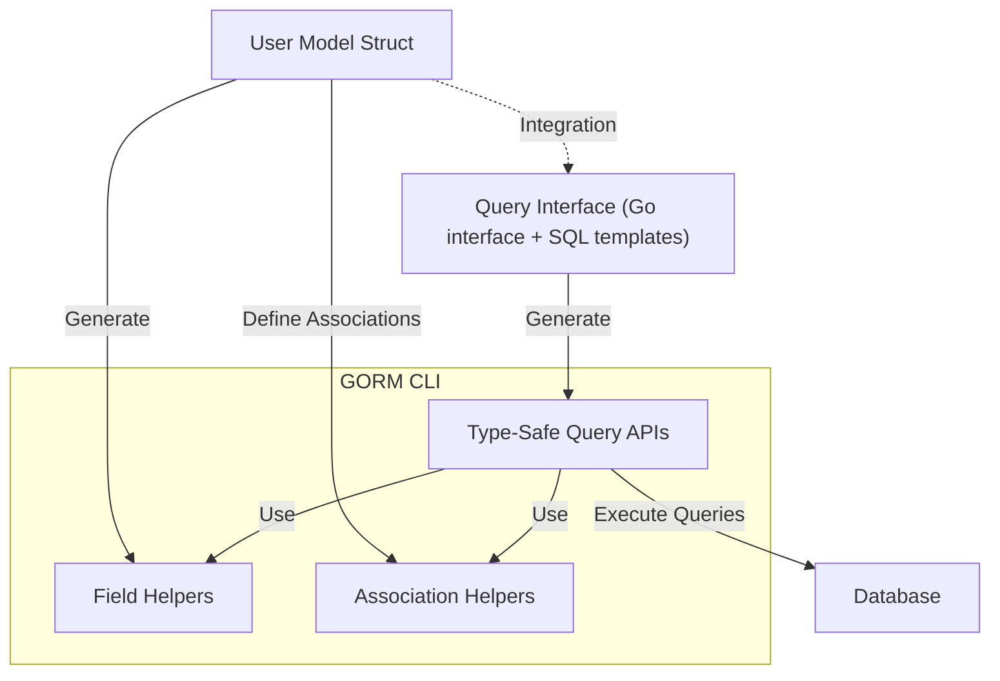

# Core Concepts & Terminology

Welcome to the foundational guide that clarifies the key terms and components you will encounter in the GORM CLI ecosystem. This page is crafted to help new users quickly build a strong mental model of critical concepts such as **query interface**, **SQL template**, **field helper**, and **association helper** — empowering you to confidently navigate and leverage GORM CLI's powerful features.

---

## Understanding Key Terms

### Query Interface

A **query interface** in GORM CLI is a Go interface that you define with annotated methods containing SQL templates in their comments. Each method corresponds to a database query or operation.

- Think of it as a blueprint where you declare *what* query you want to perform.
- The CLI generates type-safe, fluent API implementations from these interfaces making your queries compile-time safe and easy to use.

**Example:**
```go
// Query interface snippet
// SELECT * FROM @@table WHERE id=@id
GetByID(id int) (T, error)
```
The generator translates this into a strongly typed method that fetches a record by its ID.

### SQL Template

SQL templates are embedded SQL query fragments written inside comments in your query interfaces. They support a custom DSL (Domain Specific Language) to enable dynamic and conditional query generation.

- Provide static or templated SQL with placeholders bound automatically to method parameters.
- Enhance flexibility by letting you conditionally include parts of SQL using directives like `{{where}}`, `{{if}}`, and `{{for}}`.

**Key DSL directives:**
| Directive   | Purpose                         | Example Usage                              |
|-------------|---------------------------------|--------------------------------------------|
| `@@table`   | Resolves to the model's table name | `SELECT * FROM @@table WHERE id=@id`      |
| `@@column`  | Binds a dynamic column name      | `SELECT * FROM @@table WHERE @@column=@value` |
| `@param`    | Maps Go parameters to SQL params | `WHERE name=@user.Name`                    |
| `{{where}}` | Conditional WHERE clause          | `{{where}} age > 18 {{end}}`               |
| `{{if}}`    | Conditional SQL block             | `{{if age > 0}} AND age=@age {{end}}`      |
| `{{for}}`   | Iterate over collections          | `{{for _, t := range tags}} tags LIKE concat('%',@t,'%') OR {{end}}` |

These templates make query definitions expressive, reusable, and concise.

### Field Helper

Field helpers are **code-generated, type-safe representations of your model’s database columns and fields**. They act as a DSL that helps build expressive and safe filters, updates, and ordering criteria.

- For every field in your model struct, GORM CLI generates a corresponding field helper.
- They are strongly typed, minimizing errors and improving developer experience through discoverability and autocomplete.

**Example:**
```go
// Model field helper example
User.Name.Like("%jinzhu%")  // Generates SQL: name LIKE '%jinzhu%'
User.Age.Between(18, 65)      // Generates SQL: age BETWEEN 18 AND 65
```

Beyond basic types, these helpers also handle named types and special types like `sql.NullInt64` or `time.Time`.

### Association Helper

Association helpers provide generated helpers for model relationships, enabling you to perform complex association operations with compile-time safety.

- They represent associations such as `has one`, `has many`, `belongs to`, and `many2many`.
- These helpers offer methods for **create**, **update**, **unlink (dissociate)**, **delete**, and **batch operations** on related records.

**Example Operations:**
```go
// Add a new pet and associate it in a create operation
gorm.G[User](db).
  Set(
    generated.User.Name.Set("alice"),
    generated.User.Pets.Create(generated.Pet.Name.Set("fido")),
  ).
  Create(ctx)

// Unlink pets named 'fido' from the user
gorm.G[User](db).
  Where(generated.User.ID.Eq(1)).
  Set(generated.User.Pets.Where(generated.Pet.Name.Eq("fido")).Unlink()).
  Update(ctx)
```

Association helpers simplify managing model relations without manual foreign key tracking.

### Roles of These Concepts Together

GORM CLI’s power lies in combining these concepts cohesively:

- **Query interfaces** define the *what* of your database interaction in declarative Go interfaces with embedded SQL templates.
- **SQL templates** empower these interfaces with flexible, expressive, conditional, and parameterized queries.
- **Field helpers** generated from your models convert fields into safe building blocks for constructing queries.
- **Association helpers** extend support to related data operations ensuring relational integrity and expressiveness.

---

## Mental Model: The GORM CLI Ecosystem



- You write **model structs** declaring your data types and relationships.
- You write **query interfaces** with SQL templates specifying how to retrieve or modify data.
- GORM CLI generates both **field/association helpers** and **type-safe query implementations** that work seamlessly with GORM and your database.
- This setup provides fluent, error-resistant APIs for all CRUD and association operations.

---

## Practical Tips for New Users

- Start by clearly defining your model structs with all fields and associations.
- Define query interfaces for your common queries and updates using SQL templates with placeholders.
- Use the `@@table` and `@@column` tokens in your templates to refer dynamically to tables and columns.
- Leverage the generated **field helpers** to build complex filters and updates fluently.
- Utilize **association helpers** for safe and expressive related data operations.
- Keep your SQL templates readable by using the `{{where}}`, `{{if}}`, and iteration directives.
- Review generated code to familiarize yourself with the available methods and their API.

---

## Common Pitfalls to Avoid

- Forgetting to bind parameters properly in SQL templates; always use `@param` syntax to ensure safety.
- Writing query interface methods without an error return or with more than two return values will cause generation errors.
- Missing the `ctx context.Context` parameter; the generator auto-injects context but it helps to include it for clarity.
- Confusing `Unlink` and `Delete` in association helpers: `Unlink` dissociates without deleting data, while `Delete` removes associated rows.
- Using association helpers outside the context of a parent record can lead to logic mistakes.

---

## Next Steps

With a firm grasp of these core terms and concepts, you are ready to: 

- Define your models and query interfaces ([Define Models & Query Interfaces](/getting-started/first-generation/define-models-interfaces))
- Explore how GORM CLI works at a high level ([How GORM CLI Works (High-Level Architecture)](/overview/concepts-architecture/how-it-works-highlevel))
- Generate your first type-safe query APIs and field helpers
- Start building queries fluent with field/association helpers and generated APIs

---

For a deeper dive, explore [Feature Overview](/overview/quick-features/feature-summary) and the [Template-based Query Generation](/guides/generation-patterns/template-sql-gen) guide.


---

<AccordionGroup title="Quick Reference Glossary">
<Accordion title="Query Interface">
Defines a Go interface with methods annotated by SQL templates that specify database operations. The generator creates type-safe query implementations from these interfaces.
</Accordion>
<Accordion title="SQL Template">
Queried SQL code inside method comments using placeholders and directives for dynamic, parameterized, and conditional SQL generation.
</Accordion>
<Accordion title="Field Helper">
A generated, strongly typed helper representing a model’s individual database field. Used to build expressive and type-safe query predicates and updates.
</Accordion>
<Accordion title="Association Helper">
A generated helper for model associations (relations) enabling safe CRUD and linking/unlinking operations on related data.
</Accordion>
</AccordionGroup>

---

## Additional Resources
- [Overview: What is GORM CLI?](/overview/product-intro/what-is-gorm-cli)
- [Why Use GORM CLI?](/overview/product-intro/why-gorm-cli)
- [Target Audience & Use Cases](/overview/product-intro/target-audience-usecases)
- [Quickstart Workflow](/overview/quick-features/quickstart)


---