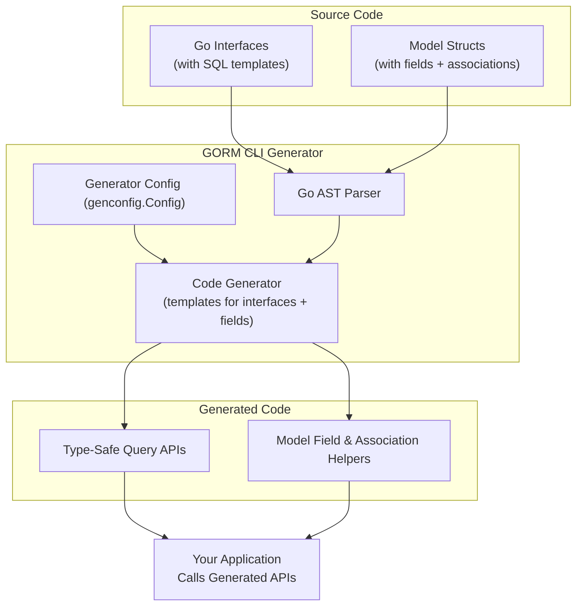

# How GORM CLI Works (High-Level Architecture)

GORM CLI streamlines Go application development by automatically generating two tightly integrated sets of helpers: **type-safe query APIs** based on your Go interfaces with embedded SQL templates, and **model-driven field helpers** for crafting expressive, safe filters, ordering, and associations. This page explains how these components work together, how the CLI integrates seamlessly with the Go toolchain, and how the generation workflow delivers robust, discoverable APIs that eliminate boilerplate and reduce runtime errors.

---

## Unlocking Type-Safe, Fluent GORM Code Through Generation

Imagine writing sophisticated database queries and mutation logic in Go without constantly wrestling with raw SQL strings or manual query construction. GORM CLI empowers you to write Go interfaces that specify your queries declaratively with SQL templates. From these, it auto-generates type-safe, fluent query methods strongly typed to your models.

Simultaneously, based on your model structs, GORM CLI generates field helpers that provide intuitive methods for filters, updates, and association operations — all enforcing compile-time safety.

Together, these generated components give you a fluent API that handles all CRUD operations in a type-safe manner, letting you focus on your application logic instead of repetitive plumbing or error-prone SQL.

---

## GORM CLI Components: What It Generates and Why They Matter

### 1. Type-Safe Query APIs from Go Interfaces

- **User Intent:** Write clean Go interfaces with SQL query templates to declare your desired database operations.
- **Generated Outcome:** Concrete implementations with auto-bound parameters and result types, ensuring method signatures that prevent common runtime errors.
- **Benefit:** Enforce compile-time checks, avoid tedious boilerplate, and get discoverable methods with clear contracts.

Example Interface:
```go
// Query interface for users
// SELECT * FROM @@table WHERE id=@id
GetByID(id int) (User, error)
```

Generated Query Usage:
```go
user, err := generated.Query[User](db).GetByID(ctx, 123)
```

### 2. Model-Driven Field Helpers

- **User Instruction:** Define Go structs representing your models, including their fields and associations.
- **Generated Code:** Strongly typed helpers for each basic field (e.g., `Eq`, `Between`, `Like` predicates) and for associations supporting create, update, unlink, and delete operations.
- **Why This Matters:** These helpers make queries expressive, readable, and type-safe, while providing intuitive methods for complex association behaviors.

Example:
```go
generated.User.Name.Like("%jinzhu%")   // generate SQL where clause 'name LIKE '%jinzhu%''
```

For associations:
```go
gorm.G[User](db).
  Set(
    generated.User.Pets.Create(generated.Pet.Name.Set("fido")),
  ).
  Create(ctx)
```

### 3. Integration into the Go Toolchain

- You invoke the CLI via a simple command specifying your input interfaces and models and output directory.
- The CLI parses your Go code, analyzes interfaces and structures, then generates code into your project structure respecting configured output paths.
- This workflow can seamlessly slot into your build or CI pipelines.

---

## How the Generation Workflow Comes Together

1. **Parsing Your Go Source:** The CLI processes your specified input directory or file(s), extracting:
   - Interface types annotated with SQL templates.
   - Model structs with database tags and relations.
   - Package and import info to generate cohesive code respecting your project structure.

2. **Applying Generator Configuration (Optional):** Configuration allows you to:
   - Customize output paths.
   - Include/exclude interfaces or structs.
   - Map specific struct fields or types to custom field helper types.

3. **Generating Code:** Using parsed information and templating, the CLI:
   - Generates interface implementations with type-safe, parameter-bound SQL execution.
   - Creates field helper variables and methods for each model field and association.
   - Writes generated source files in your specified output location.

4. **Using Generated APIs:**
   - Your codebase invokes fluent, discoverable generated methods for queries and mutations with compile-time safety.

---

## Workflow Example

```bash
# 1. Define your interfaces and models (example in ./examples)
# 2. Run generator
gorm gen -i ./examples -o ./generated

# 3. Use the generated package
```

Sample generated use:
```go
u, err := generated.Query[User](db).GetByID(ctx, 123)
users, err := gorm.G[User](db).Where(generated.User.Age.Gt(18)).Find(ctx)
```

---

## Practical Benefits to Your Development

- **Elimination of Error-Prone Boilerplate:** No more manual implementations of repetitive database access methods.
- **Compile-Time Safety:** Catch type mismatches, missing parameters, or invalid field references before running your code.
- **Clarity and Discoverability:** Generated code offers clear method names and fluent chaining for building queries and operations.
- **Seamless Association Handling:** Simplifies complex create/update/delete/unlink logic with generated helpers.
- **Configurable Generation:** Tailor output locations and customize how specific fields are handled.

---

## Architecture Diagram



---

## Tips & Best Practices

- **Keep Interfaces Clean and Focused:** Write clear SQL templates in interface comments. This clarity propagates into useful generated methods.
- **Use Configuration for Custom Types:** Map custom struct fields (e.g., JSON fields) to custom helpers for seamless querying.
- **Leverage Field Helpers for Associations:** Utilize association helpers (`CreateInBatch`, `Unlink`, `Delete`) to manage relational data safely.
- **Integrate into CI & Build:** Automate generation during builds to keep your APIs in sync with models and interfaces.

---

## Troubleshooting Common Scenarios

<AccordionGroup title="Common Issues and Solutions">
<Accordion title="Generated Code is Missing Some Interfaces or Structs">
Check if you have configuration filters (`IncludeInterfaces`, `ExcludeStructs`, etc.) that might be excluding files or types unintentionally. Adjust `genconfig.Config` accordingly.
</Accordion>
<Accordion title="SQL Template Parsing Errors">
Ensure SQL annotations in interface method comments strictly follow the template DSL syntax. Missing or malformed placeholders will cause generator errors.
</Accordion>
<Accordion title="Generated Code is Not Found in Expected Output Path">
Confirm your `-o` output flag matches configured `OutPath` settings in your project. The generator respects configured output paths and defaults.
</Accordion>
</AccordionGroup>

---

## Next Steps

- Explore [Define Models & Query Interfaces](/getting-started/first-generation/define-models-interfaces) to write your own interfaces and models.
- Follow [Run the Code Generator](/getting-started/first-generation/run-code-generator) to generate your first code.
- Dive into [Using Generated APIs in Your Application](/guides/getting-started/using-generated-apis) to integrate generated code.
- Check out [Template-based Query Generation](/guides/generation-patterns/template-sql-gen) for advanced SQL template DSL usage.


----

By understanding this high-level architecture, you can harness GORM CLI to dramatically improve your data access layer — reducing bugs, increasing developer productivity, and providing a type-safe foundation for robust Go applications.