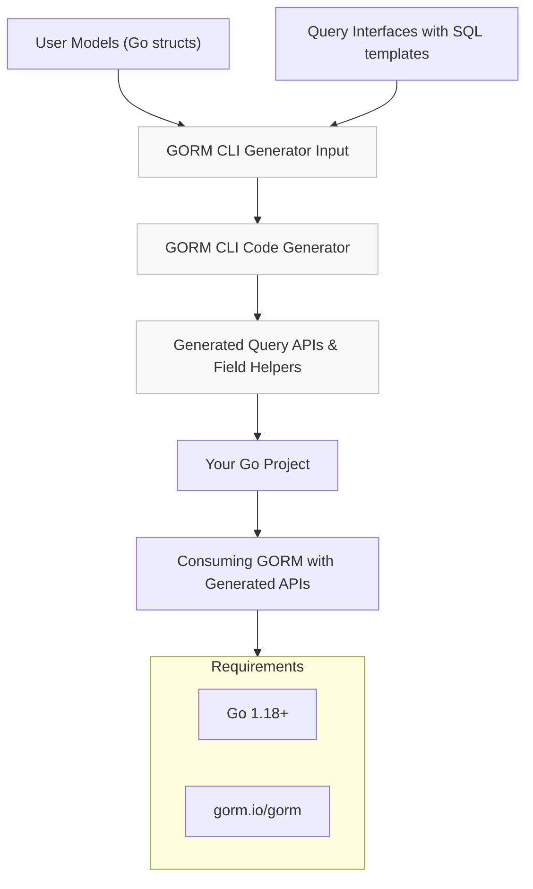

# Integration with GORM & Go Projects

Seamlessly incorporating the generated code from GORM CLI into your existing Go and GORM projects is designed to be straightforward and minimal. This page outlines how generated APIs slot directly into GORM setups, the role of `genconfig.Config` in tailoring generation behavior, and the prerequisites you must meet to adopt the generator with minimal friction.

---

## Why Integration Matters

When introducing generated code into an ongoing GORM-based application, ease of adoption and interoperability are critical. GORM CLI is created with the developer experience in mind — so you get type-safe, fluent query and field APIs that complement, not complicate, your existing codebase.

This integration approach:

- **Preserves your current database setup** — no changes needed to the DB or GORM schema
- **Leverages Go 1.18+ generics** to enable expressive, reusable code
- **Keeps the generated code idiomatic and GORM-native** so it feels like natural extension

## Core Integration Flow

1. **Write or maintain your GORM models and Go interfaces**

   Your models are standard Go structs mapped with GORM tags. Your query interfaces declare methods with SQL template comments that describe data operations.

2. **Configure generation using `genconfig.Config` (optional)**

   Define package-level configuration to customize generation, e.g., output directory, field mappings, and inclusion/exclusion filters.

3. **Run the `gorm gen` command pointing at your interface files**

   The generator analyzes your interfaces and structs, applies your configuration, and produces type-safe query API implementations alongside field helper declarations.

4. **Consume the generated APIs directly in your Go code**

   Use the generated functions and fields as native GORM clauses and operations, benefitting from compile-time checks and rich IDE support.

## Minimal Requirements

- **Go version 1.18 or higher** due to generics support.
- **GORM packages, primarily `gorm.io/gorm`**, must be part of your project dependencies.

No other runtime dependencies or complex setup steps are required.

## Role of `genconfig.Config`

The `genconfig.Config` struct, declared at the package level in your Go code, controls key generation parameters and behavior:

- **`OutPath`** - Defines where generated files are placed, allowing separation or integration as you prefer.
- **`FieldTypeMap` and `FieldNameMap`** - Enable mapping custom Go types or tagged struct fields to specialized field helpers, e.g., JSON or SQL Null types.
- **`IncludeInterfaces` / `ExcludeInterfaces` and `IncludeStructs` / `ExcludeStructs`** - Provide fine-grained control to whitelist or blacklist specific interfaces and structs by pattern or type.
- **`FileLevel`** - Dictates whether the configuration applies to the entire package subtree or only the current file.

This configurability ensures the generator adapts smoothly to existing code organization and your team’s conventions.

### Example Configuration

```go
package examples

import (
	"database/sql"
	"gorm.io/cli/gorm/field"
	"gorm.io/cli/gorm/genconfig"
)

var _ = genconfig.Config{
	OutPath: "examples/output",
	FieldTypeMap: map[any]any{
		sql.NullTime{}: field.Time{},
	},
	FieldNameMap: map[string]any{
		"json": JSON{},
	},
	IncludeInterfaces: []any{"Query*"},
	ExcludeStructs:    []any{"*DTO"},
}
```

This snippet shows configuration that customizes the output directory, maps SQL-nullable times, recognizes custom JSON fields, and selectively includes or excludes code based on interface and struct naming patterns.

## How The Generated Code Fits Into Your Project

- **Package Placement**

  Generated code is placed under your designated `OutPath` directory, preserving module and package structure for clean imports.

- **Imports & Dependencies**

  Generated files automatically include necessary imports like `gorm.io/gorm`, your model packages, and any field helper packages required by your configuration.

- **Generated Query APIs**

  For each interface with annotated SQL templates,
  - An interface implementation struct is created wrapping GORM’s generic query builder.
  - Methods implement your raw SQL queries with type-safe parameter binding and fluent chaining.

- **Generated Field Helpers**

  For each model struct,
  - Strongly typed field helpers are generated for primitive fields and associations.
  - They integrate with GORM predicate and association mechanisms seamlessly.

## Practical Examples

```go
// Using a generated query API for User
user, err := generated.Query[models.User](db).GetByID(ctx, 42)
if err != nil {
    // handle error
}

// Using generated field helpers in a GORM query
users, err := gorm.G[models.User](db).
    Where(generated.User.Name.Like("%smith%"), generated.User.Age.Gt(21)).
    Find(ctx)
```

Generated APIs behave exactly like idiomatic GORM usages, preserving your existing knowledge and tooling.

## Best Practices for Smooth Integration

- **Keep models and query interfaces organized** within the same package or directory structure to minimize configuration overhead.
- **Leverage `genconfig.Config` for custom field mappings** especially when using SQL nullable types, JSON columns, or embedded structs.
- **Use inclusion/exclusion filters to focus generation** on active code and exclude deprecated or irrelevant types.
- **Maintain up-to-date Go and GORM dependencies** to keep compatibility, especially since generics require Go 1.18+.
- **Run generation as part of your build or CI process** to standardize generated code freshness and catch issues early.

## Troubleshooting Common Integration Issues

<AccordionGroup title="Common Integration Challenges">
<Accordion title="Generated Code Not Found After Generation">
Ensure your `OutPath` in `genconfig.Config` and your build imports align. Verify that generated packages are imported correctly and your module paths resolve.
</Accordion>
<Accordion title="Incompatible Go Version Errors">
Make sure your project uses Go 1.18 or later. Older Go versions do not support generics and will fail compiling generated code.
</Accordion>
<Accordion title="Conflicts with Existing Code or Imports">
Verify no namespace collisions or import path mismatches occur by synchronizing generated code output location and import statements.
</Accordion>
<Accordion title="Field Type Mapping Not Working as Expected">
Check your mappings in `FieldTypeMap` and `FieldNameMap` for correctness. Confirm struct tags (e.g., `gen:"json"`) match your mappings.
</Accordion>
</AccordionGroup>

## Summary

By anchoring generated code firmly within your GORM and Go project’s existing structure, GORM CLI enhances database interactions with type safety and fluent APIs — all without disrupting your current workflows. With minimal setup, explicit control via configuration, and generation patterns that mirror your own code organization, integration is both smooth and powerful.

---

## Diagram: Integration Workflow




---

## Next Steps

- Explore the [Define Models & Query Interfaces](../getting-started/first-generation/define-models-interfaces) page to learn how to structure your inputs optimally.
- Follow the [Run the Code Generator](../getting-started/first-generation/run-code-generator) guide for practical command-line examples.
- Customize generation with the [Customizing Generation with genconfig.Config](../../guides/customization-integration/genconfig-config-guide) documentation.
- Review [Troubleshooting Common Issues](../getting-started/first-generation/troubleshooting-common-issues) for additional help.


---

## Related Documentation

- [What is GORM CLI?](../overview/product-intro/what-is-gorm-cli) — Introduction and product overview.
- [How GORM CLI Works (High-Level Architecture)](../overview/concepts-architecture/how-it-works-highlevel) — Understand the generation pipeline & architecture.
- [Template-based Query Generation](../../guides/generation-patterns/template-sql-gen) — Deep dive into SQL templating in interfaces.
- [Customizing Generation with genconfig.Config](../../guides/customization-integration/genconfig-config-guide) — How to tailor your code generation.

---

For detailed code examples, visit the `examples` directory in the GitHub repository: [GORM CLI GitHub](https://github.com/go-gorm/cli)

---

<Check>
Make sure your Go environment is updated to 1.18 or newer and your GORM modules are compatible before integrating generated code.
</Check>


---