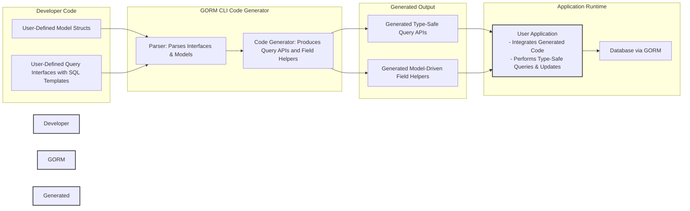

# System Architecture & Data Flow

## Visualizing the GORM CLI Code Generation Workflow

Understanding how GORM CLI transforms your Go source code into type-safe query and field helper code is fundamental to mastering the tool. This page presents a clear, illustrative diagram and explanation that traces the entire round-trip flow—from your initial model structs and query interfaces, through the GORM CLI’s generation engine, and back into your application’s runtime workflows.

### Why This Matters

When you write an interface with SQL templates and define your models, GORM CLI generates strongly-typed Go code that integrates seamlessly into your database access layer. Visualizing this empowers you to grasp how your source artifacts influence the generated output and your application's live query execution.

---

## High-Level Workflow Overview

At the core, the system follows a cyclical path of inputs and outputs enabling developer-friendly, type-safe database access:

1. **Developer Source Code:**
   - You define **query interfaces** annotated with SQL templates, specifying how to fetch or manipulate data.
   - You define **model structs**, representing your database schema with fields and associations.

2. **GORM CLI Code Generation Engine:**
   - Parses the interfaces and models.
   - Generates **interface-driven, type-safe query APIs** that match your method declarations.
   - Generates **model-driven field helpers** for filters, updates, ordering, and association operations.

3. **Generated Code:**
   - The generated code is output to your specified directory.
   - This output includes Go files with fluent, discoverable APIs for your project.

4. **Application Integration & Runtime:**
   - Your application imports the generated package.
   - Calls to generated query APIs execute type-safe SQL commands.
   - Association helpers manage linked data with compile-time correctness.

This cycle loops as you evolve your models and queries, regenerating code to reflect changes instantly.

---

## Mermaid Diagram: System Architecture & Data Flow



---

## Step-by-Step Flow Explained

### 1. Developer Source: Models and Interfaces

You start by defining Go structs to represent your data tables and interfaces that specify query methods.

Example:

```go
// Model example
 type User struct {
   ID   uint
   Name string
   Age  int
 }

// Interface example
 type Query[T any] interface {
   // SELECT * FROM @@table WHERE id=@id
   GetByID(id int) (T, error)
 }
```

This clean separation focuses on intent and schema.

### 2. Parsing and Generation

The GORM CLI parses your model structs and interface annotations containing SQL templates. It recognizes fields, types, and relational associations while interpreting your method contracts.

The generator creates two core outputs:

- **Type-safe Query APIs:** Concrete implementations of your interfaces with compile-time guarantees.
- **Field Helpers:** Helper structures and methods for filtering, updating, and managing associations on model fields.

### 3. Generated Code Integration

The produced Go files expose fluent, discoverable APIs allowing you to write code like:

```go
user, err := generated.Query[User](db).GetByID(ctx, 123)
users, err := gorm.G[User](db).Where(generated.User.Age.Gt(18)).Find(ctx)
```

These calls replace error-prone, manually written SQL with type-safe queries.

### 4. Runtime Execution with GORM

At runtime, your application invokes the generated APIs which in turn translate to SQL executed by GORM on your database. The results populate your structs safely, enabling powerful, maintainable data access.

---

## Practical Benefits of This Architecture

- **Compile-Time Safety:** Prevents SQL and mapping mistakes before runtime.
- **API Fluency:** Generated methods auto-complete in editors reducing cognitive load.
- **Consistent Model Usage:** Field helpers reflect your models exactly, keeping filters and updates in sync.
- **Association Management:** Enables complex relational operations with simple calls.
- **Scalability:** As your data model grows, generation keeps your data access layer manageable.

---

## Common User Journey

1. Define or update your model struct and query interface.
2. Run `gorm gen -i ./path -o ./generated` to regenerate your code.
3. Import and use generated packages in your Go application.
4. Perform queries and updates with confidence in correctness.
5. Iterate and regenerate as your schema evolves.

---

## Tips for Success

- Keep your query interfaces focused and annotated clearly with SQL templates.
- Use model struct tags and `genconfig.Config` to customize generation.
- Regenerate frequently during development to sync generated code.
- Use field helpers for all filtering and update clauses to maintain consistency.

## Troubleshooting Common Issues

<AccordionGroup title="Common Pitfalls and Solutions">
<Accordion title="Generated Code Not Found or Outdated">
Ensure you run the code generator (`gorm gen`) after any model or interface changes. Confirm `-i` points to the correct directory containing your sources, and `-o` to the output location you import.
</Accordion>
<Accordion title="Type Errors When Using Generated APIs">
Check that the model struct and query interface match exactly to the generated package versions. Regenerate code if the source definitions changed.
</Accordion>
<Accordion title="Unexpected SQL Generation or Runtime Failures">
Carefully review your SQL templates in interface comments for correct `@@table`, `@param`, `{{set}}`, and other DSL constructs. Use simple queries first to isolate issues.
</Accordion>
</AccordionGroup>

---

## Next Steps

Ready to dive deeper? Explore these guides:

- [Core Concepts & Terminology](/overview/concepts-architecture/core-concepts-terminology) to understand foundational terms.
- [Feature Overview at a Glance](/overview/intro-value/feature-overview) to grasp key capabilities.
- [Getting Started: Your First Code Generation](/guides/core-workflows/getting-started) for a hands-on walkthrough.

---

By understanding the system architecture and data flow of GORM CLI, you gain clarity on how your source code evolves into powerful, safe, and efficient database interactions, empowering you to build robust Go applications with confidence.
