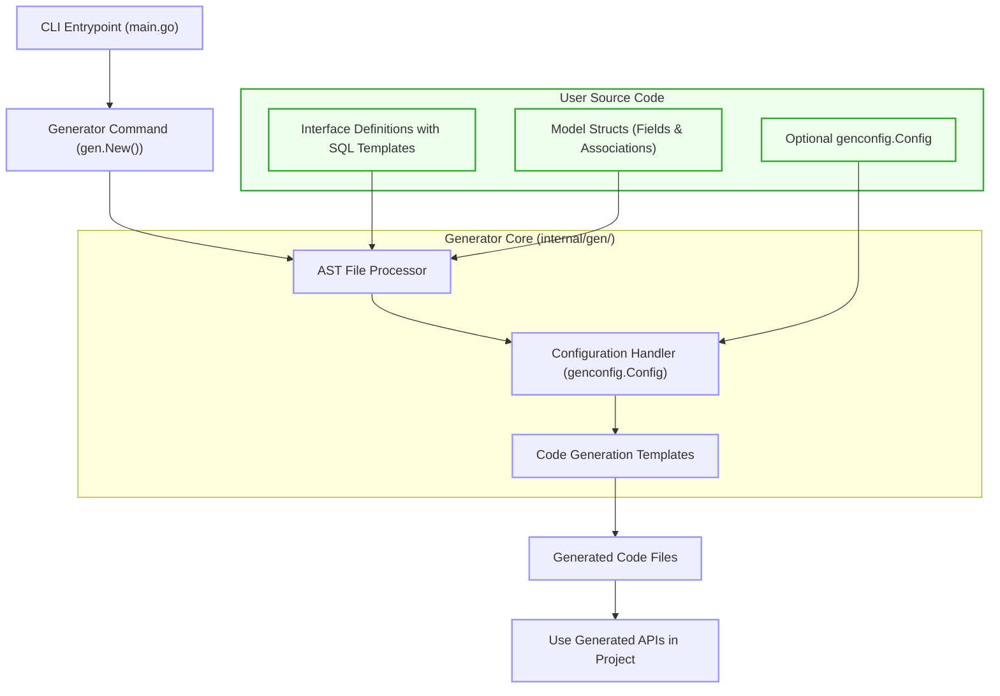

# System Architecture Overview

## Understanding the Components Behind GORM CLI

This page offers a clear, practical visualization of how GORM CLI's main components interoperate to transform your Go code and configurations into robust, type-safe GORM APIs. By exploring the flow between the CLI entrypoint, the generator modules, and your model and query definitions, you will gain a solid grasp of the entire generation process.

Whether you want to understand how interfaces with raw SQL templates are interpreted or how model structs drive field helper creation, this overview ties these pieces together with concrete insights and a high-level Mermaid architecture diagram.

---

## How GORM CLI Works: From Your Code to Generated APIs

When you run the `gorm gen` command, GORM CLI performs a structured sequence of operations that start by analyzing your source files and end with generating strongly typed, discoverable query and model code. This process ensures improved developer productivity by enforcing type safety and generating idiomatic Go code.

### User Goal

You want to generate type-safe, compile-time validated database query interfaces and model-driven field helpers that reduce boilerplate, increase clarity, and integrate seamlessly into your Go projects.

### The Workflow

1. **Start CLI Entrypoint:**
   - When you invoke the CLI (e.g., `gorm gen -i ./examples -o ./generated`), the `main.go` file initializes the root command and adds the generation command.

2. **Invoke Generator Module:**
   - The `gen` package handles the core processing logic triggered via the Cobra CLI framework.
   - It reads the input path(s), recursively parsing Go source files that contain your interfaces with SQL annotations and model structs.

3. **Parse Source Files and Extract Metadata:**
   - The generator uses Go's `go/ast` package to parse your source code, extracting interfaces, methods, structs, fields, and importantly, any generation configurations.
   - Interfaces with annotated comments containing raw SQL or SQL templates are identified and their methods analyzed.
   - Model structs are analyzed for fields and relationships, including anonymous embedding, to enable the generation of fluent field helpers.

4. **Apply Configuration Filters:**
   - The generator applies filtering based on optional configuration (defined via `genconfig.Config`) to include or exclude specific interfaces or structs, customize output paths, or map custom field types.

5. **Generate Go Code Using Templates:**
   - The collected metadata feeds into Go text templates that produce:
     - Concrete query interface implementations with type-safe methods derived from your SQL annotations.
     - Field helper structs and functions enabling expressive, fluent query composition for models.

6. **Format and Write Generated Files:**
   - Generated code files are formatted using `golang.org/x/tools/imports` for proper imports and written to the specified output directory.

7. **Ready to Use:**
   - The output is ready for instant use in your projects, letting you call strongly typed database operations with confidence.

---

## Key Components & Their Roles

| Component             | Role & Responsibility |
|-----------------------|-----------------------|
| **CLI Entrypoint (main.go)** | Initializes the CLI tool and registers the generate command. Handles command execution and error handling. |
| **Generator Core (internal/gen/)** | Processes source files, parses Go AST for interfaces and structs, applies filters based on configs, and triggers code generation. |
| **AST File Processor** | Walks through AST nodes to extract interfaces, methods, structs, fields, imports, and config info embedded as package-level variables. |
| **Config Handling (genconfig.Config)** | Enables customization of generation paths, inclusion/exclusion rules, and field type mappings to tailor output to your needs. |
| **Code Generation Templates** | Use Go templating to transform processed metadata into idiomatic, type-safe Go code for query APIs and field helpers. |
| **User Source Code (Interfaces & Models)** | Your Go interface definitions with SQL annotations and struct models define the shape and semantics of the APIs to be generated. |

---

## How Interfaces and Models Drive Output

- **Interfaces:** 
  - Each interface (`Query` or others) defines method signatures mapping to SQL operations.
  - Method comments embed raw SQL templates or conditional templates using the custom DSL.
  - Generator transforms these into concrete implementations with full Go type support.

- **Model Structs:**
  - Processed to recognize fields and associations.
  - Each field is wrapped in a field helper type (`field.String`, `field.Number[int]`, `field.Struct[Related]`, etc.) for fluent predicates, setters, and relational operations.
  - Facilitates expressive query building without manual SQL.

Together, these two components yield a full-fledged, discoverable API layer for querying and updating your database safely.

---

## Visualization: GORM CLI Architecture Diagram

---

## Practical Tips & Best Practices

- **Structure Your Interfaces and Models Clearly:** Keep SQL templates concise and leverage DSL directives for dynamic queries.

- **Use Configuration for Control:** Define `genconfig.Config` literals in your packages to adjust output paths, customize field mappings (e.g., for JSON fields), and filter what gets generated.

- **Organize Input for Scalability:** Point the generator to directories containing interfaces and models to enable recursive discovery and processing.

- **Validate Generated Code Regularly:** Follow up by inspecting generated code to ensure it aligns with your expectations and coding standards.

- **Leverage Associations Fully:** Use generated association helpers to manage related entities with type safety.

---

## Troubleshooting Common Issues

<AccordionGroup title="Common Generator Issues">
<Accordion title="Empty Generated Files or Missing Methods">
Ensure your interfaces are annotated correctly with SQL comments, and verify inclusion filters in your config do not exclude them unintentionally.
</Accordion>
<Accordion title="Parsing Errors on Source Files">
Confirm that your input Go files are syntactically valid and compilable as regular Go code. The generator uses Go's parser strictly.
</Accordion>
<Accordion title="Incorrect Output Paths or File Structure">
Check the `OutPath` setting in your `genconfig.Config` and the CLI `-o` flag. They determine where your generated code is placed.
</Accordion>
</AccordionGroup>

---

## Next Steps

This overview serves as a foundation to understand the big picture of GORM CLI's inner workings. To deepen your expertise and get practical with generation:

- Explore [Generating Type-Safe Query APIs](/guides/core-workflows/generate-type-safe-queries) to see how to craft interfaces that power your queries.
- Dive into [Generating Model-Driven Field Helpers](/guides/core-workflows/generate-field-helpers) for harnessing model-based helpers.
- Learn to [Customize Configuration](/guides/advanced-usage-patterns/customizing-generation) to tailor generation to your project.

Together, these linked guides will help you master GORM CLI and extract the full value it offers to Go development with GORM.
