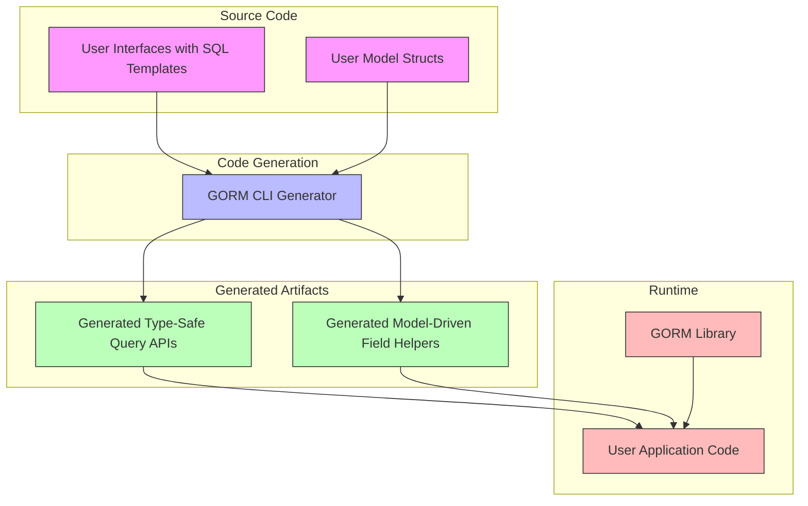

# System Architecture Diagram

## Visual Overview of GORM CLI Code Generation Workflow

This page provides a clear, visual representation of how GORM CLI transforms your Go source code into powerful, type-safe, fluent query APIs tightly integrated with GORM. Through this architecture diagram, you will understand the key components involved, how they interact, and the flow from your source interfaces and models to the generated code artifacts.

---

### Why This Diagram Matters

Many developers find it challenging to understand the internal process and components involved when using GORM CLI. This diagram bridges that gap by illustrating the sequence, inputs, and outputs involved in code generation, helping you grasp how your Go code evolves seamlessly into strongly typed, query-ready APIs.

---

## High-Level Components

- **User Source Code**
  - Go interfaces annotated with SQL templates
  - Go model structs defining database structures and relationships

- **GORM CLI Generator**
  - Parses and analyzes source code
  - Generates type-safe query API implementations
  - Generates model-driven field helpers for filters, updates, and associations

- **Generated Code Artifacts**
  - Fluent, typed query interfaces
  - Field helpers mapped to models and fields
  - Integration-ready with GORM for compile-time safety

- **Final Integration**
  - Your application uses generated APIs for database operations with enhanced safety and productivity

---

## How to Read the Diagram

The arrows depict the flow of data and transformations starting from your Go source interfaces and structs through the GORM CLI generator, leading to output files that consist of generated query and field helper APIs. This workflow tightly aligns with the Go toolchain, enabling seamless builds and integration.

---

## Detailed Flow



---

## Practical Example Scenario

Imagine you define an interface in your Go code like:

```go
// SELECT * FROM @@table WHERE id=@id
GetByID(id int) (T, error)
```

and a model struct:

```go
type User struct {
  ID   uint
  Name string
}
```

After running `gorm gen -i ./examples -o ./generated`, the GORM CLI generates:

- A concrete `GetByID` method typed specifically for `User`
- Field helpers such as `generated.User.Name` which build safe query predicates

Your application then uses the generated APIs for safe, concise queries:

```go
user, err := generated.Query[User](db).GetByID(ctx, 123)
```

This effortless flow is what the architecture diagram captures from source to runtime.

---

## Tips to Maximize Understanding

- **Follow the arrows** to see the end-to-end transformation
- **Understand your input code structure** as it directly maps to generated code
- **Remember: GORM integration is seamless, generated APIs are idiomatic Go**

---

## Troubleshooting Common Confusions

<AccordionGroup title="Common Pitfalls and Clarifications">
<Accordion title="Why do I need both interfaces and models as input?">
The generator uses interfaces with SQL templates to create query APIs and model structs to generate field helpers that simplify building queries with filters, updates, and associations.
</Accordion>
<Accordion title="What if the generator produces no output files?">
Check your configuration and file inclusions as the generator applies include/exclude filters based on your `genconfig.Config`. Missing or incorrect interface or struct annotations can cause no code generation.
</Accordion>
<Accordion title="How does the generated code relate to GORM's runtime library?">
Generated code is designed to be used with GORM's APIs, enhancing type safety and including efficient helpers but relies on GORM as its backend for executing queries and managing transactions.
</Accordion>
</AccordionGroup>

---

## Next Steps

- Explore the [How GORM CLI Works (High-Level Architecture)](/overview/concepts-architecture/how-it-works-highlevel) page for a textual breakdown of the process
- Visit Getting Started guides to define your models and interfaces and run your first generation
- Examine your generated code to see these components in action

---

With this diagram and explanation, you are equipped to understand how GORM CLI transforms your source code into robust, maintainable, and type-safe database APIs.

---

*End of System Architecture Diagram Documentation*
